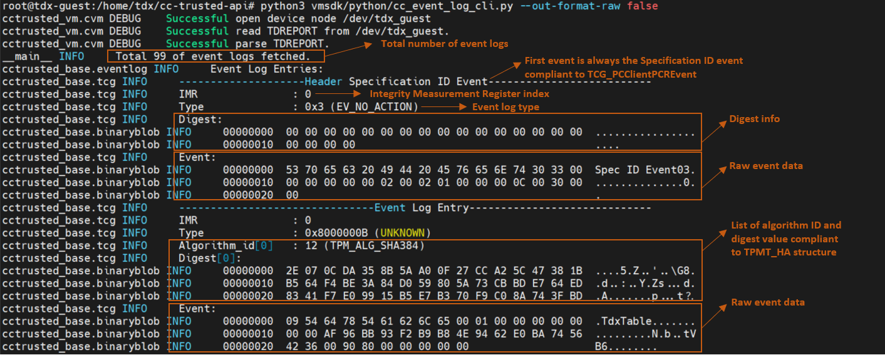

[](https://github.com/cc-api/cc-trusted-api/actions/workflows/pylint.yaml)
[](https://github.com/cc-api/cc-trusted-api/actions/workflows/doclint.yaml)
[](https://github.com/cc-api/cc-trusted-api/actions/workflows/pylicense.yaml)
[](https://github.com/cc-api/cc-trusted-api/actions/workflows/vmsdk-test-python.yaml)

# CC Trusted API

CC Trusted API helps the diverse applications to access and process the trust states
which was represented by integrity measurement, event record, report/quote in the confidential
computing environment.


## 1. TCB Measurement

The diverse application in confidential computing could be firmware or monolithic application
in Confidential VM(CVM), micro service or macro service on Kubernetes. Although
different type application might get the trust states measured in different Trusted
Computing Base (TCB), the definition and structure of integrity measurement register and
event log follows the below specifications.


| TCB | Measured By | Specification |
| --- | -------- | ------------- |
| Initial TEE | Trusted Security Manager (TSM), such as Intel TDX module, SEV secure processor | Vendor Specification such as [Intel TDX Module 1.5 ABI Specification](https://cdrdv2.intel.com/v1/dl/getContent/733579) |
| Firmware | EFI_CC_MEASUREMENT_PROTOCOL </br> CCEL ACPI Table </br> EFI_TCG2_PROTOCOL </br> TCG ACPI Table | [UEFI Specification 2.10](https://uefi.org/specs/UEFI/2.10/38_Confidential_Computing.html#virtual-platform-cc-event-log) </br> [ACPI Specification 6.5](https://uefi.org/specs/ACPI/6.5/05_ACPI_Software_Programming_Model.html#cc-event-log-acpi-table) </br> [TCG EFI Protocol Specification](https://trustedcomputinggroup.org/resource/tcg-efi-protocol-specification/) </br> [TCG ACPI Specification](https://trustedcomputinggroup.org/resource/tcg-acpi-specification/) |
| Boot Loader | EFI_CC_MEASUREMENT_PROTOCOL </br> EFI_TCG2_PROTOCOL | Grub2/Shim |
| OS | Integrity Measurement Architecture (IMA) | [Specification](https://sourceforge.net/p/linux-ima/wiki/Home/) |
| Cloud Native | Confidential Cloud Native Primitives (CCNP) | [Repository](https://github.com/intel/confidential-cloud-native-primitives) |

## 2. Trusted Foundation

Normally Trusted Platform Module(TPM) provides root of trust for PC client platform.
In confidential computing environment, vTPM (virtual TPM) might be provided different
vendor or CSP, which root of trust should be hardened by vendor secure module. Some
vendor also provided simplified solution:

|           | Measurement Register | Event Log      | Specification |
| --------- | -------------------- | ---------      | ------------- |
| vTPM      | TPM PCR              | TCG2 Event Log | [TPM2 Specification](https://trustedcomputinggroup.org/resource/tpm-library-specification/) </br> [TCG PC Client Platform TPM Profile Specification](https://trustedcomputinggroup.org/resource/pc-client-platform-tpm-profile-ptp-specification/) </br> [TCG PC Client Platform Firmware Profile Specification](https://trustedcomputinggroup.org/resource/pc-client-specific-platform-firmware-profile-specification/) |
| Intel TDX | TDX MRTD/RTMR        | CC Event Log   | [Intel® TDX Module 1.5 Base Architecture Specification](https://cdrdv2.intel.com/v1/dl/getContent/733575) </br> [Intel® TDX Virtual Firmware Design Guide](https://cdrdv2.intel.com/v1/dl/getContent/733585) </br> [td-shim specification](https://github.com/confidential-containers/td-shim/blob/main/doc/tdshim_spec.md) |


## 3. APIs

CC Trusted APIs aims to collect confidential primitives (i.e., measurement, event log, quote) for zero-trust design, supporting multiple deployment environments (firmware/VM/cloud native cluster).
The [APIs](common/python/cctrusted_base/api.py) are designed to be vendor agnostic and TCG compliant APIs. The APIs will keep evolving on demand. 

| API | Description  | Parameters  | Response  |
| --- | ------------- |----- |----- |
| get_default_algorithms | Get the default Digest algorithms supported by trusted foundation. | | A `TcgAlgorithmRegistry` object telling the default algorithms |
| get_measurement_count | Get the count of measurement register. | | An integer telling the count of measurement registers |
| get_measurement | Get measurement register according to given selected index and algorithms. | imr_select ([int, int]): The first is index of measurement register, the second is the algorithms ID | An integer telling the count of measurement registers |
| get_quote | Get the quote for given nonce and data. | nonce: a number used to protect private communications by preventing replay attacks<br> data: the data specified by user<br> extraArgs: the placeholder for extra arguments required in vTPM or other TEE cases  | A `Quote` object |
| get_eventlog | Get eventlog for given index and count. | start: the index of the event log to start fetching<br> count: the number of event logs to fetch | A `TcgEventLog` object |

## 4. SDKs

It provides different SDKs for producing the confidential primitives in different deployment environments.
Choose correct SDK according to your environment. Installation guide can be found at the readme of each implementation.

| SDK | Deployment Scenarios | Installation Guide |
| --- | --------------- | -- |
| Firmware SDK | Firmware Application | |
| [VM SDK](https://github.com/cc-api/cc-trusted-api/tree/main/vmsdk) | Confidential Virtual Machine | [Guide](vmsdk/README.md) |
| [Confidential Cloud Native Primitives (CCNP)](https://github.com/intel/confidential-cloud-native-primitives) | Confidential Cluster/Container | [Guide](https://github.com/intel/confidential-cloud-native-primitives/blob/main/deployment/README.md) |

## 5. How to use the APIs

This section contains the brief samples of APIs. You can find more examples at [API usage example](docs/API-usage-example.md).

### 5.1 Sample of `get_measurement` API

Below example code collects measurements from all integrity registers of the platform using API `get_measurement_count`, `get_default_algorithms` and `get_measurement` using `VMSDK` in python. 

```
from cctrusted import CCTrustedVmSdk

# Get total count of measurement registers, Intel® TDX is 4, vTPM is 24
count = CCTrustedVmSdk.inst().get_measurement_count()
for index in range(CCTrustedVmSdk.inst().get_measurement_count()):
    # Get default digest algorithms, Intel® TDX is SHA384, vTPM is SHA256
    alg = CCTrustedVmSdk.inst().get_default_algorithms()
    # Get digest object for given index and given algorithms
    digest_obj = CCTrustedVmSdk.inst().get_measurement([index, alg.alg_id])

    hash_str = ""
    for hash_item in digest_obj.hash:
        hash_str += "".join([f"{hash_item:02x}", " "])

    LOG.info("Algorithms: %s", str(alg))
    LOG.info("HASH: %s", hash_str)
```

Run [cc_imr_cli.py](vmsdk/python/cc_imr_cli.py) to execute the sample.

```
$ sudo su
# source setupenv.sh
# cd vmsdk/python
# python3 cc_imr_cli.py
```

Below is the example output for `get_measurement` API on Intel® TDX via VM SDK:
```
cctrusted.cvm DEBUG    Successful open device node /dev/tdx_guest
cctrusted.cvm DEBUG    Successful read TDREPORT from /dev/tdx_guest.
cctrusted.cvm DEBUG    Successful parse TDREPORT.
cctrusted.cvm INFO     ======================================
cctrusted.cvm INFO     CVM type = TDX
cctrusted.cvm INFO     CVM version = 1.5
cctrusted.cvm INFO     ======================================
__main__ INFO     Algorithms: TPM_ALG_SHA384
__main__ INFO     HASH: c1 57 27 ca c1 f5 7d 0e 91 10 6d a1 80 b3 ea ba 72 11 66 61 e1 7b a0 55 37 73 84 3a 9b 07 2e cf a3 8c c8 03 df b5 5e 0f 87 ec 23 67 80 ad b3 a6
cctrusted.cvm INFO     ======================================
cctrusted.cvm INFO     CVM type = TDX
cctrusted.cvm INFO     CVM version = 1.5
cctrusted.cvm INFO     ======================================
__main__ INFO     Algorithms: TPM_ALG_SHA384
__main__ INFO     HASH: ee 35 46 2b 47 53 58 1b 4c 5a 53 8d c1 92 51 89 ba 9d 21 f5 19 7b 6b 15 ce 10 a6 00 fb d3 12 e0 e3 5c 2b 87 01 fc b2 17 51 82 43 3c 9b 12 b9 dc
cctrusted.cvm INFO     ======================================
cctrusted.cvm INFO     CVM type = TDX
cctrusted.cvm INFO     CVM version = 1.5
cctrusted.cvm INFO     ======================================
__main__ INFO     Algorithms: TPM_ALG_SHA384
__main__ INFO     HASH: 9a c0 ba 4e db 45 03 08 9a a4 a9 2a fe 97 cb 15 94 18 2f 44 aa e0 e5 8d 6f 90 a2 22 9c f9 a4 22 86 5d 87 35 d6 0b 87 3d 6b ec 36 41 d8 96 68 00
cctrusted.cvm INFO     ======================================
cctrusted.cvm INFO     CVM type = TDX
cctrusted.cvm INFO     CVM version = 1.5
cctrusted.cvm INFO     ======================================
__main__ INFO     Algorithms: TPM_ALG_SHA384
__main__ INFO     HASH: 00 00 00 00 00 00 00 00 00 00 00 00 00 00 00 00 00 00 00 00 00 00 00 00 00 00 00 00 00 00 00 00 00 00 00 00 00 00 00 00 00 00 00 00 00 00 00 00

```

### 5.2 Sample of `get_quote` API

Below example code collect the Quote on the platform using `get_quote` API using `VMSDK` implemented by python.

```
from cctrusted import CCTrustedVmSdk

# Specify the `nonce`, `data` and `extraArgs` as None in the example
quote = CCTrustedVmSdk.inst().get_quote(None, None, None)
if quote is not None:
    # Dump Quote object as raw data
    quote.dump(is_raw=True)
```

Run [cc_quote_cli.py](vmsdk/python/cc_quote_cli.py) to execute the sample.

```
$ sudo su
# source setupenv.sh
# cd vmsdk/python
# python3 cc_quote_cli.py
```

Below is the example output for `get_quote` API on Intel® TDX via VM SDK:

```
root@tdx-guest:/home/tdx/cc-trusted-api/vmsdk/python# python3 ./cc_quote_cli.py
cctrusted.cvm DEBUG    Successful open device node /dev/tdx_guest
cctrusted.cvm DEBUG    Successful read TDREPORT from /dev/tdx_guest.
cctrusted.cvm DEBUG    Successful parse TDREPORT.
cctrusted.cvm INFO     Using report data directly to generate quote
cctrusted.cvm DEBUG    Successful open device node /dev/tdx_guest
cctrusted.cvm DEBUG    Successful get Quote from /dev/tdx_guest.
cctrusted_base.tdx.quote INFO     ======================================
cctrusted_base.tdx.quote INFO     TD Quote
cctrusted_base.tdx.quote INFO     ======================================
cctrusted_base.tdx.quote INFO     TD Quote Header:
cctrusted_base.binaryblob INFO     00000000  04 00 02 00 81 00 00 00 00 00 00 00 93 9A 72 33  ..............r3
cctrusted_base.binaryblob INFO     00000010  F7 9C 4C A9 94 0A 0D B3 95 7F 06 07 C6 0E 85 25  ..L............%
cctrusted_base.binaryblob INFO     00000020  C8 09 3C 0E A0 64 EF F1 29 6B 85 83 00 00 00 00  ..<..d..)k......
cctrusted_base.tdx.quote INFO     TD Quote Body:
cctrusted_base.binaryblob INFO     00000000  04 01 01 00 00 00 00 00 00 00 00 00 00 00 00 00  ................
cctrusted_base.binaryblob INFO     00000010  97 90 D8 9A 10 21 0E C6 96 8A 77 3C EE 2C A0 5B  .....!....w<.,.[
cctrusted_base.binaryblob INFO     00000020  5A A9 73 09 F3 67 27 A9 68 52 7B E4 60 6F C1 9E  Z.s..g'.hR{.`o..
...
cctrusted_base.binaryblob INFO     00000230  00 00 00 00 00 00 00 00 00 00 00 00 00 00 00 00  ................
cctrusted_base.binaryblob INFO     00000240  00 00 00 00 00 00 00 00                          ........
cctrusted_base.tdx.quote INFO     TD Quote Signature:
cctrusted_base.binaryblob INFO     00000000  16 1F E4 F6 8C 05 D4 8F E2 EB EB C8 32 1A CE 6C  ............2..l
cctrusted_base.binaryblob INFO     00000010  90 2A B5 EA 74 F5 4C 4D A2 6A 30 AC 5C A5 13 84  .*..t.LM.j0.\...
cctrusted_base.binaryblob INFO     00000020  3D CB A2 31 20 43 8C 38 63 3D EE D1 7F B4 9F B5  =..1 C.8c=......
...
cctrusted_base.binaryblob INFO     000010D0  44 20 43 45 52 54 49 46 49 43 41 54 45 2D 2D 2D  D CERTIFICATE---
cctrusted_base.binaryblob INFO     000010E0  2D 2D 0A 00                                      --..
```

### 5.3 Sample of `get_eventlog` API

Below example code collects all boot time event logs on the platform using API `get_eventlog` implemented in `VMSDK` in python. Sample Event logs collected within container using `CCNP` API can be found [here](https://github.com/intel/confidential-cloud-native-primitives/blob/main/docs/sample-output-for-node-measurement-tool-full.txt).

```
from cctrusted import CCTrustedVmSdk

# Specify the index of event log to start fetching(optional argument, default as 0)
start = 0
# Specify the number of event logs to be fetched.(optional argument, default as total number of event logs available)
count = 5

event_logs = CCTrustedVmSdk.inst().get_eventlog(start, count)
    if event_logs is not None:
        LOG.info("Total %d of event logs fetched.", len(event_logs.event_logs))
        # Dump event as formatted
        event_logs.dump(is_raw=false)
```

Run [cc_event_log_cli.py](vmsdk/python/cc_event_log_cli.py) to execute the sample.

```
$ sudo su
# source setupenv.sh
# cd vmsdk/python
# python3 cc_event_log_cli.py [-s <start_index_of_event_log>] [-c <count_of_event_logs>] [--out-format-raw <true/false>]
```

Below is the description of the output of `get_eventlog` API on Intel® TDX via VM SDK. Full event logs can be found in [API usage example](docs/API-usage-example.md). 



## 6. Contributors

<!-- spell-checker: disable -->

<!-- readme: contributors -start -->
<table>
<tr>
    <td align="center">
        <a href="https://github.com/kenplusplus">
            
            <br />
            <sub><b>Lu Ken</b></sub>
        </a>
    </td>
    <td align="center">
        <a href="https://github.com/Ruoyu-y">
            
            <br />
            <sub><b>Ying Ruoyu</b></sub>
        </a>
    </td>
    <td align="center">
        <a href="https://github.com/intelzhongjie">
            
            <br />
            <sub><b>Shi Zhongjie</b></sub>
        </a>
    </td>
    <td align="center">
        <a href="https://github.com/wenhuizhang">
            
            <br />
            <sub><b>Wenhui Zhang</b></sub>
        </a>
    </td>
    <td align="center">
        <a href="https://github.com/jyao1">
            
            <br />
            <sub><b>Jiewen Yao</b></sub>
        </a>
    </td>
    <td align="center">
        <a href="https://github.com/leyao-daily">
            
            <br />
            <sub><b>Le Yao</b></sub>
        </a>
    </td></tr>
<tr>
    <td align="center">
        <a href="https://github.com/dongx1x">
            
            <br />
            <sub><b>Xiaocheng Dong</b></sub>
        </a>
    </td>
    <td align="center">
        <a href="https://github.com/hairongchen">
            
            <br />
            <sub><b>Hairongchen</b></sub>
        </a>
    </td></tr>
</table>
<!-- readme: contributors -end -->

<!-- spell-checker: enable -->
