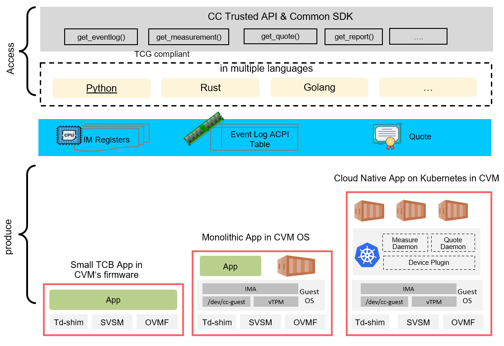
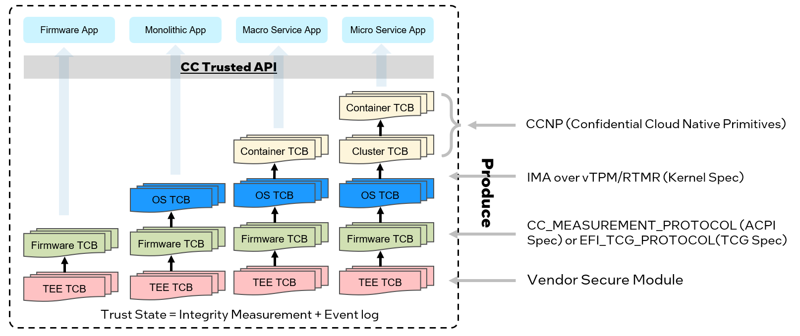
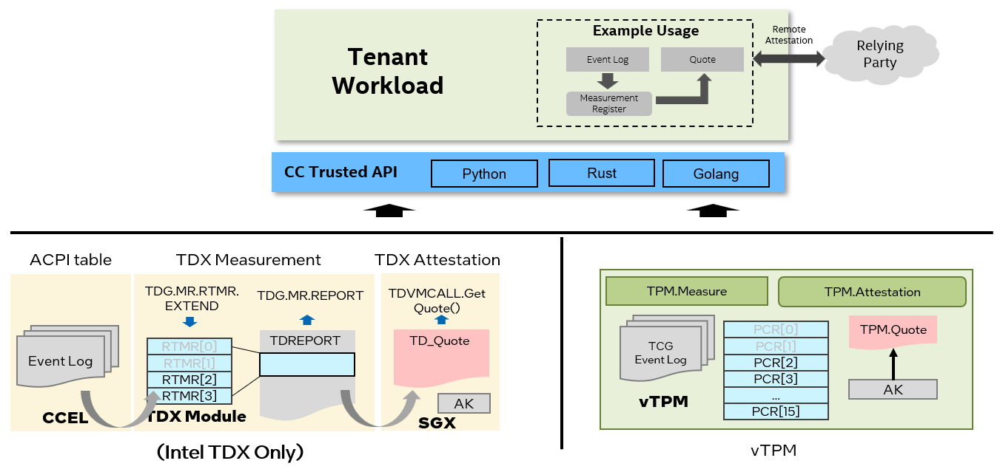

[](https://github.com/cc-api/cc-trusted-api/actions/workflows/pylint.yaml)
[](https://github.com/cc-api/cc-trusted-api/actions/workflows/doclint.yaml)
[](https://github.com/cc-api/cc-trusted-api/actions/workflows/pylicense.yaml)
[](https://github.com/cc-api/cc-trusted-api/actions/workflows/vmsdk-test-python.yaml)

# CC Trusted API

CC Trusted API helps the diverse applications to access and process the trust states
which was represented by integrity measurement, event record, report/quote in the confidential
computing environment.



## 1. TCB Measurement

The diverse application in confidential computing could be firmware or monolithic application
in Confidential VM(CVM), micro service or macro service on Kubernetes. Although
different type application might get the trust states measured in different Trusted
Computing Base (TCB), the definition and structure of integrity measurement register and
event log follows the below specifications.


| TCB | Measured By | Specification |
| --- | -------- | ------------- |
| Initial TEE | Trusted Security Manager (TSM), such as Intel TDX module, SEV secure processor | Vendor Specification such as [Intel TDX Module 1.5 ABI Specification](https://cdrdv2.intel.com/v1/dl/getContent/733579) |
| Firmware | EFI_CC_MEASUREMENT_PROTOCOL </br> CCEL ACPI Table </br> EFI_TCG2_PROTOCOL </br> TCG ACPI Table | [UEFI Specification 2.10](https://uefi.org/specs/UEFI/2.10/38_Confidential_Computing.html#virtual-platform-cc-event-log) </br> [ACPI Specification 6.5](https://uefi.org/specs/ACPI/6.5/05_ACPI_Software_Programming_Model.html#cc-event-log-acpi-table) </br> [TCG EFI Protocol Specification](https://trustedcomputinggroup.org/resource/tcg-efi-protocol-specification/) </br> [TCG ACPI Specification](https://trustedcomputinggroup.org/resource/tcg-acpi-specification/) |
| Boot Loader | EFI_CC_MEASUREMENT_PROTOCOL </br> EFI_TCG2_PROTOCOL | Grub2/Shim |
| OS | Integrity Measurement Architecture (IMA) | [Specification](https://sourceforge.net/p/linux-ima/wiki/Home/) |
| Cloud Native | Confidential Cloud Native Primitives (CCNP) | [Repository](https://github.com/intel/confidential-cloud-native-primitives) |

## 2. Trusted Foundation

Normally Trusted Platform Module(TPM) provides root of trust for PC client platform.
In confidential computing environment, vTPM (virtual TPM) might be provided different
vendor or CSP, which root of trust should be hardened by vendor secure module. Some
vendor also provided simplified solution:

|           | Measurement Register | Event Log      | Specification |
| --------- | -------------------- | ---------      | ------------- |
| vTPM      | TPM PCR              | TCG2 Event Log | [TPM2 Specification](https://trustedcomputinggroup.org/resource/tpm-library-specification/) </br> [TCG PC Client Platform TPM Profile Specification](https://trustedcomputinggroup.org/resource/pc-client-platform-tpm-profile-ptp-specification/) </br> [TCG PC Client Platform Firmware Profile Specification](https://trustedcomputinggroup.org/resource/pc-client-specific-platform-firmware-profile-specification/) |
| Intel TDX | TDX MRTD/RTMR        | CC Event Log   | [Intel TDX Module 1.5 Base Architecture Specification](https://cdrdv2.intel.com/v1/dl/getContent/733575) </br> [Intel TDX Virtual Firmware Design Guide](https://cdrdv2.intel.com/v1/dl/getContent/733585) </br> [td-shim specification](https://github.com/confidential-containers/td-shim/blob/main/doc/tdshim_spec.md) |



## 3. SDKs

The back-end SDK or service will produce the TCB measurements:

| SDK | Deployment Scenarios |
| --- | --------------- |
| Firmware SDK | Firmware Application |
| [VM SDK](https://github.com/cc-api/cc-trusted-api/tree/main/vmsdk) | Confidential Virtual Machine |
| [Confidential Cloud Native Primitives (CCNP)](https://github.com/intel/confidential-cloud-native-primitives) | Confidential Cluster/Container |

## 4. Examples

### 4.1 Enumerate the all Integrity Measurement Register

The example code is refer to [here](/vmsdk/python/cc_imr_cli.py) as follows:

```
from cctrusted import CCTrustedVmSdk

# Get total count of measurement registers, Intel TDX is 4, vTPM is 24
count = CCTrustedVmSdk.inst().get_measurement_count()
for index in range(CCTrustedVmSdk.inst().get_measurement_count()):
    # Get default digest algorithms, Intel TDX is SHA384, vTPM is SHA256
    alg = CCTrustedVmSdk.inst().get_default_algorithms()
    # Get digest object for given index and given algorithms
    digest_obj = CCTrustedVmSdk.inst().get_measurement([index, alg.alg_id])

    hash_str = ""
    for hash_item in digest_obj.hash:
        hash_str += "".join([f"{hash_item:02x}", " "])

    LOG.info("Algorithms: %s", str(alg))
    LOG.info("HASH: %s", hash_str)
```

Above code should be common for any vendor/deployment via trusted API, but following
is the example output on Intel TDX via VM SDK:

```
root@tdx-guest:/home/tdx/cc-trusted-api/vmsdk/python# python3 cc_imr_cli.py
cctrusted.cvm DEBUG    Successful open device node /dev/tdx_guest
cctrusted.cvm DEBUG    Successful read TDREPORT from /dev/tdx_guest.
cctrusted.cvm DEBUG    Successful parse TDREPORT.
cctrusted.cvm INFO     ======================================
cctrusted.cvm INFO     CVM type = TDX
cctrusted.cvm INFO     CVM version = 1.5
cctrusted.cvm INFO     ======================================
__main__ INFO     Algorithms: TPM_ALG_SHA384
__main__ INFO     HASH: c1 57 27 ca c1 f5 7d 0e 91 10 6d a1 80 b3 ea ba 72 11 66 61 e1 7b a0 55 37 73 84 3a 9b 07 2e cf a3 8c c8 03 df b5 5e 0f 87 ec 23 67 80 ad b3 a6
cctrusted.cvm INFO     ======================================
cctrusted.cvm INFO     CVM type = TDX
cctrusted.cvm INFO     CVM version = 1.5
cctrusted.cvm INFO     ======================================
__main__ INFO     Algorithms: TPM_ALG_SHA384
__main__ INFO     HASH: ee 35 46 2b 47 53 58 1b 4c 5a 53 8d c1 92 51 89 ba 9d 21 f5 19 7b 6b 15 ce 10 a6 00 fb d3 12 e0 e3 5c 2b 87 01 fc b2 17 51 82 43 3c 9b 12 b9 dc
cctrusted.cvm INFO     ======================================
cctrusted.cvm INFO     CVM type = TDX
cctrusted.cvm INFO     CVM version = 1.5
cctrusted.cvm INFO     ======================================
__main__ INFO     Algorithms: TPM_ALG_SHA384
__main__ INFO     HASH: 9a c0 ba 4e db 45 03 08 9a a4 a9 2a fe 97 cb 15 94 18 2f 44 aa e0 e5 8d 6f 90 a2 22 9c f9 a4 22 86 5d 87 35 d6 0b 87 3d 6b ec 36 41 d8 96 68 00
cctrusted.cvm INFO     ======================================
cctrusted.cvm INFO     CVM type = TDX
cctrusted.cvm INFO     CVM version = 1.5
cctrusted.cvm INFO     ======================================
__main__ INFO     Algorithms: TPM_ALG_SHA384
__main__ INFO     HASH: 00 00 00 00 00 00 00 00 00 00 00 00 00 00 00 00 00 00 00 00 00 00 00 00 00 00 00 00 00 00 00 00 00 00 00 00 00 00 00 00 00 00 00 00 00 00 00 00

```

### 4.2 Dump Report (Intel TDX only)

The example code is refer to [here](/vmsdk/python/td_report_cli.py) or as follows:

```
from cctrusted import CCTrustedTdvmSdk

tdreport = CCTrustedTdvmSdk.inst().get_tdreport()
tdreport.dump()
```

The example output is:

```
root@tdx-guest:/home/tdx/cc-trusted-api/vmsdk/python# python3 td_report_cli.py
Successful open device node /dev/tdx_guest
Successful read TDREPORT from /dev/tdx_guest.
Successful parse TDREPORT.
======================================
CVM type = TDX
CVM version = 1.5
======================================
00000000  81 00 00 00 00 00 00 00 00 00 00 00 00 00 00 00  ................
00000010  06 06 16 18 03 FF 00 01 00 00 00 00 00 00 00 00  ................
00000020  60 8D 62 36 6A E6 05 EC C3 9A 6A E3 00 31 CC 7C  `.b6j.....j..1.|
00000030  AF 69 EC 2F 76 20 6A 51 E9 30 3B 7B B5 BE 3B F7  .i./v jQ.0;{..;.
00000040  2F 69 1F C9 1F 87 E4 0C 49 27 5F 10 1F 7B 46 6F  /i......I'_..{Fo
00000050  A5 B4 AF 39 8B CB E8 09 9D 2D DF C7 96 BB 27 2B  ...9.....-....'+
00000060  07 9C 6B C9 95 6D 66 9B A9 9A 67 B1 A8 93 CA 0C  ..k..mf...g.....
00000070  60 34 B8 31 7F FB 41 FB 5E 53 B4 41 32 D8 01 2C  `4.1..A.^S.A2..,
00000080  00 00 00 00 00 00 00 00 00 00 00 00 00 00 00 00  ................
00000090  00 00 00 00 00 00 00 00 00 00 00 00 00 00 00 00  ................
000000A0  00 00 00 00 00 00 00 00 00 00 00 00 00 00 00 00  ................
000000B0  00 00 00 00 00 00 00 00 00 00 00 00 00 00 00 00  ................
000000C0  00 00 00 00 00 00 00 00 00 00 00 00 00 00 00 00  ................
000000D0  00 00 00 00 00 00 00 00 00 00 00 00 00 00 00 00  ................
000000E0  16 D2 1F D9 62 52 15 AF 4A 2A 06 0B 16 A6 4D 40  ....bR..J*....M@
000000F0  05 27 20 E3 23 3E AA B4 8A D0 FA 78 68 11 7C 59  .' .#>.....xh.|Y
00000100  FF 01 03 00 00 00 00 00 00 01 06 00 00 00 00 00  ................
00000110  00 00 00 00 00 00 00 00 58 B5 55 B6 89 2D E9 96  ........X.U..-..
00000120  81 04 E1 2A 4B 60 4D 54 46 8C AC 8E 44 D8 F5 D1  ...*K`MTF...D...
00000130  80 58 07 C6 08 B4 37 6E 7E 7B EF 0D FE 5A 96 29  .X....7n~{...Z.)
00000140  BB 4B 68 59 72 FC 03 22 00 00 00 00 00 00 00 00  .KhYr.."........
00000150  00 00 00 00 00 00 00 00 00 00 00 00 00 00 00 00  ................
00000160  00 00 00 00 00 00 00 00 00 00 00 00 00 00 00 00  ................
00000170  00 00 00 00 00 00 00 00 00 00 00 00 00 00 00 00  ................
00000180  00 01 06 00 00 00 00 00 00 00 00 00 00 00 00 00  ................
00000190  00 00 00 00 00 00 00 00 00 00 00 00 00 00 00 00  ................
000001A0  00 00 00 00 00 00 00 00 00 00 00 00 00 00 00 00  ................
000001B0  00 00 00 00 00 00 00 00 00 00 00 00 00 00 00 00  ................
000001C0  00 00 00 00 00 00 00 00 00 00 00 00 00 00 00 00  ................
000001D0  00 00 00 00 00 00 00 00 00 00 00 00 00 00 00 00  ................
000001E0  00 00 00 00 00 00 00 00 00 00 00 00 00 00 00 00  ................
000001F0  00 00 00 00 00 00 00 00 00 00 00 00 00 00 00 00  ................
00000200  00 00 00 10 00 00 00 00 E7 1A 06 00 00 00 00 00  ................
00000210  F1 96 DE 06 6C 69 E2 F9 37 8D 4D 31 6F 2D 48 53  ....li..7.M1o-HS
00000220  FB 28 56 F5 C9 B7 FB 6D 2F 4A 45 AE BD B7 14 16  .(V....m/JE.....
00000230  45 AE 30 2D 48 55 0B D0 DF 8A E0 91 5A 39 BC 2B  E.0-HU......Z9.+
00000240  00 00 00 00 00 00 00 00 00 00 00 00 00 00 00 00  ................
00000250  00 00 00 00 00 00 00 00 00 00 00 00 00 00 00 00  ................
00000260  00 00 00 00 00 00 00 00 00 00 00 00 00 00 00 00  ................
00000270  00 00 00 00 00 00 00 00 00 00 00 00 00 00 00 00  ................
00000280  00 00 00 00 00 00 00 00 00 00 00 00 00 00 00 00  ................
00000290  00 00 00 00 00 00 00 00 00 00 00 00 00 00 00 00  ................
000002A0  00 00 00 00 00 00 00 00 00 00 00 00 00 00 00 00  ................
000002B0  00 00 00 00 00 00 00 00 00 00 00 00 00 00 00 00  ................
000002C0  00 00 00 00 00 00 00 00 00 00 00 00 00 00 00 00  ................
000002D0  C1 57 27 CA C1 F5 7D 0E 91 10 6D A1 80 B3 EA BA  .W'...}...m.....
000002E0  72 11 66 61 E1 7B A0 55 37 73 84 3A 9B 07 2E CF  r.fa.{.U7s.:....
000002F0  A3 8C C8 03 DF B5 5E 0F 87 EC 23 67 80 AD B3 A6  ......^...#g....
00000300  EE 35 46 2B 47 53 58 1B 4C 5A 53 8D C1 92 51 89  .5F+GSX.LZS...Q.
00000310  BA 9D 21 F5 19 7B 6B 15 CE 10 A6 00 FB D3 12 E0  ..!..{k.........
00000320  E3 5C 2B 87 01 FC B2 17 51 82 43 3C 9B 12 B9 DC  .\+.....Q.C<....
00000330  9A C0 BA 4E DB 45 03 08 9A A4 A9 2A FE 97 CB 15  ...N.E.....*....
00000340  94 18 2F 44 AA E0 E5 8D 6F 90 A2 22 9C F9 A4 22  ../D....o.."..."
00000350  86 5D 87 35 D6 0B 87 3D 6B EC 36 41 D8 96 68 00  .].5...=k.6A..h.
00000360  00 00 00 00 00 00 00 00 00 00 00 00 00 00 00 00  ................
00000370  00 00 00 00 00 00 00 00 00 00 00 00 00 00 00 00  ................
00000380  00 00 00 00 00 00 00 00 00 00 00 00 00 00 00 00  ................
00000390  00 00 00 00 00 00 00 00 00 00 00 00 00 00 00 00  ................
000003A0  00 00 00 00 00 00 00 00 00 00 00 00 00 00 00 00  ................
000003B0  00 00 00 00 00 00 00 00 00 00 00 00 00 00 00 00  ................
000003C0  00 00 00 00 00 00 00 00 00 00 00 00 00 00 00 00  ................
000003D0  00 00 00 00 00 00 00 00 00 00 00 00 00 00 00 00  ................
000003E0  00 00 00 00 00 00 00 00 00 00 00 00 00 00 00 00  ................
000003F0  00 00 00 00 00 00 00 00 00 00 00 00 00 00 00 00  ................
```

Above structure is defined at [here](https://github.com/tianocore/edk2/blob/master/MdePkg/Include/IndustryStandard/Tdx.h):


### 4.3 Dump Quote

Please note that different trusted foundation may use different quote format.

For TDX, the TD Quote format definition can be found in the spec [here](https://download.01.org/intel-sgx/latest/dcap-latest/linux/docs/Intel_TDX_DCAP_Quoting_Library_API.pdf). And TDX depends on the Quote Generation Service to generate the quote. Please reference "[Whitepaper: Linux* Stacks for Intel® Trust Domain Extensions 1.5 (4.3 Attestation)](https://www.intel.com/content/www/us/en/content-details/790888/whitepaper-linux-stacks-for-intel-trust-domain-extensions-1-5.html)" to set up the environment:

        1. Set up the host: follow 4.3.1 ~ 4.3.4.

        2. Set up the guest: follow "Approach 2: Get quote via TDG.VP.VMCALL.GETQUOTE" in "4.3.5.1 Launch TD with Quote Generation Support".

The example code is refer to [here](/vmsdk/python/cc_quote_cli.py) or as follows:

```
from cctrusted import CCTrustedVmSdk

quote = CCTrustedVmSdk.inst().get_quote(None, None, None)
if quote is not None:
    quote.dump(args.out_format == OUT_FORMAT_RAW)
```

The example output is:

```
root@tdx-guest:/home/tdx/cc-trusted-api/vmsdk/python# python3 ./cc_quote_cli.py
cctrusted.cvm DEBUG    Successful open device node /dev/tdx_guest
cctrusted.cvm DEBUG    Successful read TDREPORT from /dev/tdx_guest.
cctrusted.cvm DEBUG    Successful parse TDREPORT.
cctrusted.cvm INFO     Using report data directly to generate quote
cctrusted.cvm DEBUG    Successful open device node /dev/tdx_guest
cctrusted.cvm DEBUG    Successful get Quote from /dev/tdx_guest.
cctrusted_base.tdx.quote INFO     ======================================
cctrusted_base.tdx.quote INFO     TD Quote
cctrusted_base.tdx.quote INFO     ======================================
cctrusted_base.tdx.quote INFO     TD Quote Header:
cctrusted_base.binaryblob INFO     00000000  04 00 02 00 81 00 00 00 00 00 00 00 93 9A 72 33  ..............r3
cctrusted_base.binaryblob INFO     00000010  F7 9C 4C A9 94 0A 0D B3 95 7F 06 07 C6 0E 85 25  ..L............%
cctrusted_base.binaryblob INFO     00000020  C8 09 3C 0E A0 64 EF F1 29 6B 85 83 00 00 00 00  ..<..d..)k......
cctrusted_base.tdx.quote INFO     TD Quote Body:
cctrusted_base.binaryblob INFO     00000000  04 01 01 00 00 00 00 00 00 00 00 00 00 00 00 00  ................
cctrusted_base.binaryblob INFO     00000010  97 90 D8 9A 10 21 0E C6 96 8A 77 3C EE 2C A0 5B  .....!....w<.,.[
cctrusted_base.binaryblob INFO     00000020  5A A9 73 09 F3 67 27 A9 68 52 7B E4 60 6F C1 9E  Z.s..g'.hR{.`o..
...
cctrusted_base.binaryblob INFO     00000230  00 00 00 00 00 00 00 00 00 00 00 00 00 00 00 00  ................
cctrusted_base.binaryblob INFO     00000240  00 00 00 00 00 00 00 00                          ........
cctrusted_base.tdx.quote INFO     TD Quote Signature:
cctrusted_base.binaryblob INFO     00000000  16 1F E4 F6 8C 05 D4 8F E2 EB EB C8 32 1A CE 6C  ............2..l
cctrusted_base.binaryblob INFO     00000010  90 2A B5 EA 74 F5 4C 4D A2 6A 30 AC 5C A5 13 84  .*..t.LM.j0.\...
cctrusted_base.binaryblob INFO     00000020  3D CB A2 31 20 43 8C 38 63 3D EE D1 7F B4 9F B5  =..1 C.8c=......
...
cctrusted_base.binaryblob INFO     000010D0  44 20 43 45 52 54 49 46 49 43 41 54 45 2D 2D 2D  D CERTIFICATE---
cctrusted_base.binaryblob INFO     000010E0  2D 2D 0A 00                                      --..
```

### 4.4 Dump the event log

Following are the boot-time event log collected by [VMSDK's sample code](/vmsdk/python/cc_event_log_cli.py).
Please refer the event logs collected in container with runtime IMA part at [CCNP's sample output within Container](https://github.com/intel/confidential-cloud-native-primitives/blob/main/docs/sample-output-for-node-measurement-tool-full.txt)

```
$ python3 vmsdk/python/cc_event_log_cli.py --out-format-raw false
cctrusted_vm.cvm DEBUG    Successful open device node /dev/tdx_guest
cctrusted_vm.cvm DEBUG    Successful read TDREPORT from /dev/tdx_guest.
cctrusted_vm.cvm DEBUG    Successful parse TDREPORT.
__main__ INFO     Total 99 of event logs fetched.
cctrusted_base.eventlog INFO     Event Log Entries:
cctrusted_base.tcg INFO     --------------------Header Specification ID Event--------------------------
cctrusted_base.tcg INFO     IMR               : 0
cctrusted_base.tcg INFO     Type              : 0x3 (EV_NO_ACTION)
cctrusted_base.tcg INFO     Digest:
cctrusted_base.binaryblob INFO     00000000  00 00 00 00 00 00 00 00 00 00 00 00 00 00 00 00  ................
cctrusted_base.binaryblob INFO     00000010  00 00 00 00                                      ....
cctrusted_base.tcg INFO     Event:
cctrusted_base.binaryblob INFO     00000000  53 70 65 63 20 49 44 20 45 76 65 6E 74 30 33 00  Spec ID Event03.
cctrusted_base.binaryblob INFO     00000010  00 00 00 00 00 02 00 02 01 00 00 00 0C 00 30 00  ..............0.
cctrusted_base.binaryblob INFO     00000020  00                                               .
cctrusted_base.tcg INFO     -------------------------------Event Log Entry-----------------------------
cctrusted_base.tcg INFO     IMR               : 0
cctrusted_base.tcg INFO     Type              : 0x8000000B (UNKNOWN)
cctrusted_base.tcg INFO     Algorithm_id[0]   : 12 (TPM_ALG_SHA384)
cctrusted_base.tcg INFO     Digest[0]:
cctrusted_base.binaryblob INFO     00000000  2E 07 0C DA 35 8B 5A A0 0F 27 CC A2 5C 47 38 1B  ....5.Z..'..\G8.
cctrusted_base.binaryblob INFO     00000010  B5 64 F4 BE 3A 84 D0 59 80 5A 73 CB BD E7 64 ED  .d..:..Y.Zs...d.
cctrusted_base.binaryblob INFO     00000020  83 41 F7 E0 99 15 B5 E7 B3 70 F9 C0 8A 74 3F BD  .A.......p...t?.
cctrusted_base.tcg INFO     Event:
cctrusted_base.binaryblob INFO     00000000  09 54 64 78 54 61 62 6C 65 00 01 00 00 00 00 00  .TdxTable.......
cctrusted_base.binaryblob INFO     00000010  00 00 AF 96 BB 93 F2 B9 B8 4E 94 62 E0 BA 74 56  .........N.b..tV
cctrusted_base.binaryblob INFO     00000020  42 36 00 90 80 00 00 00 00 00                    B6........
cctrusted_base.tcg INFO     -------------------------------Event Log Entry-----------------------------
cctrusted_base.tcg INFO     IMR               : 0
cctrusted_base.tcg INFO     Type              : 0x8000000A (UNKNOWN)
cctrusted_base.tcg INFO     Algorithm_id[0]   : 12 (TPM_ALG_SHA384)
cctrusted_base.tcg INFO     Digest[0]:
cctrusted_base.binaryblob INFO     00000000  34 4B C5 1C 98 0B A6 21 AA A0 0D A3 ED 74 36 F7  4K.....!.....t6.
cctrusted_base.binaryblob INFO     00000010  D6 E5 49 19 7D FE 69 95 15 DF A2 C6 58 3D 95 E6  ..I.}.i.....X=..
cctrusted_base.binaryblob INFO     00000020  41 2A F2 1C 09 7D 47 31 55 87 5F FD 56 1D 67 90  A*...}G1U._.V.g.
cctrusted_base.tcg INFO     Event:
cctrusted_base.binaryblob INFO     00000000  29 46 76 28 58 58 58 58 58 58 58 58 2D 58 58 58  )Fv(XXXXXXXX-XXX
cctrusted_base.binaryblob INFO     00000010  58 2D 58 58 58 58 2D 58 58 58 58 2D 58 58 58 58  X-XXXX-XXXX-XXXX
cctrusted_base.binaryblob INFO     00000020  58 58 58 58 58 58 58 58 29 00 00 00 C0 FF 00 00  XXXXXXXX).......
cctrusted_base.binaryblob INFO     00000030  00 00 00 40 08 00 00 00 00 00                    ...@......
cctrusted_base.tcg INFO     -------------------------------Event Log Entry-----------------------------
cctrusted_base.tcg INFO     IMR               : 0
cctrusted_base.tcg INFO     Type              : 0x80000001 (EV_EFI_VARIABLE_DRIVER_CONFIG)
cctrusted_base.tcg INFO     Algorithm_id[0]   : 12 (TPM_ALG_SHA384)
cctrusted_base.tcg INFO     Digest[0]:
cctrusted_base.binaryblob INFO     00000000  CF A4 E2 C6 06 F5 72 62 7B F0 6D 56 69 CC 2A B1  ......rb{.mVi.*.
cctrusted_base.binaryblob INFO     00000010  12 83 58 D2 7B 45 BC 63 EE 9E A5 6E C1 09 CF AF  ..X.{E.c...n....
cctrusted_base.binaryblob INFO     00000020  B7 19 40 06 F8 47 A6 A7 4B 5E AE D6 B7 33 32 EC  ..@..G..K^...32.
cctrusted_base.tcg INFO     Event:
cctrusted_base.binaryblob INFO     00000000  61 DF E4 8B CA 93 D2 11 AA 0D 00 E0 98 03 2B 8C  a.............+.
cctrusted_base.binaryblob INFO     00000010  0A 00 00 00 00 00 00 00 01 00 00 00 00 00 00 00  ................
cctrusted_base.binaryblob INFO     00000020  53 00 65 00 63 00 75 00 72 00 65 00 42 00 6F 00  S.e.c.u.r.e.B.o.
cctrusted_base.binaryblob INFO     00000030  6F 00 74 00 00                                   o.t..
cctrusted_base.tcg INFO     -------------------------------Event Log Entry-----------------------------
cctrusted_base.tcg INFO     IMR               : 0
cctrusted_base.tcg INFO     Type              : 0x80000001 (EV_EFI_VARIABLE_DRIVER_CONFIG)
cctrusted_base.tcg INFO     Algorithm_id[0]   : 12 (TPM_ALG_SHA384)
cctrusted_base.tcg INFO     Digest[0]:
cctrusted_base.binaryblob INFO     00000000  6F 2E 3C BC 14 F9 DE F8 69 80 F5 F6 6F D8 5E 99  o.<.....i...o.^.
cctrusted_base.binaryblob INFO     00000010  D6 3E 69 A7 30 14 ED 8A 56 33 CE 56 EC A5 B6 4B  .>i.0...V3.V...K
cctrusted_base.binaryblob INFO     00000020  69 21 08 C5 61 10 E2 2A CA DC EF 58 C3 25 0F 1B  i!..a..*...X.%..
cctrusted_base.tcg INFO     Event:
cctrusted_base.binaryblob INFO     00000000  61 DF E4 8B CA 93 D2 11 AA 0D 00 E0 98 03 2B 8C  a.............+.
cctrusted_base.binaryblob INFO     00000010  02 00 00 00 00 00 00 00 00 00 00 00 00 00 00 00  ................
cctrusted_base.binaryblob INFO     00000020  50 00 4B 00                                      P.K.
cctrusted_base.tcg INFO     -------------------------------Event Log Entry-----------------------------
cctrusted_base.tcg INFO     IMR               : 0
cctrusted_base.tcg INFO     Type              : 0x80000001 (EV_EFI_VARIABLE_DRIVER_CONFIG)
cctrusted_base.tcg INFO     Algorithm_id[0]   : 12 (TPM_ALG_SHA384)
cctrusted_base.tcg INFO     Digest[0]:
cctrusted_base.binaryblob INFO     00000000  D6 07 C0 EF B4 1C 0D 75 7D 69 BC A0 61 5C 3A 9A  .......u}i..a\:.
cctrusted_base.binaryblob INFO     00000010  C0 B1 DB 06 C5 57 D9 92 E9 06 C6 B7 DE E4 0E 0E  .....W..........
cctrusted_base.binaryblob INFO     00000020  03 16 40 C7 BF D7 BC D3 58 44 EF 9E DE AD C6 F9  ..@.....XD......
cctrusted_base.tcg INFO     Event:
cctrusted_base.binaryblob INFO     00000000  61 DF E4 8B CA 93 D2 11 AA 0D 00 E0 98 03 2B 8C  a.............+.
cctrusted_base.binaryblob INFO     00000010  03 00 00 00 00 00 00 00 00 00 00 00 00 00 00 00  ................
cctrusted_base.binaryblob INFO     00000020  4B 00 45 00 4B 00                                K.E.K.
cctrusted_base.tcg INFO     -------------------------------Event Log Entry-----------------------------
cctrusted_base.tcg INFO     IMR               : 0
cctrusted_base.tcg INFO     Type              : 0x80000001 (EV_EFI_VARIABLE_DRIVER_CONFIG)
cctrusted_base.tcg INFO     Algorithm_id[0]   : 12 (TPM_ALG_SHA384)
cctrusted_base.tcg INFO     Digest[0]:
cctrusted_base.binaryblob INFO     00000000  08 A7 4F 89 63 B3 37 AC B6 C9 36 82 F9 34 49 63  ..O.c.7...6..4Ic
cctrusted_base.binaryblob INFO     00000010  73 67 9D D2 6A F1 08 9C B4 EA F0 C3 0C F2 60 A1  sg..j.........`.
cctrusted_base.binaryblob INFO     00000020  2E 81 48 56 38 5A B8 84 3E 56 A9 AC EA 19 E1 27  ..HV8Z..>V.....'
cctrusted_base.tcg INFO     Event:
cctrusted_base.binaryblob INFO     00000000  CB B2 19 D7 3A 3D 96 45 A3 BC DA D0 0E 67 65 6F  ....:=.E.....geo
cctrusted_base.binaryblob INFO     00000010  02 00 00 00 00 00 00 00 00 00 00 00 00 00 00 00  ................
cctrusted_base.binaryblob INFO     00000020  64 00 62 00                                      d.b.
cctrusted_base.tcg INFO     -------------------------------Event Log Entry-----------------------------
cctrusted_base.tcg INFO     IMR               : 0
cctrusted_base.tcg INFO     Type              : 0x80000001 (EV_EFI_VARIABLE_DRIVER_CONFIG)
cctrusted_base.tcg INFO     Algorithm_id[0]   : 12 (TPM_ALG_SHA384)
cctrusted_base.tcg INFO     Digest[0]:
cctrusted_base.binaryblob INFO     00000000  18 CC 6E 01 F0 C6 EA 99 AA 23 F8 A2 80 42 3E 94  ..n......#...B>.
cctrusted_base.binaryblob INFO     00000010  AD 81 D9 6D 0A EB 51 80 50 4F C0 F7 A4 0C B3 61  ...m..Q.PO.....a
cctrusted_base.binaryblob INFO     00000020  9D D3 9B D6 A9 5E C1 68 0A 86 ED 6A B0 F9 82 8D  .....^.h...j....
cctrusted_base.tcg INFO     Event:
cctrusted_base.binaryblob INFO     00000000  CB B2 19 D7 3A 3D 96 45 A3 BC DA D0 0E 67 65 6F  ....:=.E.....geo
cctrusted_base.binaryblob INFO     00000010  03 00 00 00 00 00 00 00 00 00 00 00 00 00 00 00  ................
cctrusted_base.binaryblob INFO     00000020  64 00 62 00 78 00                                d.b.x.
cctrusted_base.tcg INFO     -------------------------------Event Log Entry-----------------------------
cctrusted_base.tcg INFO     IMR               : 0
cctrusted_base.tcg INFO     Type              : 0x4 (EV_SEPARATOR)
cctrusted_base.tcg INFO     Algorithm_id[0]   : 12 (TPM_ALG_SHA384)
cctrusted_base.tcg INFO     Digest[0]:
cctrusted_base.binaryblob INFO     00000000  39 43 41 B7 18 2C D2 27 C5 C6 B0 7E F8 00 0C DF  9CA..,.'...~....
cctrusted_base.binaryblob INFO     00000010  D8 61 36 C4 29 2B 8E 57 65 73 AD 7E D9 AE 41 01  .a6.)+.Wes.~..A.
cctrusted_base.binaryblob INFO     00000020  9F 58 18 B4 B9 71 C9 EF FC 60 E1 AD 9F 12 89 F0  .X...q...`......
cctrusted_base.tcg INFO     Event:
cctrusted_base.binaryblob INFO     00000000  00 00 00 00                                      ....
cctrusted_base.tcg INFO     -------------------------------Event Log Entry-----------------------------
cctrusted_base.tcg INFO     IMR               : 0
cctrusted_base.tcg INFO     Type              : 0xA (EV_PLATFORM_CONFIG_FLAGS)
cctrusted_base.tcg INFO     Algorithm_id[0]   : 12 (TPM_ALG_SHA384)
cctrusted_base.tcg INFO     Digest[0]:
cctrusted_base.binaryblob INFO     00000000  9D 80 CB B7 5A 11 4B 17 98 91 F2 AA 87 1F EF 5F  ....Z.K........_
cctrusted_base.binaryblob INFO     00000010  88 26 6B 66 91 A1 97 84 A7 C7 67 AA 05 0F 89 5E  .&kf......g....^
cctrusted_base.binaryblob INFO     00000020  F3 F7 96 FF FB E8 65 20 15 47 CC 66 35 CC 9B F6  ......e .G.f5...
cctrusted_base.tcg INFO     Event:
cctrusted_base.binaryblob INFO     00000000  41 43 50 49 20 44 41 54 41                       ACPI DATA
cctrusted_base.tcg INFO     -------------------------------Event Log Entry-----------------------------
cctrusted_base.tcg INFO     IMR               : 0
cctrusted_base.tcg INFO     Type              : 0xA (EV_PLATFORM_CONFIG_FLAGS)
cctrusted_base.tcg INFO     Algorithm_id[0]   : 12 (TPM_ALG_SHA384)
cctrusted_base.tcg INFO     Digest[0]:
cctrusted_base.binaryblob INFO     00000000  95 4E 44 90 62 B3 8A 5A 90 2C 9A 9A DB E2 DD 65  .ND.b..Z.,.....e
cctrusted_base.binaryblob INFO     00000010  AB A7 D3 C1 1E EB 40 15 96 A5 42 A8 9C B0 A1 C1  ......@...B.....
cctrusted_base.binaryblob INFO     00000020  03 E8 86 18 F0 44 4D B7 BB 5E 7F 60 6C 0B 2A 61  .....DM..^.`l.*a
cctrusted_base.tcg INFO     Event:
cctrusted_base.binaryblob INFO     00000000  41 43 50 49 20 44 41 54 41                       ACPI DATA
cctrusted_base.tcg INFO     -------------------------------Event Log Entry-----------------------------
cctrusted_base.tcg INFO     IMR               : 0
cctrusted_base.tcg INFO     Type              : 0xA (EV_PLATFORM_CONFIG_FLAGS)
cctrusted_base.tcg INFO     Algorithm_id[0]   : 12 (TPM_ALG_SHA384)
cctrusted_base.tcg INFO     Digest[0]:
cctrusted_base.binaryblob INFO     00000000  C9 0E 67 C6 04 8E B1 A3 54 ED 0C 09 0B FE E6 A4  ..g.....T.......
cctrusted_base.binaryblob INFO     00000010  D1 FA B8 24 3A 31 1F 64 01 BC 9B 1F C6 01 B2 FA  ...$:1.d........
cctrusted_base.binaryblob INFO     00000020  C8 E3 37 BC B8 FA 53 6F 87 AF ED 3A 2A E6 31 95  ..7...So...:*.1.
cctrusted_base.tcg INFO     Event:
cctrusted_base.binaryblob INFO     00000000  41 43 50 49 20 44 41 54 41                       ACPI DATA
cctrusted_base.tcg INFO     -------------------------------Event Log Entry-----------------------------
cctrusted_base.tcg INFO     IMR               : 0
cctrusted_base.tcg INFO     Type              : 0x80000002 (EV_EFI_VARIABLE_BOOT)
cctrusted_base.tcg INFO     Algorithm_id[0]   : 12 (TPM_ALG_SHA384)
cctrusted_base.tcg INFO     Digest[0]:
cctrusted_base.binaryblob INFO     00000000  72 10 AF 19 14 5E C2 A8 E2 50 A7 FE 8E 9E EE AC  r....^...P......
cctrusted_base.binaryblob INFO     00000010  13 01 E5 24 DA AB 82 36 6C 36 BE 61 4D C3 54 02  ...$...6l6.aM.T.
cctrusted_base.binaryblob INFO     00000020  A2 89 10 1E 48 CA D6 1C 45 33 7F 2F 32 C1 4F DC  ....H...E3./2.O.
cctrusted_base.tcg INFO     Event:
cctrusted_base.binaryblob INFO     00000000  61 DF E4 8B CA 93 D2 11 AA 0D 00 E0 98 03 2B 8C  a.............+.
cctrusted_base.binaryblob INFO     00000010  09 00 00 00 00 00 00 00 04 00 00 00 00 00 00 00  ................
cctrusted_base.binaryblob INFO     00000020  42 00 6F 00 6F 00 74 00 4F 00 72 00 64 00 65 00  B.o.o.t.O.r.d.e.
cctrusted_base.binaryblob INFO     00000030  72 00 01 00 00 00                                r.....
cctrusted_base.tcg INFO     -------------------------------Event Log Entry-----------------------------
cctrusted_base.tcg INFO     IMR               : 0
cctrusted_base.tcg INFO     Type              : 0x80000002 (EV_EFI_VARIABLE_BOOT)
cctrusted_base.tcg INFO     Algorithm_id[0]   : 12 (TPM_ALG_SHA384)
cctrusted_base.tcg INFO     Digest[0]:
cctrusted_base.binaryblob INFO     00000000  30 A3 B4 AB 8A E9 C8 7F F3 0B F7 36 6B B4 99 EC  0..........6k...
cctrusted_base.binaryblob INFO     00000010  C2 7B 98 72 9B CB 51 0A 52 77 AC B6 B1 CA E9 CB  .{.r..Q.Rw......
cctrusted_base.binaryblob INFO     00000020  07 41 20 BC F2 DC EA F3 C5 D9 88 55 D1 52 C8 BD  .A ........U.R..
cctrusted_base.tcg INFO     Event:
cctrusted_base.binaryblob INFO     00000000  61 DF E4 8B CA 93 D2 11 AA 0D 00 E0 98 03 2B 8C  a.............+.
cctrusted_base.binaryblob INFO     00000010  08 00 00 00 00 00 00 00 54 00 00 00 00 00 00 00  ........T.......
cctrusted_base.binaryblob INFO     00000020  42 00 6F 00 6F 00 74 00 30 00 30 00 30 00 31 00  B.o.o.t.0.0.0.1.
cctrusted_base.binaryblob INFO     00000030  01 00 00 00 1C 00 55 00 45 00 46 00 49 00 20 00  ......U.E.F.I. .
cctrusted_base.binaryblob INFO     00000040  4D 00 69 00 73 00 63 00 20 00 44 00 65 00 76 00  M.i.s.c. .D.e.v.
cctrusted_base.binaryblob INFO     00000050  69 00 63 00 65 00 00 00 02 01 0C 00 D0 41 03 0A  i.c.e........A..
cctrusted_base.binaryblob INFO     00000060  00 00 00 00 01 01 06 00 03 01 01 01 06 00 00 00  ................
cctrusted_base.binaryblob INFO     00000070  7F FF 04 00 4E AC 08 81 11 9F 59 4D 85 0E E2 1A  ....N.....YM....
cctrusted_base.binaryblob INFO     00000080  52 2C 59 B2                                      R,Y.
cctrusted_base.tcg INFO     -------------------------------Event Log Entry-----------------------------
cctrusted_base.tcg INFO     IMR               : 0
cctrusted_base.tcg INFO     Type              : 0x80000002 (EV_EFI_VARIABLE_BOOT)
cctrusted_base.tcg INFO     Algorithm_id[0]   : 12 (TPM_ALG_SHA384)
cctrusted_base.tcg INFO     Digest[0]:
cctrusted_base.binaryblob INFO     00000000  23 AD A0 7F 52 61 F1 2F 34 A0 BD 8E 46 76 09 62  #...Ra./4...Fv.b
cctrusted_base.binaryblob INFO     00000010  D6 B4 D5 76 A4 16 F1 FE A1 C6 4B C6 56 B1 D2 8E  ...v......K.V...
cctrusted_base.binaryblob INFO     00000020  AC F7 04 7A E6 E9 67 C5 8F D2 A9 8B FA 74 C2 98  ...z..g......t..
cctrusted_base.tcg INFO     Event:
cctrusted_base.binaryblob INFO     00000000  61 DF E4 8B CA 93 D2 11 AA 0D 00 E0 98 03 2B 8C  a.............+.
cctrusted_base.binaryblob INFO     00000010  08 00 00 00 00 00 00 00 3E 00 00 00 00 00 00 00  ........>.......
cctrusted_base.binaryblob INFO     00000020  42 00 6F 00 6F 00 74 00 30 00 30 00 30 00 30 00  B.o.o.t.0.0.0.0.
cctrusted_base.binaryblob INFO     00000030  09 01 00 00 2C 00 55 00 69 00 41 00 70 00 70 00  ....,.U.i.A.p.p.
cctrusted_base.binaryblob INFO     00000040  00 00 04 07 14 00 C9 BD B8 7C EB F8 34 4F AA EA  .........|..4O..
cctrusted_base.binaryblob INFO     00000050  3E E4 AF 65 16 A1 04 06 14 00 21 AA 2C 46 14 76  >..e......!.,F.v
cctrusted_base.binaryblob INFO     00000060  03 45 83 6E 8A B6 F4 66 23 31 7F FF 04 00        .E.n...f#1....
cctrusted_base.tcg INFO     -------------------------------Event Log Entry-----------------------------
cctrusted_base.tcg INFO     IMR               : 1
cctrusted_base.tcg INFO     Type              : 0x80000007 (EV_EFI_ACTION)
cctrusted_base.tcg INFO     Algorithm_id[0]   : 12 (TPM_ALG_SHA384)
cctrusted_base.tcg INFO     Digest[0]:
cctrusted_base.binaryblob INFO     00000000  77 A0 DA B2 31 2B 4E 1E 57 A8 4D 86 5A 21 E5 B2  w...1+N.W.M.Z!..
cctrusted_base.binaryblob INFO     00000010  EE 8D 67 7A 21 01 2A DA 81 9D 0A 98 98 80 78 D3  ..gz!.*.......x.
cctrusted_base.binaryblob INFO     00000020  D7 40 F6 34 6B FE 0A BA A9 38 CA 20 43 9A 8D 71  .@.4k....8. C..q
cctrusted_base.tcg INFO     Event:
cctrusted_base.binaryblob INFO     00000000  43 61 6C 6C 69 6E 67 20 45 46 49 20 41 70 70 6C  Calling EFI Appl
cctrusted_base.binaryblob INFO     00000010  69 63 61 74 69 6F 6E 20 66 72 6F 6D 20 42 6F 6F  ication from Boo
cctrusted_base.binaryblob INFO     00000020  74 20 4F 70 74 69 6F 6E                          t Option
cctrusted_base.tcg INFO     -------------------------------Event Log Entry-----------------------------
cctrusted_base.tcg INFO     IMR               : 0
cctrusted_base.tcg INFO     Type              : 0x4 (EV_SEPARATOR)
cctrusted_base.tcg INFO     Algorithm_id[0]   : 12 (TPM_ALG_SHA384)
cctrusted_base.tcg INFO     Digest[0]:
cctrusted_base.binaryblob INFO     00000000  39 43 41 B7 18 2C D2 27 C5 C6 B0 7E F8 00 0C DF  9CA..,.'...~....
cctrusted_base.binaryblob INFO     00000010  D8 61 36 C4 29 2B 8E 57 65 73 AD 7E D9 AE 41 01  .a6.)+.Wes.~..A.
cctrusted_base.binaryblob INFO     00000020  9F 58 18 B4 B9 71 C9 EF FC 60 E1 AD 9F 12 89 F0  .X...q...`......
cctrusted_base.tcg INFO     Event:
cctrusted_base.binaryblob INFO     00000000  00 00 00 00                                      ....
cctrusted_base.tcg INFO     -------------------------------Event Log Entry-----------------------------
cctrusted_base.tcg INFO     IMR               : 1
cctrusted_base.tcg INFO     Type              : 0x80000006 (EV_EFI_GPT_EVENT)
cctrusted_base.tcg INFO     Algorithm_id[0]   : 12 (TPM_ALG_SHA384)
cctrusted_base.tcg INFO     Digest[0]:
cctrusted_base.binaryblob INFO     00000000  95 F4 B9 8A 75 F4 5B C3 0D 31 12 30 32 1F 49 DF  ....u.[..1.02.I.
cctrusted_base.binaryblob INFO     00000010  D1 F1 4D DD 3B 38 D6 10 F2 13 C7 C8 64 7E 43 D0  ..M.;8......d~C.
cctrusted_base.binaryblob INFO     00000020  9C D2 A1 B8 2A 3B 06 17 7B F7 89 AC F9 9F E7 06  ....*;..{.......
cctrusted_base.tcg INFO     Event:
cctrusted_base.binaryblob INFO     00000000  45 46 49 20 50 41 52 54 00 00 01 00 5C 00 00 00  EFI PART....\...
cctrusted_base.binaryblob INFO     00000010  6C 2E 8A D3 00 00 00 00 01 00 00 00 00 00 00 00  l...............
cctrusted_base.binaryblob INFO     00000020  FF FF FF 04 00 00 00 00 22 00 00 00 00 00 00 00  ........".......
cctrusted_base.binaryblob INFO     00000030  DE FF FF 04 00 00 00 00 4E E1 2E 7B C6 00 96 42  ........N..{...B
cctrusted_base.binaryblob INFO     00000040  9D 1C F8 9F 2B 7C B0 82 02 00 00 00 00 00 00 00  ....+|..........
cctrusted_base.binaryblob INFO     00000050  80 00 00 00 80 00 00 00 01 9C 67 1F 03 00 00 00  ..........g.....
cctrusted_base.binaryblob INFO     00000060  00 00 00 00 AF 3D C6 0F 83 84 72 47 8E 79 3D 69  .....=....rG.y=i
cctrusted_base.binaryblob INFO     00000070  D8 47 7D E4 15 4F 8A 21 FB F1 27 41 97 7F 81 CB  .G}..O.!..'A....
cctrusted_base.binaryblob INFO     00000080  EC C2 72 6D 00 78 03 00 00 00 00 00 C8 17 A8 04  ..rm.x..........
cctrusted_base.binaryblob INFO     00000090  00 00 00 00 00 00 00 00 00 00 00 00 00 00 00 00  ................
cctrusted_base.binaryblob INFO     000000A0  00 00 00 00 00 00 00 00 00 00 00 00 00 00 00 00  ................
cctrusted_base.binaryblob INFO     000000B0  00 00 00 00 00 00 00 00 00 00 00 00 00 00 00 00  ................
cctrusted_base.binaryblob INFO     000000C0  00 00 00 00 00 00 00 00 00 00 00 00 00 00 00 00  ................
cctrusted_base.binaryblob INFO     000000D0  00 00 00 00 00 00 00 00 00 00 00 00 00 00 00 00  ................
cctrusted_base.binaryblob INFO     000000E0  00 00 00 00 48 61 68 21 49 64 6F 6E 74 4E 65 65  ....Hah!IdontNee
cctrusted_base.binaryblob INFO     000000F0  64 45 46 49 A4 78 5C 81 6E 1C 36 49 A7 62 64 66  dEFI.x\.n.6I.bdf
cctrusted_base.binaryblob INFO     00000100  31 17 DC DF 00 08 00 00 00 00 00 00 FF 27 00 00  1............'..
cctrusted_base.binaryblob INFO     00000110  00 00 00 00 00 00 00 00 00 00 00 00 00 00 00 00  ................
cctrusted_base.binaryblob INFO     00000120  00 00 00 00 00 00 00 00 00 00 00 00 00 00 00 00  ................
cctrusted_base.binaryblob INFO     00000130  00 00 00 00 00 00 00 00 00 00 00 00 00 00 00 00  ................
cctrusted_base.binaryblob INFO     00000140  00 00 00 00 00 00 00 00 00 00 00 00 00 00 00 00  ................
cctrusted_base.binaryblob INFO     00000150  00 00 00 00 00 00 00 00 00 00 00 00 00 00 00 00  ................
cctrusted_base.binaryblob INFO     00000160  00 00 00 00 28 73 2A C1 1F F8 D2 11 BA 4B 00 A0  ....(s*......K..
cctrusted_base.binaryblob INFO     00000170  C9 3E C9 3B AF 3A 8D AD 2A 56 A1 43 93 3A F0 B2  .>.;.:..*V.C.:..
cctrusted_base.binaryblob INFO     00000180  B3 4E 45 06 00 28 00 00 00 00 00 00 FF 77 03 00  .NE..(.......w..
cctrusted_base.binaryblob INFO     00000190  00 00 00 00 00 00 00 00 00 00 00 00 00 00 00 00  ................
cctrusted_base.binaryblob INFO     000001A0  00 00 00 00 00 00 00 00 00 00 00 00 00 00 00 00  ................
cctrusted_base.binaryblob INFO     000001B0  00 00 00 00 00 00 00 00 00 00 00 00 00 00 00 00  ................
cctrusted_base.binaryblob INFO     000001C0  00 00 00 00 00 00 00 00 00 00 00 00 00 00 00 00  ................
cctrusted_base.binaryblob INFO     000001D0  00 00 00 00 00 00 00 00 00 00 00 00 00 00 00 00  ................
cctrusted_base.binaryblob INFO     000001E0  00 00 00 00                                      ....
cctrusted_base.tcg INFO     -------------------------------Event Log Entry-----------------------------
cctrusted_base.tcg INFO     IMR               : 1
cctrusted_base.tcg INFO     Type              : 0x80000003 (EV_EFI_BOOT_SERVICES_APPLICATION)
cctrusted_base.tcg INFO     Algorithm_id[0]   : 12 (TPM_ALG_SHA384)
cctrusted_base.tcg INFO     Digest[0]:
cctrusted_base.binaryblob INFO     00000000  8D DC 5C C6 A1 FA D3 7A D6 12 21 14 85 2B B5 5D  ..\....z..!..+.]
cctrusted_base.binaryblob INFO     00000010  90 DD 35 37 BB 99 AA 82 99 9F 45 D5 83 D5 77 7E  ..57......E...w~
cctrusted_base.binaryblob INFO     00000020  EC DB A1 62 63 80 EE C8 08 45 1D 0B 6B 0E 5C 55  ...bc....E..k.\U
cctrusted_base.tcg INFO     Event:
cctrusted_base.binaryblob INFO     00000000  18 90 BE 7B 00 00 00 00 D8 A7 0E 00 00 00 00 00  ...{............
cctrusted_base.binaryblob INFO     00000010  00 00 00 00 00 00 00 00 76 00 00 00 00 00 00 00  ........v.......
cctrusted_base.binaryblob INFO     00000020  02 01 0C 00 D0 41 03 0A 00 00 00 00 01 01 06 00  .....A..........
cctrusted_base.binaryblob INFO     00000030  03 01 01 01 06 00 00 00 04 01 2A 00 0F 00 00 00  ..........*.....
cctrusted_base.binaryblob INFO     00000040  00 28 00 00 00 00 00 00 00 50 03 00 00 00 00 00  .(.......P......
cctrusted_base.binaryblob INFO     00000050  AF 3A 8D AD 2A 56 A1 43 93 3A F0 B2 B3 4E 45 06  .:..*V.C.:...NE.
cctrusted_base.binaryblob INFO     00000060  02 02 04 04 30 00 5C 00 45 00 46 00 49 00 5C 00  ....0.\.E.F.I.\.
cctrusted_base.binaryblob INFO     00000070  42 00 4F 00 4F 00 54 00 5C 00 42 00 4F 00 4F 00  B.O.O.T.\.B.O.O.
cctrusted_base.binaryblob INFO     00000080  54 00 58 00 36 00 34 00 2E 00 45 00 46 00 49 00  T.X.6.4...E.F.I.
cctrusted_base.binaryblob INFO     00000090  00 00 7F FF 04 00                                ......
cctrusted_base.tcg INFO     -------------------------------Event Log Entry-----------------------------
cctrusted_base.tcg INFO     IMR               : 2
cctrusted_base.tcg INFO     Type              : 0xD (EV_IPL)
cctrusted_base.tcg INFO     Algorithm_id[0]   : 12 (TPM_ALG_SHA384)
cctrusted_base.tcg INFO     Digest[0]:
cctrusted_base.binaryblob INFO     00000000  05 33 57 EA 65 18 5F 01 0B 8C AA 1F C2 65 CF D5  .3W.e._......e..
cctrusted_base.binaryblob INFO     00000010  E8 0C 7C C7 81 25 4F A3 F1 E5 EA 9D 34 5A 87 00  ..|..%O.....4Z..
cctrusted_base.binaryblob INFO     00000020  3C F7 61 47 2A 2F 04 23 F1 52 97 F5 5C FE 24 8F  <.aG*/.#.R..\.$.
cctrusted_base.tcg INFO     Event:
cctrusted_base.binaryblob INFO     00000000  4D 6F 6B 4C 69 73 74 00                          MokList.
cctrusted_base.tcg INFO     -------------------------------Event Log Entry-----------------------------
cctrusted_base.tcg INFO     IMR               : 2
cctrusted_base.tcg INFO     Type              : 0xD (EV_IPL)
cctrusted_base.tcg INFO     Algorithm_id[0]   : 12 (TPM_ALG_SHA384)
cctrusted_base.tcg INFO     Digest[0]:
cctrusted_base.binaryblob INFO     00000000  80 EE 25 71 33 4A 57 BF 90 23 8D 21 96 44 47 E5  ..%q3JW..#.!.DG.
cctrusted_base.binaryblob INFO     00000010  42 07 9D 48 05 FA 87 88 78 17 A9 7D CB 72 09 06  B..H....x..}.r..
cctrusted_base.binaryblob INFO     00000020  68 3A 09 B1 AC 63 4C 76 C0 C0 BE 11 77 F7 61 10  h:...cLv....w.a.
cctrusted_base.tcg INFO     Event:
cctrusted_base.binaryblob INFO     00000000  4D 6F 6B 4C 69 73 74 58 00                       MokListX.
cctrusted_base.tcg INFO     -------------------------------Event Log Entry-----------------------------
cctrusted_base.tcg INFO     IMR               : 0
cctrusted_base.tcg INFO     Type              : 0x800000E0 (UNKNOWN)
cctrusted_base.tcg INFO     Algorithm_id[0]   : 12 (TPM_ALG_SHA384)
cctrusted_base.tcg INFO     Digest[0]:
cctrusted_base.binaryblob INFO     00000000  62 BB 10 36 F9 EB 75 8B B5 E2 56 C1 4D 53 A3 C1  b..6..u...V.MS..
cctrusted_base.binaryblob INFO     00000010  F1 49 77 79 EC 88 16 E2 16 3B 48 48 6E 22 D0 B7  .Iwy.....;HHn"..
cctrusted_base.binaryblob INFO     00000020  4F A1 8C 3B C1 F1 71 71 1B 7F BC C0 37 EB 84 93  O..;..qq....7...
cctrusted_base.tcg INFO     Event:
cctrusted_base.binaryblob INFO     00000000  50 AB 5D 60 46 E0 00 43 AB B6 3D D8 10 DD 8B 23  P.]`F..C..=....#
cctrusted_base.binaryblob INFO     00000010  09 00 00 00 00 00 00 00 19 00 00 00 00 00 00 00  ................
cctrusted_base.binaryblob INFO     00000020  53 00 62 00 61 00 74 00 4C 00 65 00 76 00 65 00  S.b.a.t.L.e.v.e.
cctrusted_base.binaryblob INFO     00000030  6C 00 73 62 61 74 2C 31 2C 32 30 32 32 30 35 32  l.sbat,1,2022052
cctrusted_base.binaryblob INFO     00000040  34 30 30 0A 67 72 75 62 2C 32 0A                 400.grub,2.
cctrusted_base.tcg INFO     -------------------------------Event Log Entry-----------------------------
cctrusted_base.tcg INFO     IMR               : 2
cctrusted_base.tcg INFO     Type              : 0xD (EV_IPL)
cctrusted_base.tcg INFO     Algorithm_id[0]   : 12 (TPM_ALG_SHA384)
cctrusted_base.tcg INFO     Digest[0]:
cctrusted_base.binaryblob INFO     00000000  8D 2C E8 7D 86 F5 5F CF AB 77 0A 04 7B 09 0D A2  .,.}.._..w..{...
cctrusted_base.binaryblob INFO     00000010  32 70 FA 20 68 32 DF EA 7E 0C 94 6F FF 45 1F 81  2p. h2..~..o.E..
cctrusted_base.binaryblob INFO     00000020  9A DD 24 23 74 BE 55 1B 0D 63 18 ED 6C 7D 41 D8  ..$#t.U..c..l}A.
cctrusted_base.tcg INFO     Event:
cctrusted_base.binaryblob INFO     00000000  4D 6F 6B 4C 69 73 74 54 72 75 73 74 65 64 00     MokListTrusted.
cctrusted_base.tcg INFO     -------------------------------Event Log Entry-----------------------------
cctrusted_base.tcg INFO     IMR               : 1
cctrusted_base.tcg INFO     Type              : 0x80000003 (EV_EFI_BOOT_SERVICES_APPLICATION)
cctrusted_base.tcg INFO     Algorithm_id[0]   : 12 (TPM_ALG_SHA384)
cctrusted_base.tcg INFO     Digest[0]:
cctrusted_base.binaryblob INFO     00000000  FE 21 EE 53 03 30 B0 01 9F 7F AB 92 DF 0F CB 5D  .!.S.0.........]
cctrusted_base.binaryblob INFO     00000010  9C C9 55 CD C8 57 A5 6B E4 4A 39 B6 E5 7C AF 8F  ..U..W.k.J9..|..
cctrusted_base.binaryblob INFO     00000020  6A 5C 75 AF 10 FF 12 94 2C C8 56 E2 71 C0 15 7F  j\u.....,.V.q...
cctrusted_base.tcg INFO     Event:
cctrusted_base.binaryblob INFO     00000000  18 70 E0 7C 00 00 00 00 E8 58 01 00 00 00 00 00  .p.|.....X......
cctrusted_base.binaryblob INFO     00000010  00 00 00 00 00 00 00 00 30 00 00 00 00 00 00 00  ........0.......
cctrusted_base.binaryblob INFO     00000020  04 04 2C 00 5C 00 45 00 46 00 49 00 5C 00 42 00  ..,.\.E.F.I.\.B.
cctrusted_base.binaryblob INFO     00000030  4F 00 4F 00 54 00 5C 00 66 00 62 00 78 00 36 00  O.O.T.\.f.b.x.6.
cctrusted_base.binaryblob INFO     00000040  34 00 2E 00 65 00 66 00 69 00 00 00 7F FF 04 00  4...e.f.i.......
cctrusted_base.tcg INFO     -------------------------------Event Log Entry-----------------------------
cctrusted_base.tcg INFO     IMR               : 1
cctrusted_base.tcg INFO     Type              : 0x80000003 (EV_EFI_BOOT_SERVICES_APPLICATION)
cctrusted_base.tcg INFO     Algorithm_id[0]   : 12 (TPM_ALG_SHA384)
cctrusted_base.tcg INFO     Digest[0]:
cctrusted_base.binaryblob INFO     00000000  8D DC 5C C6 A1 FA D3 7A D6 12 21 14 85 2B B5 5D  ..\....z..!..+.]
cctrusted_base.binaryblob INFO     00000010  90 DD 35 37 BB 99 AA 82 99 9F 45 D5 83 D5 77 7E  ..57......E...w~
cctrusted_base.binaryblob INFO     00000020  EC DB A1 62 63 80 EE C8 08 45 1D 0B 6B 0E 5C 55  ...bc....E..k.\U
cctrusted_base.tcg INFO     Event:
cctrusted_base.binaryblob INFO     00000000  18 90 BE 7B 00 00 00 00 D8 A7 0E 00 00 00 00 00  ...{............
cctrusted_base.binaryblob INFO     00000010  00 00 00 00 00 00 00 00 7A 00 00 00 00 00 00 00  ........z.......
cctrusted_base.binaryblob INFO     00000020  02 01 0C 00 D0 41 03 0A 00 00 00 00 01 01 06 00  .....A..........
cctrusted_base.binaryblob INFO     00000030  03 01 01 01 06 00 00 00 04 01 2A 00 0F 00 00 00  ..........*.....
cctrusted_base.binaryblob INFO     00000040  00 28 00 00 00 00 00 00 00 50 03 00 00 00 00 00  .(.......P......
cctrusted_base.binaryblob INFO     00000050  AF 3A 8D AD 2A 56 A1 43 93 3A F0 B2 B3 4E 45 06  .:..*V.C.:...NE.
cctrusted_base.binaryblob INFO     00000060  02 02 04 04 34 00 5C 00 45 00 46 00 49 00 5C 00  ....4.\.E.F.I.\.
cctrusted_base.binaryblob INFO     00000070  75 00 62 00 75 00 6E 00 74 00 75 00 5C 00 73 00  u.b.u.n.t.u.\.s.
cctrusted_base.binaryblob INFO     00000080  68 00 69 00 6D 00 78 00 36 00 34 00 2E 00 65 00  h.i.m.x.6.4...e.
cctrusted_base.binaryblob INFO     00000090  66 00 69 00 00 00 7F FF 04 00                    f.i.......
cctrusted_base.tcg INFO     -------------------------------Event Log Entry-----------------------------
cctrusted_base.tcg INFO     IMR               : 2
cctrusted_base.tcg INFO     Type              : 0xD (EV_IPL)
cctrusted_base.tcg INFO     Algorithm_id[0]   : 12 (TPM_ALG_SHA384)
cctrusted_base.tcg INFO     Digest[0]:
cctrusted_base.binaryblob INFO     00000000  05 33 57 EA 65 18 5F 01 0B 8C AA 1F C2 65 CF D5  .3W.e._......e..
cctrusted_base.binaryblob INFO     00000010  E8 0C 7C C7 81 25 4F A3 F1 E5 EA 9D 34 5A 87 00  ..|..%O.....4Z..
cctrusted_base.binaryblob INFO     00000020  3C F7 61 47 2A 2F 04 23 F1 52 97 F5 5C FE 24 8F  <.aG*/.#.R..\.$.
cctrusted_base.tcg INFO     Event:
cctrusted_base.binaryblob INFO     00000000  4D 6F 6B 4C 69 73 74 00                          MokList.
cctrusted_base.tcg INFO     -------------------------------Event Log Entry-----------------------------
cctrusted_base.tcg INFO     IMR               : 2
cctrusted_base.tcg INFO     Type              : 0xD (EV_IPL)
cctrusted_base.tcg INFO     Algorithm_id[0]   : 12 (TPM_ALG_SHA384)
cctrusted_base.tcg INFO     Digest[0]:
cctrusted_base.binaryblob INFO     00000000  80 EE 25 71 33 4A 57 BF 90 23 8D 21 96 44 47 E5  ..%q3JW..#.!.DG.
cctrusted_base.binaryblob INFO     00000010  42 07 9D 48 05 FA 87 88 78 17 A9 7D CB 72 09 06  B..H....x..}.r..
cctrusted_base.binaryblob INFO     00000020  68 3A 09 B1 AC 63 4C 76 C0 C0 BE 11 77 F7 61 10  h:...cLv....w.a.
cctrusted_base.tcg INFO     Event:
cctrusted_base.binaryblob INFO     00000000  4D 6F 6B 4C 69 73 74 58 00                       MokListX.
cctrusted_base.tcg INFO     -------------------------------Event Log Entry-----------------------------
cctrusted_base.tcg INFO     IMR               : 0
cctrusted_base.tcg INFO     Type              : 0x800000E0 (UNKNOWN)
cctrusted_base.tcg INFO     Algorithm_id[0]   : 12 (TPM_ALG_SHA384)
cctrusted_base.tcg INFO     Digest[0]:
cctrusted_base.binaryblob INFO     00000000  62 BB 10 36 F9 EB 75 8B B5 E2 56 C1 4D 53 A3 C1  b..6..u...V.MS..
cctrusted_base.binaryblob INFO     00000010  F1 49 77 79 EC 88 16 E2 16 3B 48 48 6E 22 D0 B7  .Iwy.....;HHn"..
cctrusted_base.binaryblob INFO     00000020  4F A1 8C 3B C1 F1 71 71 1B 7F BC C0 37 EB 84 93  O..;..qq....7...
cctrusted_base.tcg INFO     Event:
cctrusted_base.binaryblob INFO     00000000  50 AB 5D 60 46 E0 00 43 AB B6 3D D8 10 DD 8B 23  P.]`F..C..=....#
cctrusted_base.binaryblob INFO     00000010  09 00 00 00 00 00 00 00 19 00 00 00 00 00 00 00  ................
cctrusted_base.binaryblob INFO     00000020  53 00 62 00 61 00 74 00 4C 00 65 00 76 00 65 00  S.b.a.t.L.e.v.e.
cctrusted_base.binaryblob INFO     00000030  6C 00 73 62 61 74 2C 31 2C 32 30 32 32 30 35 32  l.sbat,1,2022052
cctrusted_base.binaryblob INFO     00000040  34 30 30 0A 67 72 75 62 2C 32 0A                 400.grub,2.
cctrusted_base.tcg INFO     -------------------------------Event Log Entry-----------------------------
cctrusted_base.tcg INFO     IMR               : 2
cctrusted_base.tcg INFO     Type              : 0xD (EV_IPL)
cctrusted_base.tcg INFO     Algorithm_id[0]   : 12 (TPM_ALG_SHA384)
cctrusted_base.tcg INFO     Digest[0]:
cctrusted_base.binaryblob INFO     00000000  8D 2C E8 7D 86 F5 5F CF AB 77 0A 04 7B 09 0D A2  .,.}.._..w..{...
cctrusted_base.binaryblob INFO     00000010  32 70 FA 20 68 32 DF EA 7E 0C 94 6F FF 45 1F 81  2p. h2..~..o.E..
cctrusted_base.binaryblob INFO     00000020  9A DD 24 23 74 BE 55 1B 0D 63 18 ED 6C 7D 41 D8  ..$#t.U..c..l}A.
cctrusted_base.tcg INFO     Event:
cctrusted_base.binaryblob INFO     00000000  4D 6F 6B 4C 69 73 74 54 72 75 73 74 65 64 00     MokListTrusted.
cctrusted_base.tcg INFO     -------------------------------Event Log Entry-----------------------------
cctrusted_base.tcg INFO     IMR               : 1
cctrusted_base.tcg INFO     Type              : 0x80000003 (EV_EFI_BOOT_SERVICES_APPLICATION)
cctrusted_base.tcg INFO     Algorithm_id[0]   : 12 (TPM_ALG_SHA384)
cctrusted_base.tcg INFO     Digest[0]:
cctrusted_base.binaryblob INFO     00000000  6D 8C B3 C7 E0 81 64 26 85 E2 D4 D5 11 B5 1A 5E  m.....d&.......^
cctrusted_base.binaryblob INFO     00000010  AD F5 F9 D3 2B F2 67 FB FC A5 DC 17 1D 45 08 D6  ....+.g......E..
cctrusted_base.binaryblob INFO     00000020  50 4D 05 EA A3 A8 36 0A C5 A0 45 82 93 31 77 6F  PM....6...E..1wo
cctrusted_base.tcg INFO     Event:
cctrusted_base.binaryblob INFO     00000000  18 20 7C 7B 00 00 00 00 88 A7 27 00 00 00 00 00  . |{......'.....
cctrusted_base.binaryblob INFO     00000010  00 00 00 00 00 00 00 00 38 00 00 00 00 00 00 00  ........8.......
cctrusted_base.binaryblob INFO     00000020  04 04 34 00 5C 00 45 00 46 00 49 00 5C 00 75 00  ..4.\.E.F.I.\.u.
cctrusted_base.binaryblob INFO     00000030  62 00 75 00 6E 00 74 00 75 00 5C 00 67 00 72 00  b.u.n.t.u.\.g.r.
cctrusted_base.binaryblob INFO     00000040  75 00 62 00 78 00 36 00 34 00 2E 00 65 00 66 00  u.b.x.6.4...e.f.
cctrusted_base.binaryblob INFO     00000050  69 00 00 00 7F FF 04 00                          i.......
cctrusted_base.tcg INFO     -------------------------------Event Log Entry-----------------------------
cctrusted_base.tcg INFO     IMR               : 2
cctrusted_base.tcg INFO     Type              : 0xD (EV_IPL)
cctrusted_base.tcg INFO     Algorithm_id[0]   : 12 (TPM_ALG_SHA384)
cctrusted_base.tcg INFO     Digest[0]:
cctrusted_base.binaryblob INFO     00000000  6B 28 9E BD D8 4D 24 51 8D 34 68 7F 6E E4 2C EC  k(...M$Q.4h.n.,.
cctrusted_base.binaryblob INFO     00000010  CF F2 5A 82 C5 E4 C6 2B 0F E8 4F AE B7 47 7F 77  ..Z....+..O..G.w
cctrusted_base.binaryblob INFO     00000020  E5 7B DB 83 69 B0 67 FB A6 8E C9 F4 5D 6E A6 36  .{..i.g.....]n.6
cctrusted_base.tcg INFO     Event:
cctrusted_base.binaryblob INFO     00000000  28 68 64 30 2C 67 70 74 31 35 29 2F 45 46 49 2F  (hd0,gpt15)/EFI/
cctrusted_base.binaryblob INFO     00000010  75 62 75 6E 74 75 2F 67 72 75 62 2E 63 66 67 00  ubuntu/grub.cfg.
cctrusted_base.tcg INFO     -------------------------------Event Log Entry-----------------------------
cctrusted_base.tcg INFO     IMR               : 2
cctrusted_base.tcg INFO     Type              : 0xD (EV_IPL)
cctrusted_base.tcg INFO     Algorithm_id[0]   : 12 (TPM_ALG_SHA384)
cctrusted_base.tcg INFO     Digest[0]:
cctrusted_base.binaryblob INFO     00000000  AB C7 5E A6 C5 B1 FE E3 C3 58 32 06 60 00 64 B0  ..^......X2.`.d.
cctrusted_base.binaryblob INFO     00000010  6D 00 CB 1B F5 D4 BA 74 1E 82 C2 2F 9E 40 51 E2  m......t.../.@Q.
cctrusted_base.binaryblob INFO     00000020  1C C9 C2 8F A7 F4 BA 10 9D CC 49 D3 D7 B7 C6 BA  ..........I.....
cctrusted_base.tcg INFO     Event:
cctrusted_base.binaryblob INFO     00000000  67 72 75 62 5F 63 6D 64 3A 20 73 65 61 72 63 68  grub_cmd: search
cctrusted_base.binaryblob INFO     00000010  2E 66 73 5F 75 75 69 64 20 32 64 33 36 64 66 35  .fs_uuid 2d36df5
cctrusted_base.binaryblob INFO     00000020  33 2D 36 37 38 63 2D 34 39 61 37 2D 39 64 35 39  3-678c-49a7-9d59
cctrusted_base.binaryblob INFO     00000030  2D 30 35 61 31 61 66 37 36 36 31 64 66 20 72 6F  -05a1af7661df ro
cctrusted_base.binaryblob INFO     00000040  6F 74 00                                         ot.
cctrusted_base.tcg INFO     -------------------------------Event Log Entry-----------------------------
cctrusted_base.tcg INFO     IMR               : 2
cctrusted_base.tcg INFO     Type              : 0xD (EV_IPL)
cctrusted_base.tcg INFO     Algorithm_id[0]   : 12 (TPM_ALG_SHA384)
cctrusted_base.tcg INFO     Digest[0]:
cctrusted_base.binaryblob INFO     00000000  C7 29 23 09 3D D8 B0 83 10 53 97 C6 39 76 3C 93  .)#.=....S..9v<.
cctrusted_base.binaryblob INFO     00000010  18 00 FE 96 D4 E3 79 D9 80 D0 43 C7 F8 AB A3 C8  ......y...C.....
cctrusted_base.binaryblob INFO     00000020  F6 0D AD A0 7D 9B 2A 8C EB D9 76 26 38 21 13 65  ....}.*...v&8!.e
cctrusted_base.tcg INFO     Event:
cctrusted_base.binaryblob INFO     00000000  67 72 75 62 5F 63 6D 64 3A 20 73 65 74 20 70 72  grub_cmd: set pr
cctrusted_base.binaryblob INFO     00000010  65 66 69 78 3D 28 68 64 30 2C 67 70 74 31 29 2F  efix=(hd0,gpt1)/
cctrusted_base.binaryblob INFO     00000020  62 6F 6F 74 2F 67 72 75 62 00                    boot/grub.
cctrusted_base.tcg INFO     -------------------------------Event Log Entry-----------------------------
cctrusted_base.tcg INFO     IMR               : 2
cctrusted_base.tcg INFO     Type              : 0xD (EV_IPL)
cctrusted_base.tcg INFO     Algorithm_id[0]   : 12 (TPM_ALG_SHA384)
cctrusted_base.tcg INFO     Digest[0]:
cctrusted_base.binaryblob INFO     00000000  0A B1 F1 31 06 B9 6E C5 60 5B 11 E5 04 CB 8D 3A  ...1..n.`[.....:
cctrusted_base.binaryblob INFO     00000010  59 77 47 F5 1F E0 33 2A 74 40 8C 7F 90 65 CB 6B  YwG...3*t@...e.k
cctrusted_base.binaryblob INFO     00000020  65 4E F2 A8 C9 0A FA 6B 87 55 BC FC 5A 1F 11 82  eN.....k.U..Z...
cctrusted_base.tcg INFO     Event:
cctrusted_base.binaryblob INFO     00000000  28 68 64 30 2C 67 70 74 31 29 2F 62 6F 6F 74 2F  (hd0,gpt1)/boot/
cctrusted_base.binaryblob INFO     00000010  67 72 75 62 2F 78 38 36 5F 36 34 2D 65 66 69 2F  grub/x86_64-efi/
cctrusted_base.binaryblob INFO     00000020  63 6F 6D 6D 61 6E 64 2E 6C 73 74 00              command.lst.
cctrusted_base.tcg INFO     -------------------------------Event Log Entry-----------------------------
cctrusted_base.tcg INFO     IMR               : 2
cctrusted_base.tcg INFO     Type              : 0xD (EV_IPL)
cctrusted_base.tcg INFO     Algorithm_id[0]   : 12 (TPM_ALG_SHA384)
cctrusted_base.tcg INFO     Digest[0]:
cctrusted_base.binaryblob INFO     00000000  73 E1 7C 3E A3 6D EA 57 6F 10 77 28 63 0B 93 7F  s.|>.m.Wo.w(c...
cctrusted_base.binaryblob INFO     00000010  74 00 69 54 F2 BE 91 43 EB 12 4B 76 70 61 73 D7  t.iT...C..Kvpas.
cctrusted_base.binaryblob INFO     00000020  D9 A6 8C 32 E7 C9 0F 74 B0 FF 5C ED 89 60 39 14  ...2...t..\..`9.
cctrusted_base.tcg INFO     Event:
cctrusted_base.binaryblob INFO     00000000  28 68 64 30 2C 67 70 74 31 29 2F 62 6F 6F 74 2F  (hd0,gpt1)/boot/
cctrusted_base.binaryblob INFO     00000010  67 72 75 62 2F 78 38 36 5F 36 34 2D 65 66 69 2F  grub/x86_64-efi/
cctrusted_base.binaryblob INFO     00000020  66 73 2E 6C 73 74 00                             fs.lst.
cctrusted_base.tcg INFO     -------------------------------Event Log Entry-----------------------------
cctrusted_base.tcg INFO     IMR               : 2
cctrusted_base.tcg INFO     Type              : 0xD (EV_IPL)
cctrusted_base.tcg INFO     Algorithm_id[0]   : 12 (TPM_ALG_SHA384)
cctrusted_base.tcg INFO     Digest[0]:
cctrusted_base.binaryblob INFO     00000000  C7 D0 1A E5 14 04 41 1A 65 B0 D2 6A 60 1A 01 D6  ......A.e..j`...
cctrusted_base.binaryblob INFO     00000010  3B 91 4E 74 77 82 5D 5E CD 87 84 0A 36 43 4C 6B  ;.Ntw.]^....6CLk
cctrusted_base.binaryblob INFO     00000020  D9 56 72 54 41 B8 2A 66 B6 58 1C 36 BD 38 FA D4  .VrTA.*f.X.6.8..
cctrusted_base.tcg INFO     Event:
cctrusted_base.binaryblob INFO     00000000  28 68 64 30 2C 67 70 74 31 29 2F 62 6F 6F 74 2F  (hd0,gpt1)/boot/
cctrusted_base.binaryblob INFO     00000010  67 72 75 62 2F 78 38 36 5F 36 34 2D 65 66 69 2F  grub/x86_64-efi/
cctrusted_base.binaryblob INFO     00000020  63 72 79 70 74 6F 2E 6C 73 74 00                 crypto.lst.
cctrusted_base.tcg INFO     -------------------------------Event Log Entry-----------------------------
cctrusted_base.tcg INFO     IMR               : 2
cctrusted_base.tcg INFO     Type              : 0xD (EV_IPL)
cctrusted_base.tcg INFO     Algorithm_id[0]   : 12 (TPM_ALG_SHA384)
cctrusted_base.tcg INFO     Digest[0]:
cctrusted_base.binaryblob INFO     00000000  80 08 24 FD 12 4D F1 0E EA FD 6B BA 36 C5 96 C3  ..$..M....k.6...
cctrusted_base.binaryblob INFO     00000010  3A FB B5 27 E3 00 6B 58 C1 9F AD CE D4 7B 03 C8  :..'..kX.....{..
cctrusted_base.binaryblob INFO     00000020  AE 92 F8 9E F3 CA EF 23 46 B3 BD 54 5C FD D8 DE  .......#F..T\...
cctrusted_base.tcg INFO     Event:
cctrusted_base.binaryblob INFO     00000000  28 68 64 30 2C 67 70 74 31 29 2F 62 6F 6F 74 2F  (hd0,gpt1)/boot/
cctrusted_base.binaryblob INFO     00000010  67 72 75 62 2F 78 38 36 5F 36 34 2D 65 66 69 2F  grub/x86_64-efi/
cctrusted_base.binaryblob INFO     00000020  74 65 72 6D 69 6E 61 6C 2E 6C 73 74 00           terminal.lst.
cctrusted_base.tcg INFO     -------------------------------Event Log Entry-----------------------------
cctrusted_base.tcg INFO     IMR               : 2
cctrusted_base.tcg INFO     Type              : 0xD (EV_IPL)
cctrusted_base.tcg INFO     Algorithm_id[0]   : 12 (TPM_ALG_SHA384)
cctrusted_base.tcg INFO     Digest[0]:
cctrusted_base.binaryblob INFO     00000000  AB 8C 53 AC CC 47 FF EF 55 C4 B6 07 72 5B 4B DA  ..S..G..U...r[K.
cctrusted_base.binaryblob INFO     00000010  C7 EB 63 E4 ED 7E C2 D5 65 50 EB 0B 97 4A E5 46  ..c..~..eP...J.F
cctrusted_base.binaryblob INFO     00000020  B5 DF B6 B1 19 B9 C6 56 9F 47 37 AD 9A D7 9D BB  .......V.G7.....
cctrusted_base.tcg INFO     Event:
cctrusted_base.binaryblob INFO     00000000  67 72 75 62 5F 63 6D 64 3A 20 63 6F 6E 66 69 67  grub_cmd: config
cctrusted_base.binaryblob INFO     00000010  66 69 6C 65 20 28 68 64 30 2C 67 70 74 31 29 2F  file (hd0,gpt1)/
cctrusted_base.binaryblob INFO     00000020  62 6F 6F 74 2F 67 72 75 62 2F 67 72 75 62 2E 63  boot/grub/grub.c
cctrusted_base.binaryblob INFO     00000030  66 67 00                                         fg.
cctrusted_base.tcg INFO     -------------------------------Event Log Entry-----------------------------
cctrusted_base.tcg INFO     IMR               : 2
cctrusted_base.tcg INFO     Type              : 0xD (EV_IPL)
cctrusted_base.tcg INFO     Algorithm_id[0]   : 12 (TPM_ALG_SHA384)
cctrusted_base.tcg INFO     Digest[0]:
cctrusted_base.binaryblob INFO     00000000  4B 9D 4A 2D 03 E8 78 46 D8 85 6A 9F 0E 30 F9 43  K.J-..xF..j..0.C
cctrusted_base.binaryblob INFO     00000010  2F FC 8B 7D D1 31 25 06 B2 A2 34 2B 7E 3A CF 08  /..}.1%...4+~:..
cctrusted_base.binaryblob INFO     00000020  EB 89 AB 0A 89 36 5C 20 F0 6A 66 B9 EE B3 C0 A3  .....6\ .jf.....
cctrusted_base.tcg INFO     Event:
cctrusted_base.binaryblob INFO     00000000  28 68 64 30 2C 67 70 74 31 29 2F 62 6F 6F 74 2F  (hd0,gpt1)/boot/
cctrusted_base.binaryblob INFO     00000010  67 72 75 62 2F 67 72 75 62 2E 63 66 67 00        grub/grub.cfg.
cctrusted_base.tcg INFO     -------------------------------Event Log Entry-----------------------------
cctrusted_base.tcg INFO     IMR               : 2
cctrusted_base.tcg INFO     Type              : 0xD (EV_IPL)
cctrusted_base.tcg INFO     Algorithm_id[0]   : 12 (TPM_ALG_SHA384)
cctrusted_base.tcg INFO     Digest[0]:
cctrusted_base.binaryblob INFO     00000000  56 BB CD 86 47 A6 E5 BF E7 C8 71 6F 36 10 CE FF  V...G.....qo6...
cctrusted_base.binaryblob INFO     00000010  F4 AC A1 B4 C3 1D EF 4A D9 F4 7F 7A 6C EE 68 BB  .......J...zl.h.
cctrusted_base.binaryblob INFO     00000020  83 1F E4 74 02 66 30 BE D7 D0 53 E1 2A A9 75 1E  ...t.f0...S.*.u.
cctrusted_base.tcg INFO     Event:
cctrusted_base.binaryblob INFO     00000000  67 72 75 62 5F 63 6D 64 3A 20 5B 20 2D 73 20 28  grub_cmd: [ -s (
cctrusted_base.binaryblob INFO     00000010  68 64 30 2C 67 70 74 31 29 2F 62 6F 6F 74 2F 67  hd0,gpt1)/boot/g
cctrusted_base.binaryblob INFO     00000020  72 75 62 2F 67 72 75 62 65 6E 76 20 5D 00        rub/grubenv ].
cctrusted_base.tcg INFO     -------------------------------Event Log Entry-----------------------------
cctrusted_base.tcg INFO     IMR               : 2
cctrusted_base.tcg INFO     Type              : 0xD (EV_IPL)
cctrusted_base.tcg INFO     Algorithm_id[0]   : 12 (TPM_ALG_SHA384)
cctrusted_base.tcg INFO     Digest[0]:
cctrusted_base.binaryblob INFO     00000000  A6 B1 3B 11 A7 52 A7 D6 90 31 E8 F9 0F E7 28 B2  ..;..R...1....(.
cctrusted_base.binaryblob INFO     00000010  37 E2 12 C8 8C 5F 5E A1 DA C6 72 F0 64 72 B1 5B  7...._^...r.dr.[
cctrusted_base.binaryblob INFO     00000020  C3 13 33 B3 2E 62 29 63 11 CF 37 DF 45 B9 03 89  ..3..b)c..7.E...
cctrusted_base.tcg INFO     Event:
cctrusted_base.binaryblob INFO     00000000  28 68 64 30 2C 67 70 74 31 29 2F 62 6F 6F 74 2F  (hd0,gpt1)/boot/
cctrusted_base.binaryblob INFO     00000010  67 72 75 62 2F 67 72 75 62 65 6E 76 00           grub/grubenv.
cctrusted_base.tcg INFO     -------------------------------Event Log Entry-----------------------------
cctrusted_base.tcg INFO     IMR               : 2
cctrusted_base.tcg INFO     Type              : 0xD (EV_IPL)
cctrusted_base.tcg INFO     Algorithm_id[0]   : 12 (TPM_ALG_SHA384)
cctrusted_base.tcg INFO     Digest[0]:
cctrusted_base.binaryblob INFO     00000000  54 1C 82 F4 04 67 19 D9 BD A2 72 92 78 AF 73 5F  T....g....r.x.s_
cctrusted_base.binaryblob INFO     00000010  44 E4 0D 77 9D C8 60 B6 9B 6F C9 E4 DD C3 D1 23  D..w..`..o.....#
cctrusted_base.binaryblob INFO     00000020  38 30 FB 10 1D C4 87 F9 52 4C CF 5A A1 52 F5 F5  80......RL.Z.R..
cctrusted_base.tcg INFO     Event:
cctrusted_base.binaryblob INFO     00000000  67 72 75 62 5F 63 6D 64 3A 20 73 65 74 20 68 61  grub_cmd: set ha
cctrusted_base.binaryblob INFO     00000010  76 65 5F 67 72 75 62 65 6E 76 3D 74 72 75 65 00  ve_grubenv=true.
cctrusted_base.tcg INFO     -------------------------------Event Log Entry-----------------------------
cctrusted_base.tcg INFO     IMR               : 2
cctrusted_base.tcg INFO     Type              : 0xD (EV_IPL)
cctrusted_base.tcg INFO     Algorithm_id[0]   : 12 (TPM_ALG_SHA384)
cctrusted_base.tcg INFO     Digest[0]:
cctrusted_base.binaryblob INFO     00000000  B0 F5 C1 56 E0 35 81 3A EB 78 D5 EC 47 D4 A6 C2  ...V.5.:.x..G...
cctrusted_base.binaryblob INFO     00000010  D0 65 1C 88 43 84 98 79 07 34 0F D1 8B 45 38 4C  .e..C..y.4...E8L
cctrusted_base.binaryblob INFO     00000020  DA B8 CB 46 0B 54 75 42 7C 84 88 68 B1 32 88 7B  ...F.TuB|..h.2.{
cctrusted_base.tcg INFO     Event:
cctrusted_base.binaryblob INFO     00000000  67 72 75 62 5F 63 6D 64 3A 20 6C 6F 61 64 5F 65  grub_cmd: load_e
cctrusted_base.binaryblob INFO     00000010  6E 76 00                                         nv.
cctrusted_base.tcg INFO     -------------------------------Event Log Entry-----------------------------
cctrusted_base.tcg INFO     IMR               : 2
cctrusted_base.tcg INFO     Type              : 0xD (EV_IPL)
cctrusted_base.tcg INFO     Algorithm_id[0]   : 12 (TPM_ALG_SHA384)
cctrusted_base.tcg INFO     Digest[0]:
cctrusted_base.binaryblob INFO     00000000  A6 B1 3B 11 A7 52 A7 D6 90 31 E8 F9 0F E7 28 B2  ..;..R...1....(.
cctrusted_base.binaryblob INFO     00000010  37 E2 12 C8 8C 5F 5E A1 DA C6 72 F0 64 72 B1 5B  7...._^...r.dr.[
cctrusted_base.binaryblob INFO     00000020  C3 13 33 B3 2E 62 29 63 11 CF 37 DF 45 B9 03 89  ..3..b)c..7.E...
cctrusted_base.tcg INFO     Event:
cctrusted_base.binaryblob INFO     00000000  28 68 64 30 2C 67 70 74 31 29 2F 62 6F 6F 74 2F  (hd0,gpt1)/boot/
cctrusted_base.binaryblob INFO     00000010  67 72 75 62 2F 67 72 75 62 65 6E 76 00           grub/grubenv.
cctrusted_base.tcg INFO     -------------------------------Event Log Entry-----------------------------
cctrusted_base.tcg INFO     IMR               : 2
cctrusted_base.tcg INFO     Type              : 0xD (EV_IPL)
cctrusted_base.tcg INFO     Algorithm_id[0]   : 12 (TPM_ALG_SHA384)
cctrusted_base.tcg INFO     Digest[0]:
cctrusted_base.binaryblob INFO     00000000  1B 2D 9A 89 F9 8D 0D 60 EE 47 64 8B 01 6D E8 6C  .-.....`.Gd..m.l
cctrusted_base.binaryblob INFO     00000010  2C 78 40 B2 6B D3 12 48 BE 74 C3 14 6A 07 E0 C8  ,x@.k..H.t..j...
cctrusted_base.binaryblob INFO     00000020  3E 88 98 87 FE 21 2A 12 19 43 DD BD AB 5D 32 46  >....!*..C...]2F
cctrusted_base.tcg INFO     Event:
cctrusted_base.binaryblob INFO     00000000  67 72 75 62 5F 63 6D 64 3A 20 5B 20 20 3D 20 32  grub_cmd: [  = 2
cctrusted_base.binaryblob INFO     00000010  20 5D 00                                          ].
cctrusted_base.tcg INFO     -------------------------------Event Log Entry-----------------------------
cctrusted_base.tcg INFO     IMR               : 2
cctrusted_base.tcg INFO     Type              : 0xD (EV_IPL)
cctrusted_base.tcg INFO     Algorithm_id[0]   : 12 (TPM_ALG_SHA384)
cctrusted_base.tcg INFO     Digest[0]:
cctrusted_base.binaryblob INFO     00000000  AE 10 61 C4 5B 3C 25 C8 9C EA 3F 7D DE E4 64 0F  ..a.[<%...?}..d.
cctrusted_base.binaryblob INFO     00000010  8E 77 60 86 F7 D6 2F B4 B9 C1 D5 61 48 A1 BE 04  .w`.../....aH...
cctrusted_base.binaryblob INFO     00000020  BF 11 DE 6A 39 53 44 56 7B 53 8C 6D F0 6D 07 9E  ...j9SDV{S.m.m..
cctrusted_base.tcg INFO     Event:
cctrusted_base.binaryblob INFO     00000000  67 72 75 62 5F 63 6D 64 3A 20 5B 20 20 3D 20 31  grub_cmd: [  = 1
cctrusted_base.binaryblob INFO     00000010  20 5D 00                                          ].
cctrusted_base.tcg INFO     -------------------------------Event Log Entry-----------------------------
cctrusted_base.tcg INFO     IMR               : 2
cctrusted_base.tcg INFO     Type              : 0xD (EV_IPL)
cctrusted_base.tcg INFO     Algorithm_id[0]   : 12 (TPM_ALG_SHA384)
cctrusted_base.tcg INFO     Digest[0]:
cctrusted_base.binaryblob INFO     00000000  22 2E 25 70 E5 2F 72 BB 99 F3 EF 97 CB 75 1D D4  ".%p./r......u..
cctrusted_base.binaryblob INFO     00000010  DE 0F 3A 54 55 83 EA 4D 66 01 56 80 67 3F 74 BB  ..:TU..Mf.V.g?t.
cctrusted_base.binaryblob INFO     00000020  27 03 1B D0 CA 5C B3 B5 8A 25 EC 78 CE 8F 48 51  '....\...%.x..HQ
cctrusted_base.tcg INFO     Event:
cctrusted_base.binaryblob INFO     00000000  67 72 75 62 5F 63 6D 64 3A 20 5B 20 20 5D 00     grub_cmd: [  ].
cctrusted_base.tcg INFO     -------------------------------Event Log Entry-----------------------------
cctrusted_base.tcg INFO     IMR               : 2
cctrusted_base.tcg INFO     Type              : 0xD (EV_IPL)
cctrusted_base.tcg INFO     Algorithm_id[0]   : 12 (TPM_ALG_SHA384)
cctrusted_base.tcg INFO     Digest[0]:
cctrusted_base.binaryblob INFO     00000000  6B F6 24 2F 8E B0 CA 72 17 C6 E3 A5 D4 C6 A6 2E  k.$/...r........
cctrusted_base.binaryblob INFO     00000010  58 58 44 02 64 E8 46 96 CD 67 30 6E F2 DB 8C F6  XXD.d.F..g0n....
cctrusted_base.binaryblob INFO     00000020  25 95 2D 5F D9 06 1D AA DE FD 18 10 39 47 97 40  %.-_........9G.@
cctrusted_base.tcg INFO     Event:
cctrusted_base.binaryblob INFO     00000000  67 72 75 62 5F 63 6D 64 3A 20 73 65 74 20 64 65  grub_cmd: set de
cctrusted_base.binaryblob INFO     00000010  66 61 75 6C 74 3D 30 00                          fault=0.
cctrusted_base.tcg INFO     -------------------------------Event Log Entry-----------------------------
cctrusted_base.tcg INFO     IMR               : 2
cctrusted_base.tcg INFO     Type              : 0xD (EV_IPL)
cctrusted_base.tcg INFO     Algorithm_id[0]   : 12 (TPM_ALG_SHA384)
cctrusted_base.tcg INFO     Digest[0]:
cctrusted_base.binaryblob INFO     00000000  10 B1 F8 D0 36 AE FD 32 CE 77 03 11 EA 00 42 6E  ....6..2.w....Bn
cctrusted_base.binaryblob INFO     00000010  14 7B 3D AE E3 78 DD 06 79 AE DA 81 96 3B 2C 53  .{=..x..y....;,S
cctrusted_base.binaryblob INFO     00000020  89 17 87 87 96 2C E9 EA 08 E5 57 17 01 CC E9 4A  .....,....W....J
cctrusted_base.tcg INFO     Event:
cctrusted_base.binaryblob INFO     00000000  67 72 75 62 5F 63 6D 64 3A 20 5B 20 78 79 20 3D  grub_cmd: [ xy =
cctrusted_base.binaryblob INFO     00000010  20 78 79 20 5D 00                                 xy ].
cctrusted_base.tcg INFO     -------------------------------Event Log Entry-----------------------------
cctrusted_base.tcg INFO     IMR               : 2
cctrusted_base.tcg INFO     Type              : 0xD (EV_IPL)
cctrusted_base.tcg INFO     Algorithm_id[0]   : 12 (TPM_ALG_SHA384)
cctrusted_base.tcg INFO     Digest[0]:
cctrusted_base.binaryblob INFO     00000000  86 61 95 3F 51 8C 89 8C B9 40 7C 83 1F A6 06 54  .a.?Q....@|....T
cctrusted_base.binaryblob INFO     00000010  FD AF 98 04 D2 5D 99 CB C3 1F D1 52 55 B5 32 BA  .....].....RU.2.
cctrusted_base.binaryblob INFO     00000020  D0 44 C3 90 B7 A6 3B 29 61 EE D1 E9 BE AC 66 03  .D....;)a.....f.
cctrusted_base.tcg INFO     Event:
cctrusted_base.binaryblob INFO     00000000  67 72 75 62 5F 63 6D 64 3A 20 6D 65 6E 75 65 6E  grub_cmd: menuen
cctrusted_base.binaryblob INFO     00000010  74 72 79 5F 69 64 5F 6F 70 74 69 6F 6E 3D 2D 2D  try_id_option=--
cctrusted_base.binaryblob INFO     00000020  69 64 00                                         id.
cctrusted_base.tcg INFO     -------------------------------Event Log Entry-----------------------------
cctrusted_base.tcg INFO     IMR               : 2
cctrusted_base.tcg INFO     Type              : 0xD (EV_IPL)
cctrusted_base.tcg INFO     Algorithm_id[0]   : 12 (TPM_ALG_SHA384)
cctrusted_base.tcg INFO     Digest[0]:
cctrusted_base.binaryblob INFO     00000000  95 2D CE 39 0E A9 E2 83 EE 7B 3D EF B6 64 FC 8D  .-.9.....{=..d..
cctrusted_base.binaryblob INFO     00000010  7F 94 2A 95 98 BD 8B 6D 20 A9 84 3B 28 78 6E C7  ..*....m ..;(xn.
cctrusted_base.binaryblob INFO     00000020  C2 7F 6B AF A2 8C 0C 16 01 3C FB 88 DB B7 B5 68  ..k......<.....h
cctrusted_base.tcg INFO     Event:
cctrusted_base.binaryblob INFO     00000000  67 72 75 62 5F 63 6D 64 3A 20 65 78 70 6F 72 74  grub_cmd: export
cctrusted_base.binaryblob INFO     00000010  20 6D 65 6E 75 65 6E 74 72 79 5F 69 64 5F 6F 70   menuentry_id_op
cctrusted_base.binaryblob INFO     00000020  74 69 6F 6E 00                                   tion.
cctrusted_base.tcg INFO     -------------------------------Event Log Entry-----------------------------
cctrusted_base.tcg INFO     IMR               : 2
cctrusted_base.tcg INFO     Type              : 0xD (EV_IPL)
cctrusted_base.tcg INFO     Algorithm_id[0]   : 12 (TPM_ALG_SHA384)
cctrusted_base.tcg INFO     Digest[0]:
cctrusted_base.binaryblob INFO     00000000  22 2E 25 70 E5 2F 72 BB 99 F3 EF 97 CB 75 1D D4  ".%p./r......u..
cctrusted_base.binaryblob INFO     00000010  DE 0F 3A 54 55 83 EA 4D 66 01 56 80 67 3F 74 BB  ..:TU..Mf.V.g?t.
cctrusted_base.binaryblob INFO     00000020  27 03 1B D0 CA 5C B3 B5 8A 25 EC 78 CE 8F 48 51  '....\...%.x..HQ
cctrusted_base.tcg INFO     Event:
cctrusted_base.binaryblob INFO     00000000  67 72 75 62 5F 63 6D 64 3A 20 5B 20 20 5D 00     grub_cmd: [  ].
cctrusted_base.tcg INFO     -------------------------------Event Log Entry-----------------------------
cctrusted_base.tcg INFO     IMR               : 2
cctrusted_base.tcg INFO     Type              : 0xD (EV_IPL)
cctrusted_base.tcg INFO     Algorithm_id[0]   : 12 (TPM_ALG_SHA384)
cctrusted_base.tcg INFO     Digest[0]:
cctrusted_base.binaryblob INFO     00000000  5C D3 4C EE 9C E2 4C A6 E4 01 A8 0E CB 46 54 03  \.L...L......FT.
cctrusted_base.binaryblob INFO     00000010  1B FB CF E5 C5 B2 1C 19 F2 D9 90 67 6F 84 53 E8  ...........go.S.
cctrusted_base.binaryblob INFO     00000020  9A 69 EC F4 A1 53 C2 B0 25 FF 7B A4 B0 3A 2E 2A  .i...S..%.{..:.*
cctrusted_base.tcg INFO     Event:
cctrusted_base.binaryblob INFO     00000000  67 72 75 62 5F 63 6D 64 3A 20 74 65 72 6D 69 6E  grub_cmd: termin
cctrusted_base.binaryblob INFO     00000010  61 6C 5F 69 6E 70 75 74 20 63 6F 6E 73 6F 6C 65  al_input console
cctrusted_base.binaryblob INFO     00000020  00                                               .
cctrusted_base.tcg INFO     -------------------------------Event Log Entry-----------------------------
cctrusted_base.tcg INFO     IMR               : 2
cctrusted_base.tcg INFO     Type              : 0xD (EV_IPL)
cctrusted_base.tcg INFO     Algorithm_id[0]   : 12 (TPM_ALG_SHA384)
cctrusted_base.tcg INFO     Digest[0]:
cctrusted_base.binaryblob INFO     00000000  A4 7D 54 22 EF 14 05 12 0A 22 46 A5 5B C4 E6 F6  .}T"....."F.[...
cctrusted_base.binaryblob INFO     00000010  0D E6 F4 AA 04 10 DC 20 5D 5E 80 BA 9D CE 7A B4  ....... ]^....z.
cctrusted_base.binaryblob INFO     00000020  80 AC 93 A0 26 D1 75 12 02 B2 E6 8B A3 A0 69 4C  ....&.u.......iL
cctrusted_base.tcg INFO     Event:
cctrusted_base.binaryblob INFO     00000000  67 72 75 62 5F 63 6D 64 3A 20 74 65 72 6D 69 6E  grub_cmd: termin
cctrusted_base.binaryblob INFO     00000010  61 6C 5F 6F 75 74 70 75 74 20 63 6F 6E 73 6F 6C  al_output consol
cctrusted_base.binaryblob INFO     00000020  65 00                                            e.
cctrusted_base.tcg INFO     -------------------------------Event Log Entry-----------------------------
cctrusted_base.tcg INFO     IMR               : 2
cctrusted_base.tcg INFO     Type              : 0xD (EV_IPL)
cctrusted_base.tcg INFO     Algorithm_id[0]   : 12 (TPM_ALG_SHA384)
cctrusted_base.tcg INFO     Digest[0]:
cctrusted_base.binaryblob INFO     00000000  AE 10 61 C4 5B 3C 25 C8 9C EA 3F 7D DE E4 64 0F  ..a.[<%...?}..d.
cctrusted_base.binaryblob INFO     00000010  8E 77 60 86 F7 D6 2F B4 B9 C1 D5 61 48 A1 BE 04  .w`.../....aH...
cctrusted_base.binaryblob INFO     00000020  BF 11 DE 6A 39 53 44 56 7B 53 8C 6D F0 6D 07 9E  ...j9SDV{S.m.m..
cctrusted_base.tcg INFO     Event:
cctrusted_base.binaryblob INFO     00000000  67 72 75 62 5F 63 6D 64 3A 20 5B 20 20 3D 20 31  grub_cmd: [  = 1
cctrusted_base.binaryblob INFO     00000010  20 5D 00                                          ].
cctrusted_base.tcg INFO     -------------------------------Event Log Entry-----------------------------
cctrusted_base.tcg INFO     IMR               : 2
cctrusted_base.tcg INFO     Type              : 0xD (EV_IPL)
cctrusted_base.tcg INFO     Algorithm_id[0]   : 12 (TPM_ALG_SHA384)
cctrusted_base.tcg INFO     Digest[0]:
cctrusted_base.binaryblob INFO     00000000  10 B1 F8 D0 36 AE FD 32 CE 77 03 11 EA 00 42 6E  ....6..2.w....Bn
cctrusted_base.binaryblob INFO     00000010  14 7B 3D AE E3 78 DD 06 79 AE DA 81 96 3B 2C 53  .{=..x..y....;,S
cctrusted_base.binaryblob INFO     00000020  89 17 87 87 96 2C E9 EA 08 E5 57 17 01 CC E9 4A  .....,....W....J
cctrusted_base.tcg INFO     Event:
cctrusted_base.binaryblob INFO     00000000  67 72 75 62 5F 63 6D 64 3A 20 5B 20 78 79 20 3D  grub_cmd: [ xy =
cctrusted_base.binaryblob INFO     00000010  20 78 79 20 5D 00                                 xy ].
cctrusted_base.tcg INFO     -------------------------------Event Log Entry-----------------------------
cctrusted_base.tcg INFO     IMR               : 2
cctrusted_base.tcg INFO     Type              : 0xD (EV_IPL)
cctrusted_base.tcg INFO     Algorithm_id[0]   : 12 (TPM_ALG_SHA384)
cctrusted_base.tcg INFO     Digest[0]:
cctrusted_base.binaryblob INFO     00000000  9F 76 CD A7 6F D8 2E 4B 45 A0 0F 25 83 57 A7 10  .v..o..KE..%.W..
cctrusted_base.binaryblob INFO     00000010  46 17 2E A7 DE E4 37 01 7A D0 D9 4B 48 9F 7D 8B  F.....7.z..KH.}.
cctrusted_base.binaryblob INFO     00000020  02 1F 12 10 44 E7 88 65 42 F5 DC 8A 1C F1 56 17  ....D..eB.....V.
cctrusted_base.tcg INFO     Event:
cctrusted_base.binaryblob INFO     00000000  67 72 75 62 5F 63 6D 64 3A 20 73 65 74 20 74 69  grub_cmd: set ti
cctrusted_base.binaryblob INFO     00000010  6D 65 6F 75 74 5F 73 74 79 6C 65 3D 68 69 64 64  meout_style=hidd
cctrusted_base.binaryblob INFO     00000020  65 6E 00                                         en.
cctrusted_base.tcg INFO     -------------------------------Event Log Entry-----------------------------
cctrusted_base.tcg INFO     IMR               : 2
cctrusted_base.tcg INFO     Type              : 0xD (EV_IPL)
cctrusted_base.tcg INFO     Algorithm_id[0]   : 12 (TPM_ALG_SHA384)
cctrusted_base.tcg INFO     Digest[0]:
cctrusted_base.binaryblob INFO     00000000  54 83 6D 34 65 33 9D B0 8F 1F C8 C7 CC 26 30 91  T.m4e3.......&0.
cctrusted_base.binaryblob INFO     00000010  8A 48 6C A4 44 7F 41 6D D5 A2 67 E3 37 30 8F 07  .Hl.D.Am..g.70..
cctrusted_base.binaryblob INFO     00000020  B8 98 C6 DD 7A 25 86 A3 82 AC 40 91 7F 1A C2 22  ....z%....@...."
cctrusted_base.tcg INFO     Event:
cctrusted_base.binaryblob INFO     00000000  67 72 75 62 5F 63 6D 64 3A 20 73 65 74 20 74 69  grub_cmd: set ti
cctrusted_base.binaryblob INFO     00000010  6D 65 6F 75 74 3D 30 00                          meout=0.
cctrusted_base.tcg INFO     -------------------------------Event Log Entry-----------------------------
cctrusted_base.tcg INFO     IMR               : 2
cctrusted_base.tcg INFO     Type              : 0xD (EV_IPL)
cctrusted_base.tcg INFO     Algorithm_id[0]   : 12 (TPM_ALG_SHA384)
cctrusted_base.tcg INFO     Digest[0]:
cctrusted_base.binaryblob INFO     00000000  93 4A AF C9 9C B0 A7 CB 1E F8 3C 5A 1E B0 1C 31  .J........<Z...1
cctrusted_base.binaryblob INFO     00000010  D6 09 27 F0 8B 2F F7 2D 2C 05 E0 B4 66 0E D1 DD  ..'../.-,...f...
cctrusted_base.binaryblob INFO     00000020  1E 13 97 38 B3 C5 63 05 02 E6 29 E8 F5 93 D7 AF  ...8..c...).....
cctrusted_base.tcg INFO     Event:
cctrusted_base.binaryblob INFO     00000000  67 72 75 62 5F 63 6D 64 3A 20 5B 20 2D 6E 20 74  grub_cmd: [ -n t
cctrusted_base.binaryblob INFO     00000010  72 75 65 20 5D 00                                rue ].
cctrusted_base.tcg INFO     -------------------------------Event Log Entry-----------------------------
cctrusted_base.tcg INFO     IMR               : 2
cctrusted_base.tcg INFO     Type              : 0xD (EV_IPL)
cctrusted_base.tcg INFO     Algorithm_id[0]   : 12 (TPM_ALG_SHA384)
cctrusted_base.tcg INFO     Digest[0]:
cctrusted_base.binaryblob INFO     00000000  4C F7 26 EC D4 22 B5 6D F7 1D CA 2F 37 7C B2 A4  L.&..".m.../7|..
cctrusted_base.binaryblob INFO     00000010  EE 6D 9C A1 F5 B4 40 96 F8 FC 66 07 B7 3B 56 D0  .m....@...f..;V.
cctrusted_base.binaryblob INFO     00000020  EF FC 39 31 00 C5 06 A9 33 27 51 1A 72 CB F7 07  ..91....3'Q.r...
cctrusted_base.tcg INFO     Event:
cctrusted_base.binaryblob INFO     00000000  67 72 75 62 5F 63 6D 64 3A 20 5B 20 2D 6E 20 20  grub_cmd: [ -n
cctrusted_base.binaryblob INFO     00000010  5D 00                                            ].
cctrusted_base.tcg INFO     -------------------------------Event Log Entry-----------------------------
cctrusted_base.tcg INFO     IMR               : 2
cctrusted_base.tcg INFO     Type              : 0xD (EV_IPL)
cctrusted_base.tcg INFO     Algorithm_id[0]   : 12 (TPM_ALG_SHA384)
cctrusted_base.tcg INFO     Digest[0]:
cctrusted_base.binaryblob INFO     00000000  07 F9 19 0E 87 6F 9F DD 34 1C AE 43 E7 09 53 88  .....o..4..C..S.
cctrusted_base.binaryblob INFO     00000010  8B CA 1D 46 09 9D 4A C2 94 F7 21 EA F4 76 62 1B  ...F..J...!..vb.
cctrusted_base.binaryblob INFO     00000020  C1 B8 45 28 10 7B C7 7A 29 FE 9B 1A 0F 4A 1F 63  ..E(.{.z)....J.c
cctrusted_base.tcg INFO     Event:
cctrusted_base.binaryblob INFO     00000000  67 72 75 62 5F 63 6D 64 3A 20 75 6E 73 65 74 20  grub_cmd: unset
cctrusted_base.binaryblob INFO     00000010  69 6E 69 74 72 64 6C 65 73 73 5F 62 6F 6F 74 5F  initrdless_boot_
cctrusted_base.binaryblob INFO     00000020  66 61 6C 6C 62 61 63 6B 5F 74 72 69 67 67 65 72  fallback_trigger
cctrusted_base.binaryblob INFO     00000030  65 64 00                                         ed.
cctrusted_base.tcg INFO     -------------------------------Event Log Entry-----------------------------
cctrusted_base.tcg INFO     IMR               : 2
cctrusted_base.tcg INFO     Type              : 0xD (EV_IPL)
cctrusted_base.tcg INFO     Algorithm_id[0]   : 12 (TPM_ALG_SHA384)
cctrusted_base.tcg INFO     Digest[0]:
cctrusted_base.binaryblob INFO     00000000  8E 06 66 26 6C AF 62 6C ED C8 01 AC 78 24 9B 0E  ..f&l.bl....x$..
cctrusted_base.binaryblob INFO     00000010  70 CC A2 93 6A E6 58 26 A8 B0 BA AC A9 C6 AA 9B  p...j.X&........
cctrusted_base.binaryblob INFO     00000020  C8 4E 11 56 B0 2B 77 49 AC 1E 7A D7 97 C6 FE 6A  .N.V.+wI..z....j
cctrusted_base.tcg INFO     Event:
cctrusted_base.binaryblob INFO     00000000  67 72 75 62 5F 63 6D 64 3A 20 73 61 76 65 5F 65  grub_cmd: save_e
cctrusted_base.binaryblob INFO     00000010  6E 76 20 69 6E 69 74 72 64 6C 65 73 73 5F 62 6F  nv initrdless_bo
cctrusted_base.binaryblob INFO     00000020  6F 74 5F 66 61 6C 6C 62 61 63 6B 5F 74 72 69 67  ot_fallback_trig
cctrusted_base.binaryblob INFO     00000030  67 65 72 65 64 00                                gered.
cctrusted_base.tcg INFO     -------------------------------Event Log Entry-----------------------------
cctrusted_base.tcg INFO     IMR               : 2
cctrusted_base.tcg INFO     Type              : 0xD (EV_IPL)
cctrusted_base.tcg INFO     Algorithm_id[0]   : 12 (TPM_ALG_SHA384)
cctrusted_base.tcg INFO     Digest[0]:
cctrusted_base.binaryblob INFO     00000000  69 7C 60 CD DF 7D 38 6B 91 A2 1C 6B D5 00 51 81  i|`..}8k...k..Q.
cctrusted_base.binaryblob INFO     00000010  77 7D 52 D6 25 AE 27 FD 61 03 6E F4 42 4C 57 D4  w}R.%.'.a.n.BLW.
cctrusted_base.binaryblob INFO     00000020  B2 B9 75 52 B4 84 17 7D 62 87 61 A3 96 14 8D AC  ..uR...}b.a.....
cctrusted_base.tcg INFO     Event:
cctrusted_base.binaryblob INFO     00000000  67 72 75 62 5F 63 6D 64 3A 20 73 65 74 20 6D 65  grub_cmd: set me
cctrusted_base.binaryblob INFO     00000010  6E 75 5F 63 6F 6C 6F 72 5F 6E 6F 72 6D 61 6C 3D  nu_color_normal=
cctrusted_base.binaryblob INFO     00000020  77 68 69 74 65 2F 62 6C 61 63 6B 00              white/black.
cctrusted_base.tcg INFO     -------------------------------Event Log Entry-----------------------------
cctrusted_base.tcg INFO     IMR               : 2
cctrusted_base.tcg INFO     Type              : 0xD (EV_IPL)
cctrusted_base.tcg INFO     Algorithm_id[0]   : 12 (TPM_ALG_SHA384)
cctrusted_base.tcg INFO     Digest[0]:
cctrusted_base.binaryblob INFO     00000000  4E EE F8 DC C4 A6 16 38 86 8D 1D CA 69 6C AD 45  N......8....il.E
cctrusted_base.binaryblob INFO     00000010  91 3D 39 22 B9 0E A7 F2 64 BA 78 F0 2E 1F 80 09  .=9"....d.x.....
cctrusted_base.binaryblob INFO     00000020  5C 9B 66 82 29 EC FF 97 2C 4C C5 86 B1 4D 98 70  \.f.)...,L...M.p
cctrusted_base.tcg INFO     Event:
cctrusted_base.binaryblob INFO     00000000  67 72 75 62 5F 63 6D 64 3A 20 73 65 74 20 6D 65  grub_cmd: set me
cctrusted_base.binaryblob INFO     00000010  6E 75 5F 63 6F 6C 6F 72 5F 68 69 67 68 6C 69 67  nu_color_highlig
cctrusted_base.binaryblob INFO     00000020  68 74 3D 62 6C 61 63 6B 2F 6C 69 67 68 74 2D 67  ht=black/light-g
cctrusted_base.binaryblob INFO     00000030  72 61 79 00                                      ray.
cctrusted_base.tcg INFO     -------------------------------Event Log Entry-----------------------------
cctrusted_base.tcg INFO     IMR               : 2
cctrusted_base.tcg INFO     Type              : 0xD (EV_IPL)
cctrusted_base.tcg INFO     Algorithm_id[0]   : 12 (TPM_ALG_SHA384)
cctrusted_base.tcg INFO     Digest[0]:
cctrusted_base.binaryblob INFO     00000000  7A 5A C0 79 6F A8 2F 4E FA 88 B6 21 39 85 B2 13  zZ.yo./N...!9...
cctrusted_base.binaryblob INFO     00000010  D8 78 E6 49 88 06 6A 99 58 76 01 66 CF 85 C5 F4  .x.I..j.Xv.f....
cctrusted_base.binaryblob INFO     00000020  77 8A 00 A3 CF 84 95 2C 18 A6 CA D3 F3 85 53 CB  w......,......S.
cctrusted_base.tcg INFO     Event:
cctrusted_base.binaryblob INFO     00000000  67 72 75 62 5F 63 6D 64 3A 20 5B 20 20 21 3D 20  grub_cmd: [  !=
cctrusted_base.binaryblob INFO     00000010  31 20 5D 00                                      1 ].
cctrusted_base.tcg INFO     -------------------------------Event Log Entry-----------------------------
cctrusted_base.tcg INFO     IMR               : 2
cctrusted_base.tcg INFO     Type              : 0xD (EV_IPL)
cctrusted_base.tcg INFO     Algorithm_id[0]   : 12 (TPM_ALG_SHA384)
cctrusted_base.tcg INFO     Digest[0]:
cctrusted_base.binaryblob INFO     00000000  A5 E0 7C FC 96 71 76 6B 7F 9B B8 38 73 C6 FF 4B  ..|..qvk...8s..K
cctrusted_base.binaryblob INFO     00000010  ED 7D FB B9 27 D5 B0 27 3D 2A EB B9 30 DB A4 63  .}..'..'=*..0..c
cctrusted_base.binaryblob INFO     00000020  0C 37 20 75 A0 92 DB D7 C5 49 5F AF A7 45 3E D0  .7 u.....I_..E>.
cctrusted_base.tcg INFO     Event:
cctrusted_base.binaryblob INFO     00000000  67 72 75 62 5F 63 6D 64 3A 20 5B 20 2D 65 20 28  grub_cmd: [ -e (
cctrusted_base.binaryblob INFO     00000010  68 64 30 2C 67 70 74 31 29 2F 62 6F 6F 74 2F 67  hd0,gpt1)/boot/g
cctrusted_base.binaryblob INFO     00000020  72 75 62 2F 67 66 78 62 6C 61 63 6B 6C 69 73 74  rub/gfxblacklist
cctrusted_base.binaryblob INFO     00000030  2E 74 78 74 20 5D 00                             .txt ].
cctrusted_base.tcg INFO     -------------------------------Event Log Entry-----------------------------
cctrusted_base.tcg INFO     IMR               : 2
cctrusted_base.tcg INFO     Type              : 0xD (EV_IPL)
cctrusted_base.tcg INFO     Algorithm_id[0]   : 12 (TPM_ALG_SHA384)
cctrusted_base.tcg INFO     Digest[0]:
cctrusted_base.binaryblob INFO     00000000  8F 47 B4 06 48 17 6F CB BA D9 BA 21 39 D0 07 8F  .G..H.o....!9...
cctrusted_base.binaryblob INFO     00000010  DF 19 B1 BF 4C 7E B9 31 27 6E 1E A4 07 C8 B9 DC  ....L~.1'n......
cctrusted_base.binaryblob INFO     00000020  74 7E D4 52 91 8E CC 79 0F D6 AD 91 67 26 53 63  t~.R...y....g&Sc
cctrusted_base.tcg INFO     Event:
cctrusted_base.binaryblob INFO     00000000  67 72 75 62 5F 63 6D 64 3A 20 5B 20 65 66 69 20  grub_cmd: [ efi
cctrusted_base.binaryblob INFO     00000010  21 3D 20 70 63 20 5D 00                          != pc ].
cctrusted_base.tcg INFO     -------------------------------Event Log Entry-----------------------------
cctrusted_base.tcg INFO     IMR               : 2
cctrusted_base.tcg INFO     Type              : 0xD (EV_IPL)
cctrusted_base.tcg INFO     Algorithm_id[0]   : 12 (TPM_ALG_SHA384)
cctrusted_base.tcg INFO     Digest[0]:
cctrusted_base.binaryblob INFO     00000000  E1 6F B8 44 6B 3D 8C DC 0E 33 18 55 04 B6 9E 3D  .o.Dk=...3.U...=
cctrusted_base.binaryblob INFO     00000010  00 D9 64 6D 5C 71 C4 23 11 C1 DB AA 99 64 51 A9  ..dm\q.#.....dQ.
cctrusted_base.binaryblob INFO     00000020  F1 91 0B 70 F8 FA 1D 97 E6 A4 EC 3A BE 6B F4 8D  ...p.......:.k..
cctrusted_base.tcg INFO     Event:
cctrusted_base.binaryblob INFO     00000000  67 72 75 62 5F 63 6D 64 3A 20 73 65 74 20 6C 69  grub_cmd: set li
cctrusted_base.binaryblob INFO     00000010  6E 75 78 5F 67 66 78 5F 6D 6F 64 65 3D 6B 65 65  nux_gfx_mode=kee
cctrusted_base.binaryblob INFO     00000020  70 00                                            p.
cctrusted_base.tcg INFO     -------------------------------Event Log Entry-----------------------------
cctrusted_base.tcg INFO     IMR               : 2
cctrusted_base.tcg INFO     Type              : 0xD (EV_IPL)
cctrusted_base.tcg INFO     Algorithm_id[0]   : 12 (TPM_ALG_SHA384)
cctrusted_base.tcg INFO     Digest[0]:
cctrusted_base.binaryblob INFO     00000000  F5 E5 36 5D 6E 97 64 94 11 36 2C 83 E2 E8 80 8F  ..6]n.d..6,.....
cctrusted_base.binaryblob INFO     00000010  7C 19 EF A1 1D 4F 16 D4 AC 66 09 32 14 51 0B EE  |....O...f.2.Q..
cctrusted_base.binaryblob INFO     00000020  D5 54 48 88 2C BB DD A8 F0 16 46 88 46 59 05 B0  .TH.,.....F.FY..
cctrusted_base.tcg INFO     Event:
cctrusted_base.binaryblob INFO     00000000  67 72 75 62 5F 63 6D 64 3A 20 65 78 70 6F 72 74  grub_cmd: export
cctrusted_base.binaryblob INFO     00000010  20 6C 69 6E 75 78 5F 67 66 78 5F 6D 6F 64 65 00   linux_gfx_mode.
cctrusted_base.tcg INFO     -------------------------------Event Log Entry-----------------------------
cctrusted_base.tcg INFO     IMR               : 2
cctrusted_base.tcg INFO     Type              : 0xD (EV_IPL)
cctrusted_base.tcg INFO     Algorithm_id[0]   : 12 (TPM_ALG_SHA384)
cctrusted_base.tcg INFO     Digest[0]:
cctrusted_base.binaryblob INFO     00000000  84 26 5D D2 C7 DB 8E E5 8D C1 13 01 0B F7 DD BE  .&].............
cctrusted_base.binaryblob INFO     00000010  68 60 CD BC 70 A4 69 BA EA B1 53 59 8F 40 F6 75  h`..p.i...SY.@.u
cctrusted_base.binaryblob INFO     00000020  86 91 3E 3C 6E 50 CF AF C4 E1 ED 69 4D 28 79 82  ..><nP.....iM(y.
cctrusted_base.tcg INFO     Event:
cctrusted_base.binaryblob INFO     00000000  67 72 75 62 5F 63 6D 64 3A 20 6D 65 6E 75 65 6E  grub_cmd: menuen
cctrusted_base.binaryblob INFO     00000010  74 72 79 20 55 62 75 6E 74 75 20 2D 2D 63 6C 61  try Ubuntu --cla
cctrusted_base.binaryblob INFO     00000020  73 73 20 75 62 75 6E 74 75 20 2D 2D 63 6C 61 73  ss ubuntu --clas
cctrusted_base.binaryblob INFO     00000030  73 20 67 6E 75 2D 6C 69 6E 75 78 20 2D 2D 63 6C  s gnu-linux --cl
cctrusted_base.binaryblob INFO     00000040  61 73 73 20 67 6E 75 20 2D 2D 63 6C 61 73 73 20  ass gnu --class
cctrusted_base.binaryblob INFO     00000050  6F 73 20 2D 2D 69 64 20 67 6E 75 6C 69 6E 75 78  os --id gnulinux
cctrusted_base.binaryblob INFO     00000060  2D 73 69 6D 70 6C 65 2D 32 64 33 36 64 66 35 33  -simple-2d36df53
cctrusted_base.binaryblob INFO     00000070  2D 36 37 38 63 2D 34 39 61 37 2D 39 64 35 39 2D  -678c-49a7-9d59-
cctrusted_base.binaryblob INFO     00000080  30 35 61 31 61 66 37 36 36 31 64 66 20 7B 0A 09  05a1af7661df {..
cctrusted_base.binaryblob INFO     00000090  72 65 63 6F 72 64 66 61 69 6C 0A 09 6C 6F 61 64  recordfail..load
cctrusted_base.binaryblob INFO     000000A0  5F 76 69 64 65 6F 0A 09 67 66 78 6D 6F 64 65 20  _video..gfxmode
cctrusted_base.binaryblob INFO     000000B0  24 6C 69 6E 75 78 5F 67 66 78 5F 6D 6F 64 65 0A  $linux_gfx_mode.
cctrusted_base.binaryblob INFO     000000C0  09 69 6E 73 6D 6F 64 20 67 7A 69 6F 0A 09 69 66  .insmod gzio..if
cctrusted_base.binaryblob INFO     000000D0  20 5B 20 78 24 67 72 75 62 5F 70 6C 61 74 66 6F   [ x$grub_platfo
cctrusted_base.binaryblob INFO     000000E0  72 6D 20 3D 20 78 78 65 6E 20 5D 3B 20 74 68 65  rm = xxen ]; the
cctrusted_base.binaryblob INFO     000000F0  6E 20 69 6E 73 6D 6F 64 20 78 7A 69 6F 3B 20 69  n insmod xzio; i
cctrusted_base.binaryblob INFO     00000100  6E 73 6D 6F 64 20 6C 7A 6F 70 69 6F 3B 20 66 69  nsmod lzopio; fi
cctrusted_base.binaryblob INFO     00000110  0A 09 69 6E 73 6D 6F 64 20 70 61 72 74 5F 67 70  ..insmod part_gp
cctrusted_base.binaryblob INFO     00000120  74 0A 09 69 6E 73 6D 6F 64 20 65 78 74 32 0A 09  t..insmod ext2..
cctrusted_base.binaryblob INFO     00000130  73 65 61 72 63 68 20 2D 2D 6E 6F 2D 66 6C 6F 70  search --no-flop
cctrusted_base.binaryblob INFO     00000140  70 79 20 2D 2D 66 73 2D 75 75 69 64 20 2D 2D 73  py --fs-uuid --s
cctrusted_base.binaryblob INFO     00000150  65 74 3D 72 6F 6F 74 20 32 64 33 36 64 66 35 33  et=root 2d36df53
cctrusted_base.binaryblob INFO     00000160  2D 36 37 38 63 2D 34 39 61 37 2D 39 64 35 39 2D  -678c-49a7-9d59-
cctrusted_base.binaryblob INFO     00000170  30 35 61 31 61 66 37 36 36 31 64 66 0A 09 6C 69  05a1af7661df..li
cctrusted_base.binaryblob INFO     00000180  6E 75 78 09 2F 62 6F 6F 74 2F 76 6D 6C 69 6E 75  nux./boot/vmlinu
cctrusted_base.binaryblob INFO     00000190  7A 2D 36 2E 32 2E 31 36 2D 76 35 2E 32 2E 6D 76  z-6.2.16-v5.2.mv
cctrusted_base.binaryblob INFO     000001A0  70 34 32 2D 67 65 6E 65 72 69 63 20 72 6F 6F 74  p42-generic root
cctrusted_base.binaryblob INFO     000001B0  3D 55 55 49 44 3D 32 64 33 36 64 66 35 33 2D 36  =UUID=2d36df53-6
cctrusted_base.binaryblob INFO     000001C0  37 38 63 2D 34 39 61 37 2D 39 64 35 39 2D 30 35  78c-49a7-9d59-05
cctrusted_base.binaryblob INFO     000001D0  61 31 61 66 37 36 36 31 64 66 20 72 6F 20 69 6D  a1af7661df ro im
cctrusted_base.binaryblob INFO     000001E0  61 5F 68 61 73 68 3D 73 68 61 33 38 34 20 69 6D  a_hash=sha384 im
cctrusted_base.binaryblob INFO     000001F0  61 5F 70 6F 6C 69 63 79 3D 63 72 69 74 69 63 61  a_policy=critica
cctrusted_base.binaryblob INFO     00000200  6C 5F 64 61 74 61 20 63 6F 6E 73 6F 6C 65 3D 68  l_data console=h
cctrusted_base.binaryblob INFO     00000210  76 63 30 0A 09 69 6E 69 74 72 64 09 2F 62 6F 6F  vc0..initrd./boo
cctrusted_base.binaryblob INFO     00000220  74 2F 69 6E 69 74 72 64 2E 69 6D 67 2D 36 2E 32  t/initrd.img-6.2
cctrusted_base.binaryblob INFO     00000230  2E 31 36 2D 76 35 2E 32 2E 6D 76 70 34 32 2D 67  .16-v5.2.mvp42-g
cctrusted_base.binaryblob INFO     00000240  65 6E 65 72 69 63 0A 7D 00                       eneric.}.
cctrusted_base.tcg INFO     -------------------------------Event Log Entry-----------------------------
cctrusted_base.tcg INFO     IMR               : 2
cctrusted_base.tcg INFO     Type              : 0xD (EV_IPL)
cctrusted_base.tcg INFO     Algorithm_id[0]   : 12 (TPM_ALG_SHA384)
cctrusted_base.tcg INFO     Digest[0]:
cctrusted_base.binaryblob INFO     00000000  E7 F5 34 A8 56 95 14 79 33 DE 88 39 54 E7 7F 77  ..4.V..y3..9T..w
cctrusted_base.binaryblob INFO     00000010  53 9B 0F 1C 13 5D 34 A1 71 66 C9 8D A5 5B 66 D7  S....]4.qf...[f.
cctrusted_base.binaryblob INFO     00000020  42 95 3C 29 BB 69 51 4C 79 2D 8D 9E A3 03 76 0D  B.<).iQLy-....v.
cctrusted_base.tcg INFO     Event:
cctrusted_base.binaryblob INFO     00000000  67 72 75 62 5F 63 6D 64 3A 20 73 75 62 6D 65 6E  grub_cmd: submen
cctrusted_base.binaryblob INFO     00000010  75 20 41 64 76 61 6E 63 65 64 20 6F 70 74 69 6F  u Advanced optio
cctrusted_base.binaryblob INFO     00000020  6E 73 20 66 6F 72 20 55 62 75 6E 74 75 20 2D 2D  ns for Ubuntu --
cctrusted_base.binaryblob INFO     00000030  69 64 20 67 6E 75 6C 69 6E 75 78 2D 61 64 76 61  id gnulinux-adva
cctrusted_base.binaryblob INFO     00000040  6E 63 65 64 2D 32 64 33 36 64 66 35 33 2D 36 37  nced-2d36df53-67
cctrusted_base.binaryblob INFO     00000050  38 63 2D 34 39 61 37 2D 39 64 35 39 2D 30 35 61  8c-49a7-9d59-05a
cctrusted_base.binaryblob INFO     00000060  31 61 66 37 36 36 31 64 66 20 7B 0A 09 6D 65 6E  1af7661df {..men
cctrusted_base.binaryblob INFO     00000070  75 65 6E 74 72 79 20 27 55 62 75 6E 74 75 2C 20  uentry 'Ubuntu,
cctrusted_base.binaryblob INFO     00000080  77 69 74 68 20 4C 69 6E 75 78 20 36 2E 32 2E 31  with Linux 6.2.1
cctrusted_base.binaryblob INFO     00000090  36 2D 76 35 2E 32 2E 6D 76 70 34 32 2D 67 65 6E  6-v5.2.mvp42-gen
cctrusted_base.binaryblob INFO     000000A0  65 72 69 63 27 20 2D 2D 63 6C 61 73 73 20 75 62  eric' --class ub
cctrusted_base.binaryblob INFO     000000B0  75 6E 74 75 20 2D 2D 63 6C 61 73 73 20 67 6E 75  untu --class gnu
cctrusted_base.binaryblob INFO     000000C0  2D 6C 69 6E 75 78 20 2D 2D 63 6C 61 73 73 20 67  -linux --class g
cctrusted_base.binaryblob INFO     000000D0  6E 75 20 2D 2D 63 6C 61 73 73 20 6F 73 20 24 6D  nu --class os $m
cctrusted_base.binaryblob INFO     000000E0  65 6E 75 65 6E 74 72 79 5F 69 64 5F 6F 70 74 69  enuentry_id_opti
cctrusted_base.binaryblob INFO     000000F0  6F 6E 20 27 67 6E 75 6C 69 6E 75 78 2D 36 2E 32  on 'gnulinux-6.2
cctrusted_base.binaryblob INFO     00000100  2E 31 36 2D 76 35 2E 32 2E 6D 76 70 34 32 2D 67  .16-v5.2.mvp42-g
cctrusted_base.binaryblob INFO     00000110  65 6E 65 72 69 63 2D 61 64 76 61 6E 63 65 64 2D  eneric-advanced-
cctrusted_base.binaryblob INFO     00000120  32 64 33 36 64 66 35 33 2D 36 37 38 63 2D 34 39  2d36df53-678c-49
cctrusted_base.binaryblob INFO     00000130  61 37 2D 39 64 35 39 2D 30 35 61 31 61 66 37 36  a7-9d59-05a1af76
cctrusted_base.binaryblob INFO     00000140  36 31 64 66 27 20 7B 0A 09 09 72 65 63 6F 72 64  61df' {...record
cctrusted_base.binaryblob INFO     00000150  66 61 69 6C 0A 09 09 6C 6F 61 64 5F 76 69 64 65  fail...load_vide
cctrusted_base.binaryblob INFO     00000160  6F 0A 09 09 67 66 78 6D 6F 64 65 20 24 6C 69 6E  o...gfxmode $lin
cctrusted_base.binaryblob INFO     00000170  75 78 5F 67 66 78 5F 6D 6F 64 65 0A 09 09 69 6E  ux_gfx_mode...in
cctrusted_base.binaryblob INFO     00000180  73 6D 6F 64 20 67 7A 69 6F 0A 09 09 69 66 20 5B  smod gzio...if [
cctrusted_base.binaryblob INFO     00000190  20 78 24 67 72 75 62 5F 70 6C 61 74 66 6F 72 6D   x$grub_platform
cctrusted_base.binaryblob INFO     000001A0  20 3D 20 78 78 65 6E 20 5D 3B 20 74 68 65 6E 20   = xxen ]; then
cctrusted_base.binaryblob INFO     000001B0  69 6E 73 6D 6F 64 20 78 7A 69 6F 3B 20 69 6E 73  insmod xzio; ins
cctrusted_base.binaryblob INFO     000001C0  6D 6F 64 20 6C 7A 6F 70 69 6F 3B 20 66 69 0A 09  mod lzopio; fi..
cctrusted_base.binaryblob INFO     000001D0  09 69 6E 73 6D 6F 64 20 70 61 72 74 5F 67 70 74  .insmod part_gpt
cctrusted_base.binaryblob INFO     000001E0  0A 09 09 69 6E 73 6D 6F 64 20 65 78 74 32 0A 09  ...insmod ext2..
cctrusted_base.binaryblob INFO     000001F0  09 73 65 61 72 63 68 20 2D 2D 6E 6F 2D 66 6C 6F  .search --no-flo
cctrusted_base.binaryblob INFO     00000200  70 70 79 20 2D 2D 66 73 2D 75 75 69 64 20 2D 2D  ppy --fs-uuid --
cctrusted_base.binaryblob INFO     00000210  73 65 74 3D 72 6F 6F 74 20 32 64 33 36 64 66 35  set=root 2d36df5
cctrusted_base.binaryblob INFO     00000220  33 2D 36 37 38 63 2D 34 39 61 37 2D 39 64 35 39  3-678c-49a7-9d59
cctrusted_base.binaryblob INFO     00000230  2D 30 35 61 31 61 66 37 36 36 31 64 66 0A 09 09  -05a1af7661df...
cctrusted_base.binaryblob INFO     00000240  65 63 68 6F 09 27 4C 6F 61 64 69 6E 67 20 4C 69  echo.'Loading Li
cctrusted_base.binaryblob INFO     00000250  6E 75 78 20 36 2E 32 2E 31 36 2D 76 35 2E 32 2E  nux 6.2.16-v5.2.
cctrusted_base.binaryblob INFO     00000260  6D 76 70 34 32 2D 67 65 6E 65 72 69 63 20 2E 2E  mvp42-generic ..
cctrusted_base.binaryblob INFO     00000270  2E 27 0A 09 09 6C 69 6E 75 78 09 2F 62 6F 6F 74  .'...linux./boot
cctrusted_base.binaryblob INFO     00000280  2F 76 6D 6C 69 6E 75 7A 2D 36 2E 32 2E 31 36 2D  /vmlinuz-6.2.16-
cctrusted_base.binaryblob INFO     00000290  76 35 2E 32 2E 6D 76 70 34 32 2D 67 65 6E 65 72  v5.2.mvp42-gener
cctrusted_base.binaryblob INFO     000002A0  69 63 20 72 6F 6F 74 3D 55 55 49 44 3D 32 64 33  ic root=UUID=2d3
cctrusted_base.binaryblob INFO     000002B0  36 64 66 35 33 2D 36 37 38 63 2D 34 39 61 37 2D  6df53-678c-49a7-
cctrusted_base.binaryblob INFO     000002C0  39 64 35 39 2D 30 35 61 31 61 66 37 36 36 31 64  9d59-05a1af7661d
cctrusted_base.binaryblob INFO     000002D0  66 20 72 6F 20 69 6D 61 5F 68 61 73 68 3D 73 68  f ro ima_hash=sh
cctrusted_base.binaryblob INFO     000002E0  61 33 38 34 20 69 6D 61 5F 70 6F 6C 69 63 79 3D  a384 ima_policy=
cctrusted_base.binaryblob INFO     000002F0  63 72 69 74 69 63 61 6C 5F 64 61 74 61 20 63 6F  critical_data co
cctrusted_base.binaryblob INFO     00000300  6E 73 6F 6C 65 3D 68 76 63 30 0A 09 09 65 63 68  nsole=hvc0...ech
cctrusted_base.binaryblob INFO     00000310  6F 09 27 4C 6F 61 64 69 6E 67 20 69 6E 69 74 69  o.'Loading initi
cctrusted_base.binaryblob INFO     00000320  61 6C 20 72 61 6D 64 69 73 6B 20 2E 2E 2E 27 0A  al ramdisk ...'.
cctrusted_base.binaryblob INFO     00000330  09 09 69 6E 69 74 72 64 09 2F 62 6F 6F 74 2F 69  ..initrd./boot/i
cctrusted_base.binaryblob INFO     00000340  6E 69 74 72 64 2E 69 6D 67 2D 36 2E 32 2E 31 36  nitrd.img-6.2.16
cctrusted_base.binaryblob INFO     00000350  2D 76 35 2E 32 2E 6D 76 70 34 32 2D 67 65 6E 65  -v5.2.mvp42-gene
cctrusted_base.binaryblob INFO     00000360  72 69 63 0A 09 7D 0A 09 6D 65 6E 75 65 6E 74 72  ric..}..menuentr
cctrusted_base.binaryblob INFO     00000370  79 20 27 55 62 75 6E 74 75 2C 20 77 69 74 68 20  y 'Ubuntu, with
cctrusted_base.binaryblob INFO     00000380  4C 69 6E 75 78 20 36 2E 32 2E 31 36 2D 76 35 2E  Linux 6.2.16-v5.
cctrusted_base.binaryblob INFO     00000390  32 2E 6D 76 70 34 32 2D 67 65 6E 65 72 69 63 20  2.mvp42-generic
cctrusted_base.binaryblob INFO     000003A0  28 72 65 63 6F 76 65 72 79 20 6D 6F 64 65 29 27  (recovery mode)'
cctrusted_base.binaryblob INFO     000003B0  20 2D 2D 63 6C 61 73 73 20 75 62 75 6E 74 75 20   --class ubuntu
cctrusted_base.binaryblob INFO     000003C0  2D 2D 63 6C 61 73 73 20 67 6E 75 2D 6C 69 6E 75  --class gnu-linu
cctrusted_base.binaryblob INFO     000003D0  78 20 2D 2D 63 6C 61 73 73 20 67 6E 75 20 2D 2D  x --class gnu --
cctrusted_base.binaryblob INFO     000003E0  63 6C 61 73 73 20 6F 73 20 24 6D 65 6E 75 65 6E  class os $menuen
cctrusted_base.binaryblob INFO     000003F0  74 72 79 5F 69 64 5F 6F 70 74 69 6F 6E 20 27 67  try_id_option 'g
cctrusted_base.binaryblob INFO     00000400  6E 75 6C 69 6E 75 78 2D 36 2E 32 2E 31 36 2D 76  nulinux-6.2.16-v
cctrusted_base.binaryblob INFO     00000410  35 2E 32 2E 6D 76 70 34 32 2D 67 65 6E 65 72 69  5.2.mvp42-generi
cctrusted_base.binaryblob INFO     00000420  63 2D 72 65 63 6F 76 65 72 79 2D 32 64 33 36 64  c-recovery-2d36d
cctrusted_base.binaryblob INFO     00000430  66 35 33 2D 36 37 38 63 2D 34 39 61 37 2D 39 64  f53-678c-49a7-9d
cctrusted_base.binaryblob INFO     00000440  35 39 2D 30 35 61 31 61 66 37 36 36 31 64 66 27  59-05a1af7661df'
cctrusted_base.binaryblob INFO     00000450  20 7B 0A 09 09 72 65 63 6F 72 64 66 61 69 6C 0A   {...recordfail.
cctrusted_base.binaryblob INFO     00000460  09 09 6C 6F 61 64 5F 76 69 64 65 6F 0A 09 09 69  ..load_video...i
cctrusted_base.binaryblob INFO     00000470  6E 73 6D 6F 64 20 67 7A 69 6F 0A 09 09 69 66 20  nsmod gzio...if
cctrusted_base.binaryblob INFO     00000480  5B 20 78 24 67 72 75 62 5F 70 6C 61 74 66 6F 72  [ x$grub_platfor
cctrusted_base.binaryblob INFO     00000490  6D 20 3D 20 78 78 65 6E 20 5D 3B 20 74 68 65 6E  m = xxen ]; then
cctrusted_base.binaryblob INFO     000004A0  20 69 6E 73 6D 6F 64 20 78 7A 69 6F 3B 20 69 6E   insmod xzio; in
cctrusted_base.binaryblob INFO     000004B0  73 6D 6F 64 20 6C 7A 6F 70 69 6F 3B 20 66 69 0A  smod lzopio; fi.
cctrusted_base.binaryblob INFO     000004C0  09 09 69 6E 73 6D 6F 64 20 70 61 72 74 5F 67 70  ..insmod part_gp
cctrusted_base.binaryblob INFO     000004D0  74 0A 09 09 69 6E 73 6D 6F 64 20 65 78 74 32 0A  t...insmod ext2.
cctrusted_base.binaryblob INFO     000004E0  09 09 73 65 61 72 63 68 20 2D 2D 6E 6F 2D 66 6C  ..search --no-fl
cctrusted_base.binaryblob INFO     000004F0  6F 70 70 79 20 2D 2D 66 73 2D 75 75 69 64 20 2D  oppy --fs-uuid -
cctrusted_base.binaryblob INFO     00000500  2D 73 65 74 3D 72 6F 6F 74 20 32 64 33 36 64 66  -set=root 2d36df
cctrusted_base.binaryblob INFO     00000510  35 33 2D 36 37 38 63 2D 34 39 61 37 2D 39 64 35  53-678c-49a7-9d5
cctrusted_base.binaryblob INFO     00000520  39 2D 30 35 61 31 61 66 37 36 36 31 64 66 0A 09  9-05a1af7661df..
cctrusted_base.binaryblob INFO     00000530  09 65 63 68 6F 09 27 4C 6F 61 64 69 6E 67 20 4C  .echo.'Loading L
cctrusted_base.binaryblob INFO     00000540  69 6E 75 78 20 36 2E 32 2E 31 36 2D 76 35 2E 32  inux 6.2.16-v5.2
cctrusted_base.binaryblob INFO     00000550  2E 6D 76 70 34 32 2D 67 65 6E 65 72 69 63 20 2E  .mvp42-generic .
cctrusted_base.binaryblob INFO     00000560  2E 2E 27 0A 09 09 6C 69 6E 75 78 09 2F 62 6F 6F  ..'...linux./boo
cctrusted_base.binaryblob INFO     00000570  74 2F 76 6D 6C 69 6E 75 7A 2D 36 2E 32 2E 31 36  t/vmlinuz-6.2.16
cctrusted_base.binaryblob INFO     00000580  2D 76 35 2E 32 2E 6D 76 70 34 32 2D 67 65 6E 65  -v5.2.mvp42-gene
cctrusted_base.binaryblob INFO     00000590  72 69 63 20 72 6F 6F 74 3D 55 55 49 44 3D 32 64  ric root=UUID=2d
cctrusted_base.binaryblob INFO     000005A0  33 36 64 66 35 33 2D 36 37 38 63 2D 34 39 61 37  36df53-678c-49a7
cctrusted_base.binaryblob INFO     000005B0  2D 39 64 35 39 2D 30 35 61 31 61 66 37 36 36 31  -9d59-05a1af7661
cctrusted_base.binaryblob INFO     000005C0  64 66 20 72 6F 20 72 65 63 6F 76 65 72 79 20 6E  df ro recovery n
cctrusted_base.binaryblob INFO     000005D0  6F 6D 6F 64 65 73 65 74 20 64 69 73 5F 75 63 6F  omodeset dis_uco
cctrusted_base.binaryblob INFO     000005E0  64 65 5F 6C 64 72 20 69 6D 61 5F 68 61 73 68 3D  de_ldr ima_hash=
cctrusted_base.binaryblob INFO     000005F0  73 68 61 33 38 34 20 69 6D 61 5F 70 6F 6C 69 63  sha384 ima_polic
cctrusted_base.binaryblob INFO     00000600  79 3D 63 72 69 74 69 63 61 6C 5F 64 61 74 61 0A  y=critical_data.
cctrusted_base.binaryblob INFO     00000610  09 09 65 63 68 6F 09 27 4C 6F 61 64 69 6E 67 20  ..echo.'Loading
cctrusted_base.binaryblob INFO     00000620  69 6E 69 74 69 61 6C 20 72 61 6D 64 69 73 6B 20  initial ramdisk
cctrusted_base.binaryblob INFO     00000630  2E 2E 2E 27 0A 09 09 69 6E 69 74 72 64 09 2F 62  ...'...initrd./b
cctrusted_base.binaryblob INFO     00000640  6F 6F 74 2F 69 6E 69 74 72 64 2E 69 6D 67 2D 36  oot/initrd.img-6
cctrusted_base.binaryblob INFO     00000650  2E 32 2E 31 36 2D 76 35 2E 32 2E 6D 76 70 34 32  .2.16-v5.2.mvp42
cctrusted_base.binaryblob INFO     00000660  2D 67 65 6E 65 72 69 63 0A 09 7D 0A 09 6D 65 6E  -generic..}..men
cctrusted_base.binaryblob INFO     00000670  75 65 6E 74 72 79 20 27 55 62 75 6E 74 75 2C 20  uentry 'Ubuntu,
cctrusted_base.binaryblob INFO     00000680  77 69 74 68 20 4C 69 6E 75 78 20 35 2E 31 35 2E  with Linux 5.15.
cctrusted_base.binaryblob INFO     00000690  30 2D 39 31 2D 67 65 6E 65 72 69 63 27 20 2D 2D  0-91-generic' --
cctrusted_base.binaryblob INFO     000006A0  63 6C 61 73 73 20 75 62 75 6E 74 75 20 2D 2D 63  class ubuntu --c
cctrusted_base.binaryblob INFO     000006B0  6C 61 73 73 20 67 6E 75 2D 6C 69 6E 75 78 20 2D  lass gnu-linux -
cctrusted_base.binaryblob INFO     000006C0  2D 63 6C 61 73 73 20 67 6E 75 20 2D 2D 63 6C 61  -class gnu --cla
cctrusted_base.binaryblob INFO     000006D0  73 73 20 6F 73 20 24 6D 65 6E 75 65 6E 74 72 79  ss os $menuentry
cctrusted_base.binaryblob INFO     000006E0  5F 69 64 5F 6F 70 74 69 6F 6E 20 27 67 6E 75 6C  _id_option 'gnul
cctrusted_base.binaryblob INFO     000006F0  69 6E 75 78 2D 35 2E 31 35 2E 30 2D 39 31 2D 67  inux-5.15.0-91-g
cctrusted_base.binaryblob INFO     00000700  65 6E 65 72 69 63 2D 61 64 76 61 6E 63 65 64 2D  eneric-advanced-
cctrusted_base.binaryblob INFO     00000710  32 64 33 36 64 66 35 33 2D 36 37 38 63 2D 34 39  2d36df53-678c-49
cctrusted_base.binaryblob INFO     00000720  61 37 2D 39 64 35 39 2D 30 35 61 31 61 66 37 36  a7-9d59-05a1af76
cctrusted_base.binaryblob INFO     00000730  36 31 64 66 27 20 7B 0A 09 09 72 65 63 6F 72 64  61df' {...record
cctrusted_base.binaryblob INFO     00000740  66 61 69 6C 0A 09 09 6C 6F 61 64 5F 76 69 64 65  fail...load_vide
cctrusted_base.binaryblob INFO     00000750  6F 0A 09 09 67 66 78 6D 6F 64 65 20 24 6C 69 6E  o...gfxmode $lin
cctrusted_base.binaryblob INFO     00000760  75 78 5F 67 66 78 5F 6D 6F 64 65 0A 09 09 69 6E  ux_gfx_mode...in
cctrusted_base.binaryblob INFO     00000770  73 6D 6F 64 20 67 7A 69 6F 0A 09 09 69 66 20 5B  smod gzio...if [
cctrusted_base.binaryblob INFO     00000780  20 78 24 67 72 75 62 5F 70 6C 61 74 66 6F 72 6D   x$grub_platform
cctrusted_base.binaryblob INFO     00000790  20 3D 20 78 78 65 6E 20 5D 3B 20 74 68 65 6E 20   = xxen ]; then
cctrusted_base.binaryblob INFO     000007A0  69 6E 73 6D 6F 64 20 78 7A 69 6F 3B 20 69 6E 73  insmod xzio; ins
cctrusted_base.binaryblob INFO     000007B0  6D 6F 64 20 6C 7A 6F 70 69 6F 3B 20 66 69 0A 09  mod lzopio; fi..
cctrusted_base.binaryblob INFO     000007C0  09 69 6E 73 6D 6F 64 20 70 61 72 74 5F 67 70 74  .insmod part_gpt
cctrusted_base.binaryblob INFO     000007D0  0A 09 09 69 6E 73 6D 6F 64 20 65 78 74 32 0A 09  ...insmod ext2..
cctrusted_base.binaryblob INFO     000007E0  09 73 65 61 72 63 68 20 2D 2D 6E 6F 2D 66 6C 6F  .search --no-flo
cctrusted_base.binaryblob INFO     000007F0  70 70 79 20 2D 2D 66 73 2D 75 75 69 64 20 2D 2D  ppy --fs-uuid --
cctrusted_base.binaryblob INFO     00000800  73 65 74 3D 72 6F 6F 74 20 32 64 33 36 64 66 35  set=root 2d36df5
cctrusted_base.binaryblob INFO     00000810  33 2D 36 37 38 63 2D 34 39 61 37 2D 39 64 35 39  3-678c-49a7-9d59
cctrusted_base.binaryblob INFO     00000820  2D 30 35 61 31 61 66 37 36 36 31 64 66 0A 09 09  -05a1af7661df...
cctrusted_base.binaryblob INFO     00000830  65 63 68 6F 09 27 4C 6F 61 64 69 6E 67 20 4C 69  echo.'Loading Li
cctrusted_base.binaryblob INFO     00000840  6E 75 78 20 35 2E 31 35 2E 30 2D 39 31 2D 67 65  nux 5.15.0-91-ge
cctrusted_base.binaryblob INFO     00000850  6E 65 72 69 63 20 2E 2E 2E 27 0A 09 09 6C 69 6E  neric ...'...lin
cctrusted_base.binaryblob INFO     00000860  75 78 09 2F 62 6F 6F 74 2F 76 6D 6C 69 6E 75 7A  ux./boot/vmlinuz
cctrusted_base.binaryblob INFO     00000870  2D 35 2E 31 35 2E 30 2D 39 31 2D 67 65 6E 65 72  -5.15.0-91-gener
cctrusted_base.binaryblob INFO     00000880  69 63 20 72 6F 6F 74 3D 55 55 49 44 3D 32 64 33  ic root=UUID=2d3
cctrusted_base.binaryblob INFO     00000890  36 64 66 35 33 2D 36 37 38 63 2D 34 39 61 37 2D  6df53-678c-49a7-
cctrusted_base.binaryblob INFO     000008A0  39 64 35 39 2D 30 35 61 31 61 66 37 36 36 31 64  9d59-05a1af7661d
cctrusted_base.binaryblob INFO     000008B0  66 20 72 6F 20 69 6D 61 5F 68 61 73 68 3D 73 68  f ro ima_hash=sh
cctrusted_base.binaryblob INFO     000008C0  61 33 38 34 20 69 6D 61 5F 70 6F 6C 69 63 79 3D  a384 ima_policy=
cctrusted_base.binaryblob INFO     000008D0  63 72 69 74 69 63 61 6C 5F 64 61 74 61 20 63 6F  critical_data co
cctrusted_base.binaryblob INFO     000008E0  6E 73 6F 6C 65 3D 68 76 63 30 0A 09 09 65 63 68  nsole=hvc0...ech
cctrusted_base.binaryblob INFO     000008F0  6F 09 27 4C 6F 61 64 69 6E 67 20 69 6E 69 74 69  o.'Loading initi
cctrusted_base.binaryblob INFO     00000900  61 6C 20 72 61 6D 64 69 73 6B 20 2E 2E 2E 27 0A  al ramdisk ...'.
cctrusted_base.binaryblob INFO     00000910  09 09 69 6E 69 74 72 64 09 2F 62 6F 6F 74 2F 69  ..initrd./boot/i
cctrusted_base.binaryblob INFO     00000920  6E 69 74 72 64 2E 69 6D 67 2D 35 2E 31 35 2E 30  nitrd.img-5.15.0
cctrusted_base.binaryblob INFO     00000930  2D 39 31 2D 67 65 6E 65 72 69 63 0A 09 7D 0A 09  -91-generic..}..
cctrusted_base.binaryblob INFO     00000940  6D 65 6E 75 65 6E 74 72 79 20 27 55 62 75 6E 74  menuentry 'Ubunt
cctrusted_base.binaryblob INFO     00000950  75 2C 20 77 69 74 68 20 4C 69 6E 75 78 20 35 2E  u, with Linux 5.
cctrusted_base.binaryblob INFO     00000960  31 35 2E 30 2D 39 31 2D 67 65 6E 65 72 69 63 20  15.0-91-generic
cctrusted_base.binaryblob INFO     00000970  28 72 65 63 6F 76 65 72 79 20 6D 6F 64 65 29 27  (recovery mode)'
cctrusted_base.binaryblob INFO     00000980  20 2D 2D 63 6C 61 73 73 20 75 62 75 6E 74 75 20   --class ubuntu
cctrusted_base.binaryblob INFO     00000990  2D 2D 63 6C 61 73 73 20 67 6E 75 2D 6C 69 6E 75  --class gnu-linu
cctrusted_base.binaryblob INFO     000009A0  78 20 2D 2D 63 6C 61 73 73 20 67 6E 75 20 2D 2D  x --class gnu --
cctrusted_base.binaryblob INFO     000009B0  63 6C 61 73 73 20 6F 73 20 24 6D 65 6E 75 65 6E  class os $menuen
cctrusted_base.binaryblob INFO     000009C0  74 72 79 5F 69 64 5F 6F 70 74 69 6F 6E 20 27 67  try_id_option 'g
cctrusted_base.binaryblob INFO     000009D0  6E 75 6C 69 6E 75 78 2D 35 2E 31 35 2E 30 2D 39  nulinux-5.15.0-9
cctrusted_base.binaryblob INFO     000009E0  31 2D 67 65 6E 65 72 69 63 2D 72 65 63 6F 76 65  1-generic-recove
cctrusted_base.binaryblob INFO     000009F0  72 79 2D 32 64 33 36 64 66 35 33 2D 36 37 38 63  ry-2d36df53-678c
cctrusted_base.binaryblob INFO     00000A00  2D 34 39 61 37 2D 39 64 35 39 2D 30 35 61 31 61  -49a7-9d59-05a1a
cctrusted_base.binaryblob INFO     00000A10  66 37 36 36 31 64 66 27 20 7B 0A 09 09 72 65 63  f7661df' {...rec
cctrusted_base.binaryblob INFO     00000A20  6F 72 64 66 61 69 6C 0A 09 09 6C 6F 61 64 5F 76  ordfail...load_v
cctrusted_base.binaryblob INFO     00000A30  69 64 65 6F 0A 09 09 69 6E 73 6D 6F 64 20 67 7A  ideo...insmod gz
cctrusted_base.binaryblob INFO     00000A40  69 6F 0A 09 09 69 66 20 5B 20 78 24 67 72 75 62  io...if [ x$grub
cctrusted_base.binaryblob INFO     00000A50  5F 70 6C 61 74 66 6F 72 6D 20 3D 20 78 78 65 6E  _platform = xxen
cctrusted_base.binaryblob INFO     00000A60  20 5D 3B 20 74 68 65 6E 20 69 6E 73 6D 6F 64 20   ]; then insmod
cctrusted_base.binaryblob INFO     00000A70  78 7A 69 6F 3B 20 69 6E 73 6D 6F 64 20 6C 7A 6F  xzio; insmod lzo
cctrusted_base.binaryblob INFO     00000A80  70 69 6F 3B 20 66 69 0A 09 09 69 6E 73 6D 6F 64  pio; fi...insmod
cctrusted_base.binaryblob INFO     00000A90  20 70 61 72 74 5F 67 70 74 0A 09 09 69 6E 73 6D   part_gpt...insm
cctrusted_base.binaryblob INFO     00000AA0  6F 64 20 65 78 74 32 0A 09 09 73 65 61 72 63 68  od ext2...search
cctrusted_base.binaryblob INFO     00000AB0  20 2D 2D 6E 6F 2D 66 6C 6F 70 70 79 20 2D 2D 66   --no-floppy --f
cctrusted_base.binaryblob INFO     00000AC0  73 2D 75 75 69 64 20 2D 2D 73 65 74 3D 72 6F 6F  s-uuid --set=roo
cctrusted_base.binaryblob INFO     00000AD0  74 20 32 64 33 36 64 66 35 33 2D 36 37 38 63 2D  t 2d36df53-678c-
cctrusted_base.binaryblob INFO     00000AE0  34 39 61 37 2D 39 64 35 39 2D 30 35 61 31 61 66  49a7-9d59-05a1af
cctrusted_base.binaryblob INFO     00000AF0  37 36 36 31 64 66 0A 09 09 65 63 68 6F 09 27 4C  7661df...echo.'L
cctrusted_base.binaryblob INFO     00000B00  6F 61 64 69 6E 67 20 4C 69 6E 75 78 20 35 2E 31  oading Linux 5.1
cctrusted_base.binaryblob INFO     00000B10  35 2E 30 2D 39 31 2D 67 65 6E 65 72 69 63 20 2E  5.0-91-generic .
cctrusted_base.binaryblob INFO     00000B20  2E 2E 27 0A 09 09 6C 69 6E 75 78 09 2F 62 6F 6F  ..'...linux./boo
cctrusted_base.binaryblob INFO     00000B30  74 2F 76 6D 6C 69 6E 75 7A 2D 35 2E 31 35 2E 30  t/vmlinuz-5.15.0
cctrusted_base.binaryblob INFO     00000B40  2D 39 31 2D 67 65 6E 65 72 69 63 20 72 6F 6F 74  -91-generic root
cctrusted_base.binaryblob INFO     00000B50  3D 55 55 49 44 3D 32 64 33 36 64 66 35 33 2D 36  =UUID=2d36df53-6
cctrusted_base.binaryblob INFO     00000B60  37 38 63 2D 34 39 61 37 2D 39 64 35 39 2D 30 35  78c-49a7-9d59-05
cctrusted_base.binaryblob INFO     00000B70  61 31 61 66 37 36 36 31 64 66 20 72 6F 20 72 65  a1af7661df ro re
cctrusted_base.binaryblob INFO     00000B80  63 6F 76 65 72 79 20 6E 6F 6D 6F 64 65 73 65 74  covery nomodeset
cctrusted_base.binaryblob INFO     00000B90  20 64 69 73 5F 75 63 6F 64 65 5F 6C 64 72 20 69   dis_ucode_ldr i
cctrusted_base.binaryblob INFO     00000BA0  6D 61 5F 68 61 73 68 3D 73 68 61 33 38 34 20 69  ma_hash=sha384 i
cctrusted_base.binaryblob INFO     00000BB0  6D 61 5F 70 6F 6C 69 63 79 3D 63 72 69 74 69 63  ma_policy=critic
cctrusted_base.binaryblob INFO     00000BC0  61 6C 5F 64 61 74 61 0A 09 09 65 63 68 6F 09 27  al_data...echo.'
cctrusted_base.binaryblob INFO     00000BD0  4C 6F 61 64 69 6E 67 20 69 6E 69 74 69 61 6C 20  Loading initial
cctrusted_base.binaryblob INFO     00000BE0  72 61 6D 64 69 73 6B 20 2E 2E 2E 27 0A 09 09 69  ramdisk ...'...i
cctrusted_base.binaryblob INFO     00000BF0  6E 69 74 72 64 09 2F 62 6F 6F 74 2F 69 6E 69 74  nitrd./boot/init
cctrusted_base.binaryblob INFO     00000C00  72 64 2E 69 6D 67 2D 35 2E 31 35 2E 30 2D 39 31  rd.img-5.15.0-91
cctrusted_base.binaryblob INFO     00000C10  2D 67 65 6E 65 72 69 63 0A 09 7D 0A 09 6D 65 6E  -generic..}..men
cctrusted_base.binaryblob INFO     00000C20  75 65 6E 74 72 79 20 27 55 62 75 6E 74 75 2C 20  uentry 'Ubuntu,
cctrusted_base.binaryblob INFO     00000C30  77 69 74 68 20 4C 69 6E 75 78 20 35 2E 31 35 2E  with Linux 5.15.
cctrusted_base.binaryblob INFO     00000C40  30 2D 38 39 2D 67 65 6E 65 72 69 63 27 20 2D 2D  0-89-generic' --
cctrusted_base.binaryblob INFO     00000C50  63 6C 61 73 73 20 75 62 75 6E 74 75 20 2D 2D 63  class ubuntu --c
cctrusted_base.binaryblob INFO     00000C60  6C 61 73 73 20 67 6E 75 2D 6C 69 6E 75 78 20 2D  lass gnu-linux -
cctrusted_base.binaryblob INFO     00000C70  2D 63 6C 61 73 73 20 67 6E 75 20 2D 2D 63 6C 61  -class gnu --cla
cctrusted_base.binaryblob INFO     00000C80  73 73 20 6F 73 20 24 6D 65 6E 75 65 6E 74 72 79  ss os $menuentry
cctrusted_base.binaryblob INFO     00000C90  5F 69 64 5F 6F 70 74 69 6F 6E 20 27 67 6E 75 6C  _id_option 'gnul
cctrusted_base.binaryblob INFO     00000CA0  69 6E 75 78 2D 35 2E 31 35 2E 30 2D 38 39 2D 67  inux-5.15.0-89-g
cctrusted_base.binaryblob INFO     00000CB0  65 6E 65 72 69 63 2D 61 64 76 61 6E 63 65 64 2D  eneric-advanced-
cctrusted_base.binaryblob INFO     00000CC0  32 64 33 36 64 66 35 33 2D 36 37 38 63 2D 34 39  2d36df53-678c-49
cctrusted_base.binaryblob INFO     00000CD0  61 37 2D 39 64 35 39 2D 30 35 61 31 61 66 37 36  a7-9d59-05a1af76
cctrusted_base.binaryblob INFO     00000CE0  36 31 64 66 27 20 7B 0A 09 09 72 65 63 6F 72 64  61df' {...record
cctrusted_base.binaryblob INFO     00000CF0  66 61 69 6C 0A 09 09 6C 6F 61 64 5F 76 69 64 65  fail...load_vide
cctrusted_base.binaryblob INFO     00000D00  6F 0A 09 09 67 66 78 6D 6F 64 65 20 24 6C 69 6E  o...gfxmode $lin
cctrusted_base.binaryblob INFO     00000D10  75 78 5F 67 66 78 5F 6D 6F 64 65 0A 09 09 69 6E  ux_gfx_mode...in
cctrusted_base.binaryblob INFO     00000D20  73 6D 6F 64 20 67 7A 69 6F 0A 09 09 69 66 20 5B  smod gzio...if [
cctrusted_base.binaryblob INFO     00000D30  20 78 24 67 72 75 62 5F 70 6C 61 74 66 6F 72 6D   x$grub_platform
cctrusted_base.binaryblob INFO     00000D40  20 3D 20 78 78 65 6E 20 5D 3B 20 74 68 65 6E 20   = xxen ]; then
cctrusted_base.binaryblob INFO     00000D50  69 6E 73 6D 6F 64 20 78 7A 69 6F 3B 20 69 6E 73  insmod xzio; ins
cctrusted_base.binaryblob INFO     00000D60  6D 6F 64 20 6C 7A 6F 70 69 6F 3B 20 66 69 0A 09  mod lzopio; fi..
cctrusted_base.binaryblob INFO     00000D70  09 69 6E 73 6D 6F 64 20 70 61 72 74 5F 67 70 74  .insmod part_gpt
cctrusted_base.binaryblob INFO     00000D80  0A 09 09 69 6E 73 6D 6F 64 20 65 78 74 32 0A 09  ...insmod ext2..
cctrusted_base.binaryblob INFO     00000D90  09 73 65 61 72 63 68 20 2D 2D 6E 6F 2D 66 6C 6F  .search --no-flo
cctrusted_base.binaryblob INFO     00000DA0  70 70 79 20 2D 2D 66 73 2D 75 75 69 64 20 2D 2D  ppy --fs-uuid --
cctrusted_base.binaryblob INFO     00000DB0  73 65 74 3D 72 6F 6F 74 20 32 64 33 36 64 66 35  set=root 2d36df5
cctrusted_base.binaryblob INFO     00000DC0  33 2D 36 37 38 63 2D 34 39 61 37 2D 39 64 35 39  3-678c-49a7-9d59
cctrusted_base.binaryblob INFO     00000DD0  2D 30 35 61 31 61 66 37 36 36 31 64 66 0A 09 09  -05a1af7661df...
cctrusted_base.binaryblob INFO     00000DE0  65 63 68 6F 09 27 4C 6F 61 64 69 6E 67 20 4C 69  echo.'Loading Li
cctrusted_base.binaryblob INFO     00000DF0  6E 75 78 20 35 2E 31 35 2E 30 2D 38 39 2D 67 65  nux 5.15.0-89-ge
cctrusted_base.binaryblob INFO     00000E00  6E 65 72 69 63 20 2E 2E 2E 27 0A 09 09 6C 69 6E  neric ...'...lin
cctrusted_base.binaryblob INFO     00000E10  75 78 09 2F 62 6F 6F 74 2F 76 6D 6C 69 6E 75 7A  ux./boot/vmlinuz
cctrusted_base.binaryblob INFO     00000E20  2D 35 2E 31 35 2E 30 2D 38 39 2D 67 65 6E 65 72  -5.15.0-89-gener
cctrusted_base.binaryblob INFO     00000E30  69 63 20 72 6F 6F 74 3D 55 55 49 44 3D 32 64 33  ic root=UUID=2d3
cctrusted_base.binaryblob INFO     00000E40  36 64 66 35 33 2D 36 37 38 63 2D 34 39 61 37 2D  6df53-678c-49a7-
cctrusted_base.binaryblob INFO     00000E50  39 64 35 39 2D 30 35 61 31 61 66 37 36 36 31 64  9d59-05a1af7661d
cctrusted_base.binaryblob INFO     00000E60  66 20 72 6F 20 69 6D 61 5F 68 61 73 68 3D 73 68  f ro ima_hash=sh
cctrusted_base.binaryblob INFO     00000E70  61 33 38 34 20 69 6D 61 5F 70 6F 6C 69 63 79 3D  a384 ima_policy=
cctrusted_base.binaryblob INFO     00000E80  63 72 69 74 69 63 61 6C 5F 64 61 74 61 20 63 6F  critical_data co
cctrusted_base.binaryblob INFO     00000E90  6E 73 6F 6C 65 3D 68 76 63 30 0A 09 09 65 63 68  nsole=hvc0...ech
cctrusted_base.binaryblob INFO     00000EA0  6F 09 27 4C 6F 61 64 69 6E 67 20 69 6E 69 74 69  o.'Loading initi
cctrusted_base.binaryblob INFO     00000EB0  61 6C 20 72 61 6D 64 69 73 6B 20 2E 2E 2E 27 0A  al ramdisk ...'.
cctrusted_base.binaryblob INFO     00000EC0  09 09 69 6E 69 74 72 64 09 2F 62 6F 6F 74 2F 69  ..initrd./boot/i
cctrusted_base.binaryblob INFO     00000ED0  6E 69 74 72 64 2E 69 6D 67 2D 35 2E 31 35 2E 30  nitrd.img-5.15.0
cctrusted_base.binaryblob INFO     00000EE0  2D 38 39 2D 67 65 6E 65 72 69 63 0A 09 7D 0A 09  -89-generic..}..
cctrusted_base.binaryblob INFO     00000EF0  6D 65 6E 75 65 6E 74 72 79 20 27 55 62 75 6E 74  menuentry 'Ubunt
cctrusted_base.binaryblob INFO     00000F00  75 2C 20 77 69 74 68 20 4C 69 6E 75 78 20 35 2E  u, with Linux 5.
cctrusted_base.binaryblob INFO     00000F10  31 35 2E 30 2D 38 39 2D 67 65 6E 65 72 69 63 20  15.0-89-generic
cctrusted_base.binaryblob INFO     00000F20  28 72 65 63 6F 76 65 72 79 20 6D 6F 64 65 29 27  (recovery mode)'
cctrusted_base.binaryblob INFO     00000F30  20 2D 2D 63 6C 61 73 73 20 75 62 75 6E 74 75 20   --class ubuntu
cctrusted_base.binaryblob INFO     00000F40  2D 2D 63 6C 61 73 73 20 67 6E 75 2D 6C 69 6E 75  --class gnu-linu
cctrusted_base.binaryblob INFO     00000F50  78 20 2D 2D 63 6C 61 73 73 20 67 6E 75 20 2D 2D  x --class gnu --
cctrusted_base.binaryblob INFO     00000F60  63 6C 61 73 73 20 6F 73 20 24 6D 65 6E 75 65 6E  class os $menuen
cctrusted_base.binaryblob INFO     00000F70  74 72 79 5F 69 64 5F 6F 70 74 69 6F 6E 20 27 67  try_id_option 'g
cctrusted_base.binaryblob INFO     00000F80  6E 75 6C 69 6E 75 78 2D 35 2E 31 35 2E 30 2D 38  nulinux-5.15.0-8
cctrusted_base.binaryblob INFO     00000F90  39 2D 67 65 6E 65 72 69 63 2D 72 65 63 6F 76 65  9-generic-recove
cctrusted_base.binaryblob INFO     00000FA0  72 79 2D 32 64 33 36 64 66 35 33 2D 36 37 38 63  ry-2d36df53-678c
cctrusted_base.binaryblob INFO     00000FB0  2D 34 39 61 37 2D 39 64 35 39 2D 30 35 61 31 61  -49a7-9d59-05a1a
cctrusted_base.binaryblob INFO     00000FC0  66 37 36 36 31 64 66 27 20 7B 0A 09 09 72 65 63  f7661df' {...rec
cctrusted_base.binaryblob INFO     00000FD0  6F 72 64 66 61 69 6C 0A 09 09 6C 6F 61 64 5F 76  ordfail...load_v
cctrusted_base.binaryblob INFO     00000FE0  69 64 65 6F 0A 09 09 69 6E 73 6D 6F 64 20 67 7A  ideo...insmod gz
cctrusted_base.binaryblob INFO     00000FF0  69 6F 0A 09 09 69 66 20 5B 20 78 24 67 72 75 62  io...if [ x$grub
cctrusted_base.binaryblob INFO     00001000  5F 70 6C 61 74 66 6F 72 6D 20 3D 20 78 78 65 6E  _platform = xxen
cctrusted_base.binaryblob INFO     00001010  20 5D 3B 20 74 68 65 6E 20 69 6E 73 6D 6F 64 20   ]; then insmod
cctrusted_base.binaryblob INFO     00001020  78 7A 69 6F 3B 20 69 6E 73 6D 6F 64 20 6C 7A 6F  xzio; insmod lzo
cctrusted_base.binaryblob INFO     00001030  70 69 6F 3B 20 66 69 0A 09 09 69 6E 73 6D 6F 64  pio; fi...insmod
cctrusted_base.binaryblob INFO     00001040  20 70 61 72 74 5F 67 70 74 0A 09 09 69 6E 73 6D   part_gpt...insm
cctrusted_base.binaryblob INFO     00001050  6F 64 20 65 78 74 32 0A 09 09 73 65 61 72 63 68  od ext2...search
cctrusted_base.binaryblob INFO     00001060  20 2D 2D 6E 6F 2D 66 6C 6F 70 70 79 20 2D 2D 66   --no-floppy --f
cctrusted_base.binaryblob INFO     00001070  73 2D 75 75 69 64 20 2D 2D 73 65 74 3D 72 6F 6F  s-uuid --set=roo
cctrusted_base.binaryblob INFO     00001080  74 20 32 64 33 36 64 66 35 33 2D 36 37 38 63 2D  t 2d36df53-678c-
cctrusted_base.binaryblob INFO     00001090  34 39 61 37 2D 39 64 35 39 2D 30 35 61 31 61 66  49a7-9d59-05a1af
cctrusted_base.binaryblob INFO     000010A0  37 36 36 31 64 66 0A 09 09 65 63 68 6F 09 27 4C  7661df...echo.'L
cctrusted_base.binaryblob INFO     000010B0  6F 61 64 69 6E 67 20 4C 69 6E 75 78 20 35 2E 31  oading Linux 5.1
cctrusted_base.binaryblob INFO     000010C0  35 2E 30 2D 38 39 2D 67 65 6E 65 72 69 63 20 2E  5.0-89-generic .
cctrusted_base.binaryblob INFO     000010D0  2E 2E 27 0A 09 09 6C 69 6E 75 78 09 2F 62 6F 6F  ..'...linux./boo
cctrusted_base.binaryblob INFO     000010E0  74 2F 76 6D 6C 69 6E 75 7A 2D 35 2E 31 35 2E 30  t/vmlinuz-5.15.0
cctrusted_base.binaryblob INFO     000010F0  2D 38 39 2D 67 65 6E 65 72 69 63 20 72 6F 6F 74  -89-generic root
cctrusted_base.binaryblob INFO     00001100  3D 55 55 49 44 3D 32 64 33 36 64 66 35 33 2D 36  =UUID=2d36df53-6
cctrusted_base.binaryblob INFO     00001110  37 38 63 2D 34 39 61 37 2D 39 64 35 39 2D 30 35  78c-49a7-9d59-05
cctrusted_base.binaryblob INFO     00001120  61 31 61 66 37 36 36 31 64 66 20 72 6F 20 72 65  a1af7661df ro re
cctrusted_base.binaryblob INFO     00001130  63 6F 76 65 72 79 20 6E 6F 6D 6F 64 65 73 65 74  covery nomodeset
cctrusted_base.binaryblob INFO     00001140  20 64 69 73 5F 75 63 6F 64 65 5F 6C 64 72 20 69   dis_ucode_ldr i
cctrusted_base.binaryblob INFO     00001150  6D 61 5F 68 61 73 68 3D 73 68 61 33 38 34 20 69  ma_hash=sha384 i
cctrusted_base.binaryblob INFO     00001160  6D 61 5F 70 6F 6C 69 63 79 3D 63 72 69 74 69 63  ma_policy=critic
cctrusted_base.binaryblob INFO     00001170  61 6C 5F 64 61 74 61 0A 09 09 65 63 68 6F 09 27  al_data...echo.'
cctrusted_base.binaryblob INFO     00001180  4C 6F 61 64 69 6E 67 20 69 6E 69 74 69 61 6C 20  Loading initial
cctrusted_base.binaryblob INFO     00001190  72 61 6D 64 69 73 6B 20 2E 2E 2E 27 0A 09 09 69  ramdisk ...'...i
cctrusted_base.binaryblob INFO     000011A0  6E 69 74 72 64 09 2F 62 6F 6F 74 2F 69 6E 69 74  nitrd./boot/init
cctrusted_base.binaryblob INFO     000011B0  72 64 2E 69 6D 67 2D 35 2E 31 35 2E 30 2D 38 39  rd.img-5.15.0-89
cctrusted_base.binaryblob INFO     000011C0  2D 67 65 6E 65 72 69 63 0A 09 7D 0A 7D 00        -generic..}.}.
cctrusted_base.tcg INFO     -------------------------------Event Log Entry-----------------------------
cctrusted_base.tcg INFO     IMR               : 2
cctrusted_base.tcg INFO     Type              : 0xD (EV_IPL)
cctrusted_base.tcg INFO     Algorithm_id[0]   : 12 (TPM_ALG_SHA384)
cctrusted_base.tcg INFO     Digest[0]:
cctrusted_base.binaryblob INFO     00000000  C3 0A 0E 3A 93 57 F2 86 7A E4 66 FC F0 D5 02 3C  ...:.W..z.f....<
cctrusted_base.binaryblob INFO     00000010  62 A2 37 D4 1B 12 53 16 AA C3 BF 39 D5 F5 22 97  b.7...S....9..".
cctrusted_base.binaryblob INFO     00000020  92 D7 DA 9B 42 60 2E 47 70 45 38 34 FC C2 8B EA  ....B`.GpE84....
cctrusted_base.tcg INFO     Event:
cctrusted_base.binaryblob INFO     00000000  67 72 75 62 5F 63 6D 64 3A 20 6D 65 6E 75 65 6E  grub_cmd: menuen
cctrusted_base.binaryblob INFO     00000010  74 72 79 20 55 45 46 49 20 46 69 72 6D 77 61 72  try UEFI Firmwar
cctrusted_base.binaryblob INFO     00000020  65 20 53 65 74 74 69 6E 67 73 20 2D 2D 69 64 20  e Settings --id
cctrusted_base.binaryblob INFO     00000030  75 65 66 69 2D 66 69 72 6D 77 61 72 65 20 7B 0A  uefi-firmware {.
cctrusted_base.binaryblob INFO     00000040  09 66 77 73 65 74 75 70 0A 7D 00                 .fwsetup.}.
cctrusted_base.tcg INFO     -------------------------------Event Log Entry-----------------------------
cctrusted_base.tcg INFO     IMR               : 2
cctrusted_base.tcg INFO     Type              : 0xD (EV_IPL)
cctrusted_base.tcg INFO     Algorithm_id[0]   : 12 (TPM_ALG_SHA384)
cctrusted_base.tcg INFO     Digest[0]:
cctrusted_base.binaryblob INFO     00000000  AE D8 96 A2 1F B1 61 21 56 8D D9 3E D2 33 4C 6A  ......a!V..>.3Lj
cctrusted_base.binaryblob INFO     00000010  84 15 66 0B 34 95 CD 1E C9 E8 96 2E 1F 87 63 9F  ..f.4.........c.
cctrusted_base.binaryblob INFO     00000020  D8 CF 41 C9 4E 8A 48 84 1B E1 9A 2B C1 03 E1 00  ..A.N.H....+....
cctrusted_base.tcg INFO     Event:
cctrusted_base.binaryblob INFO     00000000  67 72 75 62 5F 63 6D 64 3A 20 5B 20 2D 66 20 28  grub_cmd: [ -f (
cctrusted_base.binaryblob INFO     00000010  68 64 30 2C 67 70 74 31 29 2F 62 6F 6F 74 2F 67  hd0,gpt1)/boot/g
cctrusted_base.binaryblob INFO     00000020  72 75 62 2F 63 75 73 74 6F 6D 2E 63 66 67 20 5D  rub/custom.cfg ]
cctrusted_base.binaryblob INFO     00000030  00                                               .
cctrusted_base.tcg INFO     -------------------------------Event Log Entry-----------------------------
cctrusted_base.tcg INFO     IMR               : 2
cctrusted_base.tcg INFO     Type              : 0xD (EV_IPL)
cctrusted_base.tcg INFO     Algorithm_id[0]   : 12 (TPM_ALG_SHA384)
cctrusted_base.tcg INFO     Digest[0]:
cctrusted_base.binaryblob INFO     00000000  FB B3 86 45 48 61 03 B1 BA A7 7A 61 57 6D 34 2C  ...EHa....zaWm4,
cctrusted_base.binaryblob INFO     00000010  27 C0 D0 25 97 64 98 25 CE E4 4C 16 F6 58 AF 2B  '..%.d.%..L..X.+
cctrusted_base.binaryblob INFO     00000020  0A D8 AA 49 96 E1 6B 9B 6C 32 B1 E3 8F 3B B4 1A  ...I..k.l2...;..
cctrusted_base.tcg INFO     Event:
cctrusted_base.binaryblob INFO     00000000  67 72 75 62 5F 63 6D 64 3A 20 5B 20 2D 7A 20 28  grub_cmd: [ -z (
cctrusted_base.binaryblob INFO     00000010  68 64 30 2C 67 70 74 31 29 2F 62 6F 6F 74 2F 67  hd0,gpt1)/boot/g
cctrusted_base.binaryblob INFO     00000020  72 75 62 20 2D 61 20 2D 66 20 28 68 64 30 2C 67  rub -a -f (hd0,g
cctrusted_base.binaryblob INFO     00000030  70 74 31 29 2F 62 6F 6F 74 2F 67 72 75 62 2F 63  pt1)/boot/grub/c
cctrusted_base.binaryblob INFO     00000040  75 73 74 6F 6D 2E 63 66 67 20 5D 00              ustom.cfg ].
cctrusted_base.tcg INFO     -------------------------------Event Log Entry-----------------------------
cctrusted_base.tcg INFO     IMR               : 2
cctrusted_base.tcg INFO     Type              : 0xD (EV_IPL)
cctrusted_base.tcg INFO     Algorithm_id[0]   : 12 (TPM_ALG_SHA384)
cctrusted_base.tcg INFO     Digest[0]:
cctrusted_base.binaryblob INFO     00000000  A3 0A 7B E4 FB 9B EB 8B 22 82 FF 14 14 D0 A4 7E  ..{....."......~
cctrusted_base.binaryblob INFO     00000010  B1 1B 36 47 1A 26 28 D4 28 4B D9 AE 8E 8A 74 A8  ..6G.&(.(K....t.
cctrusted_base.binaryblob INFO     00000020  E1 5F 0A 1E 84 B4 13 63 6D B7 69 2A 4A 60 CC 1A  ._.....cm.i*J`..
cctrusted_base.tcg INFO     Event:
cctrusted_base.binaryblob INFO     00000000  67 72 75 62 5F 63 6D 64 3A 20 73 65 74 70 61 72  grub_cmd: setpar
cctrusted_base.binaryblob INFO     00000010  61 6D 73 20 55 62 75 6E 74 75 00                 ams Ubuntu.
cctrusted_base.tcg INFO     -------------------------------Event Log Entry-----------------------------
cctrusted_base.tcg INFO     IMR               : 2
cctrusted_base.tcg INFO     Type              : 0xD (EV_IPL)
cctrusted_base.tcg INFO     Algorithm_id[0]   : 12 (TPM_ALG_SHA384)
cctrusted_base.tcg INFO     Digest[0]:
cctrusted_base.binaryblob INFO     00000000  B0 BB 85 FF 78 9F 25 DD 63 E3 41 73 6B 94 F4 BF  ....x.%.c.Ask...
cctrusted_base.binaryblob INFO     00000010  3A CD 1C FF 1C 1D F6 0B D3 FF CA 57 89 EB 73 7D  :..........W..s}
cctrusted_base.binaryblob INFO     00000020  28 17 A3 9A F6 6D E4 66 40 13 4B FB BB 20 DA D7  (....m.f@.K.. ..
cctrusted_base.tcg INFO     Event:
cctrusted_base.binaryblob INFO     00000000  67 72 75 62 5F 63 6D 64 3A 20 72 65 63 6F 72 64  grub_cmd: record
cctrusted_base.binaryblob INFO     00000010  66 61 69 6C 00                                   fail.
cctrusted_base.tcg INFO     -------------------------------Event Log Entry-----------------------------
cctrusted_base.tcg INFO     IMR               : 2
cctrusted_base.tcg INFO     Type              : 0xD (EV_IPL)
cctrusted_base.tcg INFO     Algorithm_id[0]   : 12 (TPM_ALG_SHA384)
cctrusted_base.tcg INFO     Digest[0]:
cctrusted_base.binaryblob INFO     00000000  B3 53 CF 98 33 05 9B E9 AB AD F1 80 D8 3A BE B5  .S..3........:..
cctrusted_base.binaryblob INFO     00000010  EE EE C0 08 43 B3 F2 24 76 BB 5D B0 BA 2F 43 61  ....C..$v.]../Ca
cctrusted_base.binaryblob INFO     00000020  A0 26 0A F3 46 0A EC B3 C1 24 ED A9 0B 6C A7 A2  .&..F....$...l..
cctrusted_base.tcg INFO     Event:
cctrusted_base.binaryblob INFO     00000000  67 72 75 62 5F 63 6D 64 3A 20 73 65 74 20 72 65  grub_cmd: set re
cctrusted_base.binaryblob INFO     00000010  63 6F 72 64 66 61 69 6C 3D 31 00                 cordfail=1.
cctrusted_base.tcg INFO     -------------------------------Event Log Entry-----------------------------
cctrusted_base.tcg INFO     IMR               : 2
cctrusted_base.tcg INFO     Type              : 0xD (EV_IPL)
cctrusted_base.tcg INFO     Algorithm_id[0]   : 12 (TPM_ALG_SHA384)
cctrusted_base.tcg INFO     Digest[0]:
cctrusted_base.binaryblob INFO     00000000  93 4A AF C9 9C B0 A7 CB 1E F8 3C 5A 1E B0 1C 31  .J........<Z...1
cctrusted_base.binaryblob INFO     00000010  D6 09 27 F0 8B 2F F7 2D 2C 05 E0 B4 66 0E D1 DD  ..'../.-,...f...
cctrusted_base.binaryblob INFO     00000020  1E 13 97 38 B3 C5 63 05 02 E6 29 E8 F5 93 D7 AF  ...8..c...).....
cctrusted_base.tcg INFO     Event:
cctrusted_base.binaryblob INFO     00000000  67 72 75 62 5F 63 6D 64 3A 20 5B 20 2D 6E 20 74  grub_cmd: [ -n t
cctrusted_base.binaryblob INFO     00000010  72 75 65 20 5D 00                                rue ].
cctrusted_base.tcg INFO     -------------------------------Event Log Entry-----------------------------
cctrusted_base.tcg INFO     IMR               : 2
cctrusted_base.tcg INFO     Type              : 0xD (EV_IPL)
cctrusted_base.tcg INFO     Algorithm_id[0]   : 12 (TPM_ALG_SHA384)
cctrusted_base.tcg INFO     Digest[0]:
cctrusted_base.binaryblob INFO     00000000  FE F3 79 38 3E 77 1F ED 45 7F EC FC 71 48 E0 08  ..y8>w..E...qH..
cctrusted_base.binaryblob INFO     00000010  C9 02 34 D0 52 6B 28 26 90 C5 7C 93 80 2C C9 62  ..4.Rk(&..|..,.b
cctrusted_base.binaryblob INFO     00000020  3C 25 92 36 89 DE 1C 2F CB 62 66 9F 10 E3 E1 E1  <%.6.../.bf.....
cctrusted_base.tcg INFO     Event:
cctrusted_base.binaryblob INFO     00000000  67 72 75 62 5F 63 6D 64 3A 20 5B 20 2D 7A 20 20  grub_cmd: [ -z
cctrusted_base.binaryblob INFO     00000010  5D 00                                            ].
cctrusted_base.tcg INFO     -------------------------------Event Log Entry-----------------------------
cctrusted_base.tcg INFO     IMR               : 2
cctrusted_base.tcg INFO     Type              : 0xD (EV_IPL)
cctrusted_base.tcg INFO     Algorithm_id[0]   : 12 (TPM_ALG_SHA384)
cctrusted_base.tcg INFO     Digest[0]:
cctrusted_base.binaryblob INFO     00000000  02 2E 47 C5 E4 9B F3 C9 34 F4 88 FC C0 73 18 48  ..G.....4....s.H
cctrusted_base.binaryblob INFO     00000010  95 50 A6 4D B6 2A A0 7C A0 44 C9 DD 9C 2A 0F F9  .P.M.*.|.D...*..
cctrusted_base.binaryblob INFO     00000020  06 37 64 1B 7C 87 BD 77 E3 38 3E 70 03 9E A0 FA  .7d.|..w.8>p....
cctrusted_base.tcg INFO     Event:
cctrusted_base.binaryblob INFO     00000000  67 72 75 62 5F 63 6D 64 3A 20 73 61 76 65 5F 65  grub_cmd: save_e
cctrusted_base.binaryblob INFO     00000010  6E 76 20 72 65 63 6F 72 64 66 61 69 6C 00        nv recordfail.
cctrusted_base.tcg INFO     -------------------------------Event Log Entry-----------------------------
cctrusted_base.tcg INFO     IMR               : 2
cctrusted_base.tcg INFO     Type              : 0xD (EV_IPL)
cctrusted_base.tcg INFO     Algorithm_id[0]   : 12 (TPM_ALG_SHA384)
cctrusted_base.tcg INFO     Digest[0]:
cctrusted_base.binaryblob INFO     00000000  CB B7 09 D1 3F AF 7D 16 F1 91 75 1A E2 75 F2 2A  ....?.}...u..u.*
cctrusted_base.binaryblob INFO     00000010  00 35 03 38 9E 2E 49 0A 60 CF F7 8B EB 3C D5 46  .5.8..I.`....<.F
cctrusted_base.binaryblob INFO     00000020  22 2D 59 19 04 D5 19 87 48 7F 03 CD BD 41 E4 79  "-Y.....H....A.y
cctrusted_base.tcg INFO     Event:
cctrusted_base.binaryblob INFO     00000000  67 72 75 62 5F 63 6D 64 3A 20 6C 6F 61 64 5F 76  grub_cmd: load_v
cctrusted_base.binaryblob INFO     00000010  69 64 65 6F 00                                   ideo.
cctrusted_base.tcg INFO     -------------------------------Event Log Entry-----------------------------
cctrusted_base.tcg INFO     IMR               : 2
cctrusted_base.tcg INFO     Type              : 0xD (EV_IPL)
cctrusted_base.tcg INFO     Algorithm_id[0]   : 12 (TPM_ALG_SHA384)
cctrusted_base.tcg INFO     Digest[0]:
cctrusted_base.binaryblob INFO     00000000  10 B1 F8 D0 36 AE FD 32 CE 77 03 11 EA 00 42 6E  ....6..2.w....Bn
cctrusted_base.binaryblob INFO     00000010  14 7B 3D AE E3 78 DD 06 79 AE DA 81 96 3B 2C 53  .{=..x..y....;,S
cctrusted_base.binaryblob INFO     00000020  89 17 87 87 96 2C E9 EA 08 E5 57 17 01 CC E9 4A  .....,....W....J
cctrusted_base.tcg INFO     Event:
cctrusted_base.binaryblob INFO     00000000  67 72 75 62 5F 63 6D 64 3A 20 5B 20 78 79 20 3D  grub_cmd: [ xy =
cctrusted_base.binaryblob INFO     00000010  20 78 79 20 5D 00                                 xy ].
cctrusted_base.tcg INFO     -------------------------------Event Log Entry-----------------------------
cctrusted_base.tcg INFO     IMR               : 2
cctrusted_base.tcg INFO     Type              : 0xD (EV_IPL)
cctrusted_base.tcg INFO     Algorithm_id[0]   : 12 (TPM_ALG_SHA384)
cctrusted_base.tcg INFO     Digest[0]:
cctrusted_base.binaryblob INFO     00000000  14 7B BD CD 07 04 D1 94 2B 21 71 A0 97 E7 B0 83  .{......+!q.....
cctrusted_base.binaryblob INFO     00000010  84 F1 06 CA C7 6F 7D 57 37 E5 FE E2 BC 2E 38 DE  .....o}W7.....8.
cctrusted_base.binaryblob INFO     00000020  DB 82 1B 91 E0 9A C1 84 B4 6B B4 DC 86 B4 A8 AF  .........k......
cctrusted_base.tcg INFO     Event:
cctrusted_base.binaryblob INFO     00000000  67 72 75 62 5F 63 6D 64 3A 20 69 6E 73 6D 6F 64  grub_cmd: insmod
cctrusted_base.binaryblob INFO     00000010  20 61 6C 6C 5F 76 69 64 65 6F 00                  all_video.
cctrusted_base.tcg INFO     -------------------------------Event Log Entry-----------------------------
cctrusted_base.tcg INFO     IMR               : 2
cctrusted_base.tcg INFO     Type              : 0xD (EV_IPL)
cctrusted_base.tcg INFO     Algorithm_id[0]   : 12 (TPM_ALG_SHA384)
cctrusted_base.tcg INFO     Digest[0]:
cctrusted_base.binaryblob INFO     00000000  F2 7A 8D DB 55 31 35 EE 80 02 57 27 75 AE 39 0B  .z..U15...W'u.9.
cctrusted_base.binaryblob INFO     00000010  1B C7 44 3E BB E1 1B 86 3C D7 9A E6 6B 20 65 CD  ..D>....<...k e.
cctrusted_base.binaryblob INFO     00000020  02 E9 8C FB 17 0B 89 71 12 98 6A 88 CD 07 1E F8  .......q..j.....
cctrusted_base.tcg INFO     Event:
cctrusted_base.binaryblob INFO     00000000  67 72 75 62 5F 63 6D 64 3A 20 67 66 78 6D 6F 64  grub_cmd: gfxmod
cctrusted_base.binaryblob INFO     00000010  65 20 6B 65 65 70 00                             e keep.
cctrusted_base.tcg INFO     -------------------------------Event Log Entry-----------------------------
cctrusted_base.tcg INFO     IMR               : 2
cctrusted_base.tcg INFO     Type              : 0xD (EV_IPL)
cctrusted_base.tcg INFO     Algorithm_id[0]   : 12 (TPM_ALG_SHA384)
cctrusted_base.tcg INFO     Digest[0]:
cctrusted_base.binaryblob INFO     00000000  7C 5E A1 B1 0B A6 92 15 09 0E 24 90 E1 0F 9D 2D  |^........$....-
cctrusted_base.binaryblob INFO     00000010  B5 F6 A5 B0 EB 6E 08 D3 66 CC EB 8A CB 44 78 85  .....n..f....Dx.
cctrusted_base.binaryblob INFO     00000020  72 42 22 1C F5 63 23 A4 93 D1 B3 A9 58 FA 13 7C  rB"..c#.....X..|
cctrusted_base.tcg INFO     Event:
cctrusted_base.binaryblob INFO     00000000  67 72 75 62 5F 63 6D 64 3A 20 73 65 74 20 67 66  grub_cmd: set gf
cctrusted_base.binaryblob INFO     00000010  78 70 61 79 6C 6F 61 64 3D 6B 65 65 70 00        xpayload=keep.
cctrusted_base.tcg INFO     -------------------------------Event Log Entry-----------------------------
cctrusted_base.tcg INFO     IMR               : 2
cctrusted_base.tcg INFO     Type              : 0xD (EV_IPL)
cctrusted_base.tcg INFO     Algorithm_id[0]   : 12 (TPM_ALG_SHA384)
cctrusted_base.tcg INFO     Digest[0]:
cctrusted_base.binaryblob INFO     00000000  F7 C7 44 59 BB 0D 16 F8 AE 24 91 18 58 87 9C 7F  ..DY.....$..X...
cctrusted_base.binaryblob INFO     00000010  CA B3 B8 AF 90 9D 81 1D 94 5E 09 F7 B1 69 77 BD  .........^...iw.
cctrusted_base.binaryblob INFO     00000020  65 A8 19 12 8D 0B 5C 88 FF 29 CB 76 F3 81 BD D6  e.....\..).v....
cctrusted_base.tcg INFO     Event:
cctrusted_base.binaryblob INFO     00000000  67 72 75 62 5F 63 6D 64 3A 20 5B 20 6B 65 65 70  grub_cmd: [ keep
cctrusted_base.binaryblob INFO     00000010  20 3D 20 6B 65 65 70 20 5D 00                     = keep ].
cctrusted_base.tcg INFO     -------------------------------Event Log Entry-----------------------------
cctrusted_base.tcg INFO     IMR               : 2
cctrusted_base.tcg INFO     Type              : 0xD (EV_IPL)
cctrusted_base.tcg INFO     Algorithm_id[0]   : 12 (TPM_ALG_SHA384)
cctrusted_base.tcg INFO     Digest[0]:
cctrusted_base.binaryblob INFO     00000000  8B C8 E8 C5 61 F2 7F 59 88 BE 9E 69 DA 2A 00 F6  ....a..Y...i.*..
cctrusted_base.binaryblob INFO     00000010  26 C7 D3 C7 35 F5 99 AB CF 27 F8 3C 02 53 0C A7  &...5....'.<.S..
cctrusted_base.binaryblob INFO     00000020  68 47 DC 5E 15 00 7F 49 0E 2F 41 7A 24 B2 F4 57  hG.^...I./Az$..W
cctrusted_base.tcg INFO     Event:
cctrusted_base.binaryblob INFO     00000000  67 72 75 62 5F 63 6D 64 3A 20 73 65 74 20 76 74  grub_cmd: set vt
cctrusted_base.binaryblob INFO     00000010  5F 68 61 6E 64 6F 66 66 3D 76 74 2E 68 61 6E 64  _handoff=vt.hand
cctrusted_base.binaryblob INFO     00000020  6F 66 66 3D 37 00                                off=7.
cctrusted_base.tcg INFO     -------------------------------Event Log Entry-----------------------------
cctrusted_base.tcg INFO     IMR               : 2
cctrusted_base.tcg INFO     Type              : 0xD (EV_IPL)
cctrusted_base.tcg INFO     Algorithm_id[0]   : 12 (TPM_ALG_SHA384)
cctrusted_base.tcg INFO     Digest[0]:
cctrusted_base.binaryblob INFO     00000000  86 2A E7 97 61 53 24 FD 5C 15 3D FB FC B2 26 39  .*..aS$.\.=...&9
cctrusted_base.binaryblob INFO     00000010  12 62 85 5E D2 DB 29 69 F9 84 56 F0 DA 17 B6 AA  .b.^..)i..V.....
cctrusted_base.binaryblob INFO     00000020  1C 8A A2 E2 FE 90 BC 15 67 29 57 86 A8 3C 53 71  ........g)W..<Sq
cctrusted_base.tcg INFO     Event:
cctrusted_base.binaryblob INFO     00000000  67 72 75 62 5F 63 6D 64 3A 20 69 6E 73 6D 6F 64  grub_cmd: insmod
cctrusted_base.binaryblob INFO     00000010  20 67 7A 69 6F 00                                 gzio.
cctrusted_base.tcg INFO     -------------------------------Event Log Entry-----------------------------
cctrusted_base.tcg INFO     IMR               : 2
cctrusted_base.tcg INFO     Type              : 0xD (EV_IPL)
cctrusted_base.tcg INFO     Algorithm_id[0]   : 12 (TPM_ALG_SHA384)
cctrusted_base.tcg INFO     Digest[0]:
cctrusted_base.binaryblob INFO     00000000  99 5D BF 62 86 DC 9D 47 F0 EE E0 49 A4 65 84 7B  .].b...G...I.e.{
cctrusted_base.binaryblob INFO     00000010  B1 E4 CB 1F A9 1D EF FB 00 DD E8 32 D2 E0 0B 10  ...........2....
cctrusted_base.binaryblob INFO     00000020  90 49 C0 F2 ED D6 AD 66 52 52 27 75 81 38 A6 01  .I.....fRR'u.8..
cctrusted_base.tcg INFO     Event:
cctrusted_base.binaryblob INFO     00000000  67 72 75 62 5F 63 6D 64 3A 20 5B 20 78 65 66 69  grub_cmd: [ xefi
cctrusted_base.binaryblob INFO     00000010  20 3D 20 78 78 65 6E 20 5D 00                     = xxen ].
cctrusted_base.tcg INFO     -------------------------------Event Log Entry-----------------------------
cctrusted_base.tcg INFO     IMR               : 2
cctrusted_base.tcg INFO     Type              : 0xD (EV_IPL)
cctrusted_base.tcg INFO     Algorithm_id[0]   : 12 (TPM_ALG_SHA384)
cctrusted_base.tcg INFO     Digest[0]:
cctrusted_base.binaryblob INFO     00000000  CA C0 F0 B9 3E E7 EA A4 5E 36 CD A3 FA F3 D0 A5  ....>...^6......
cctrusted_base.binaryblob INFO     00000010  F5 FC 92 EC 4D 24 C3 AF 4A D9 58 46 69 59 8F 34  ....M$..J.XFiY.4
cctrusted_base.binaryblob INFO     00000020  B6 03 C2 11 B2 20 E5 6B E5 2B DB C3 A2 F7 4F FB  ..... .k.+....O.
cctrusted_base.tcg INFO     Event:
cctrusted_base.binaryblob INFO     00000000  67 72 75 62 5F 63 6D 64 3A 20 69 6E 73 6D 6F 64  grub_cmd: insmod
cctrusted_base.binaryblob INFO     00000010  20 70 61 72 74 5F 67 70 74 00                     part_gpt.
cctrusted_base.tcg INFO     -------------------------------Event Log Entry-----------------------------
cctrusted_base.tcg INFO     IMR               : 2
cctrusted_base.tcg INFO     Type              : 0xD (EV_IPL)
cctrusted_base.tcg INFO     Algorithm_id[0]   : 12 (TPM_ALG_SHA384)
cctrusted_base.tcg INFO     Digest[0]:
cctrusted_base.binaryblob INFO     00000000  E1 42 A5 94 D9 88 FD A5 A6 5B 14 24 A4 A4 8C 2C  .B.......[.$...,
cctrusted_base.binaryblob INFO     00000010  F4 B0 36 DD 77 9D 4A E2 99 AF 45 B7 D3 3B 0B FE  ..6.w.J...E..;..
cctrusted_base.binaryblob INFO     00000020  07 A4 A9 69 D3 C0 DA 72 C2 BA 53 F9 EE EA F7 A6  ...i...r..S.....
cctrusted_base.tcg INFO     Event:
cctrusted_base.binaryblob INFO     00000000  67 72 75 62 5F 63 6D 64 3A 20 69 6E 73 6D 6F 64  grub_cmd: insmod
cctrusted_base.binaryblob INFO     00000010  20 65 78 74 32 00                                 ext2.
cctrusted_base.tcg INFO     -------------------------------Event Log Entry-----------------------------
cctrusted_base.tcg INFO     IMR               : 2
cctrusted_base.tcg INFO     Type              : 0xD (EV_IPL)
cctrusted_base.tcg INFO     Algorithm_id[0]   : 12 (TPM_ALG_SHA384)
cctrusted_base.tcg INFO     Digest[0]:
cctrusted_base.binaryblob INFO     00000000  1C 72 F4 EF 27 22 C7 6D 2C 31 F4 E8 BC CE 20 73  .r..'".m,1.... s
cctrusted_base.binaryblob INFO     00000010  5E 41 9A BE B2 E5 75 A5 B2 2A 9D 07 77 45 03 D9  ^A....u..*..wE..
cctrusted_base.binaryblob INFO     00000020  2B D3 42 4F 7D 17 84 2D 3D B1 F9 2B 7F 8F 69 42  +.BO}..-=..+..iB
cctrusted_base.tcg INFO     Event:
cctrusted_base.binaryblob INFO     00000000  67 72 75 62 5F 63 6D 64 3A 20 73 65 61 72 63 68  grub_cmd: search
cctrusted_base.binaryblob INFO     00000010  20 2D 2D 6E 6F 2D 66 6C 6F 70 70 79 20 2D 2D 66   --no-floppy --f
cctrusted_base.binaryblob INFO     00000020  73 2D 75 75 69 64 20 2D 2D 73 65 74 3D 72 6F 6F  s-uuid --set=roo
cctrusted_base.binaryblob INFO     00000030  74 20 32 64 33 36 64 66 35 33 2D 36 37 38 63 2D  t 2d36df53-678c-
cctrusted_base.binaryblob INFO     00000040  34 39 61 37 2D 39 64 35 39 2D 30 35 61 31 61 66  49a7-9d59-05a1af
cctrusted_base.binaryblob INFO     00000050  37 36 36 31 64 66 00                             7661df.
cctrusted_base.tcg INFO     -------------------------------Event Log Entry-----------------------------
cctrusted_base.tcg INFO     IMR               : 2
cctrusted_base.tcg INFO     Type              : 0xD (EV_IPL)
cctrusted_base.tcg INFO     Algorithm_id[0]   : 12 (TPM_ALG_SHA384)
cctrusted_base.tcg INFO     Digest[0]:
cctrusted_base.binaryblob INFO     00000000  50 A0 BF 47 9C A7 67 33 62 99 0B EE 77 CE 2E 7F  P..G..g3b...w...
cctrusted_base.binaryblob INFO     00000010  0C C6 98 EF E1 34 8B CD D3 A2 1A 16 F9 40 8C 25  .....4.......@.%
cctrusted_base.binaryblob INFO     00000020  53 A2 B0 51 45 6C DD 7D 12 32 1D D1 E1 A9 BD D4  S..QEl.}.2......
cctrusted_base.tcg INFO     Event:
cctrusted_base.binaryblob INFO     00000000  67 72 75 62 5F 63 6D 64 3A 20 6C 69 6E 75 78 20  grub_cmd: linux
cctrusted_base.binaryblob INFO     00000010  2F 62 6F 6F 74 2F 76 6D 6C 69 6E 75 7A 2D 36 2E  /boot/vmlinuz-6.
cctrusted_base.binaryblob INFO     00000020  32 2E 31 36 2D 76 35 2E 32 2E 6D 76 70 34 32 2D  2.16-v5.2.mvp42-
cctrusted_base.binaryblob INFO     00000030  67 65 6E 65 72 69 63 20 72 6F 6F 74 3D 55 55 49  generic root=UUI
cctrusted_base.binaryblob INFO     00000040  44 3D 32 64 33 36 64 66 35 33 2D 36 37 38 63 2D  D=2d36df53-678c-
cctrusted_base.binaryblob INFO     00000050  34 39 61 37 2D 39 64 35 39 2D 30 35 61 31 61 66  49a7-9d59-05a1af
cctrusted_base.binaryblob INFO     00000060  37 36 36 31 64 66 20 72 6F 20 69 6D 61 5F 68 61  7661df ro ima_ha
cctrusted_base.binaryblob INFO     00000070  73 68 3D 73 68 61 33 38 34 20 69 6D 61 5F 70 6F  sh=sha384 ima_po
cctrusted_base.binaryblob INFO     00000080  6C 69 63 79 3D 63 72 69 74 69 63 61 6C 5F 64 61  licy=critical_da
cctrusted_base.binaryblob INFO     00000090  74 61 20 63 6F 6E 73 6F 6C 65 3D 68 76 63 30 00  ta console=hvc0.
cctrusted_base.tcg INFO     -------------------------------Event Log Entry-----------------------------
cctrusted_base.tcg INFO     IMR               : 2
cctrusted_base.tcg INFO     Type              : 0xD (EV_IPL)
cctrusted_base.tcg INFO     Algorithm_id[0]   : 12 (TPM_ALG_SHA384)
cctrusted_base.tcg INFO     Digest[0]:
cctrusted_base.binaryblob INFO     00000000  6D 37 85 65 B6 3B E0 99 25 AB D9 3E 53 9D 9B 49  m7.e.;..%..>S..I
cctrusted_base.binaryblob INFO     00000010  BE 36 D6 20 4F 5D 48 B8 8C E2 3B 47 F1 41 FE 94  .6. O]H...;G.A..
cctrusted_base.binaryblob INFO     00000020  5D DF 4A 15 AB C0 D6 89 2D 29 52 21 87 10 2D 58  ].J.....-)R!..-X
cctrusted_base.tcg INFO     Event:
cctrusted_base.binaryblob INFO     00000000  2F 62 6F 6F 74 2F 76 6D 6C 69 6E 75 7A 2D 36 2E  /boot/vmlinuz-6.
cctrusted_base.binaryblob INFO     00000010  32 2E 31 36 2D 76 35 2E 32 2E 6D 76 70 34 32 2D  2.16-v5.2.mvp42-
cctrusted_base.binaryblob INFO     00000020  67 65 6E 65 72 69 63 00                          generic.
cctrusted_base.tcg INFO     -------------------------------Event Log Entry-----------------------------
cctrusted_base.tcg INFO     IMR               : 2
cctrusted_base.tcg INFO     Type              : 0xD (EV_IPL)
cctrusted_base.tcg INFO     Algorithm_id[0]   : 12 (TPM_ALG_SHA384)
cctrusted_base.tcg INFO     Digest[0]:
cctrusted_base.binaryblob INFO     00000000  67 06 B3 9B 4F 9F 45 D6 25 36 88 8E F3 8F 82 89  g...O.E.%6......
cctrusted_base.binaryblob INFO     00000010  C7 84 CE 9D 79 24 80 2F 3F 80 D5 57 45 98 B4 96  ....y$./?..WE...
cctrusted_base.binaryblob INFO     00000020  D1 7E 37 FE 2D D9 1B 18 36 B7 E8 49 94 12 15 00  .~7.-...6..I....
cctrusted_base.tcg INFO     Event:
cctrusted_base.binaryblob INFO     00000000  6B 65 72 6E 65 6C 5F 63 6D 64 6C 69 6E 65 3A 20  kernel_cmdline:
cctrusted_base.binaryblob INFO     00000010  2F 62 6F 6F 74 2F 76 6D 6C 69 6E 75 7A 2D 36 2E  /boot/vmlinuz-6.
cctrusted_base.binaryblob INFO     00000020  32 2E 31 36 2D 76 35 2E 32 2E 6D 76 70 34 32 2D  2.16-v5.2.mvp42-
cctrusted_base.binaryblob INFO     00000030  67 65 6E 65 72 69 63 20 72 6F 6F 74 3D 55 55 49  generic root=UUI
cctrusted_base.binaryblob INFO     00000040  44 3D 32 64 33 36 64 66 35 33 2D 36 37 38 63 2D  D=2d36df53-678c-
cctrusted_base.binaryblob INFO     00000050  34 39 61 37 2D 39 64 35 39 2D 30 35 61 31 61 66  49a7-9d59-05a1af
cctrusted_base.binaryblob INFO     00000060  37 36 36 31 64 66 20 72 6F 20 69 6D 61 5F 68 61  7661df ro ima_ha
cctrusted_base.binaryblob INFO     00000070  73 68 3D 73 68 61 33 38 34 20 69 6D 61 5F 70 6F  sh=sha384 ima_po
cctrusted_base.binaryblob INFO     00000080  6C 69 63 79 3D 63 72 69 74 69 63 61 6C 5F 64 61  licy=critical_da
cctrusted_base.binaryblob INFO     00000090  74 61 20 63 6F 6E 73 6F 6C 65 3D 68 76 63 30 00  ta console=hvc0.
cctrusted_base.tcg INFO     -------------------------------Event Log Entry-----------------------------
cctrusted_base.tcg INFO     IMR               : 2
cctrusted_base.tcg INFO     Type              : 0xD (EV_IPL)
cctrusted_base.tcg INFO     Algorithm_id[0]   : 12 (TPM_ALG_SHA384)
cctrusted_base.tcg INFO     Digest[0]:
cctrusted_base.binaryblob INFO     00000000  A9 34 7E A5 98 AA 71 A7 1B BF C5 24 05 CF C6 61  .4~...q....$...a
cctrusted_base.binaryblob INFO     00000010  05 D3 C4 D7 E8 6E 8D 11 94 98 4A 1D 05 CC 74 29  .....n....J...t)
cctrusted_base.binaryblob INFO     00000020  9A 19 F5 91 CC FD DC 49 B2 39 85 F8 DA 12 1D B3  .......I.9......
cctrusted_base.tcg INFO     Event:
cctrusted_base.binaryblob INFO     00000000  67 72 75 62 5F 63 6D 64 3A 20 69 6E 69 74 72 64  grub_cmd: initrd
cctrusted_base.binaryblob INFO     00000010  20 2F 62 6F 6F 74 2F 69 6E 69 74 72 64 2E 69 6D   /boot/initrd.im
cctrusted_base.binaryblob INFO     00000020  67 2D 36 2E 32 2E 31 36 2D 76 35 2E 32 2E 6D 76  g-6.2.16-v5.2.mv
cctrusted_base.binaryblob INFO     00000030  70 34 32 2D 67 65 6E 65 72 69 63 00              p42-generic.
cctrusted_base.tcg INFO     -------------------------------Event Log Entry-----------------------------
cctrusted_base.tcg INFO     IMR               : 2
cctrusted_base.tcg INFO     Type              : 0xD (EV_IPL)
cctrusted_base.tcg INFO     Algorithm_id[0]   : 12 (TPM_ALG_SHA384)
cctrusted_base.tcg INFO     Digest[0]:
cctrusted_base.binaryblob INFO     00000000  C0 37 F5 5F 35 AB F1 87 64 43 9C 61 72 83 33 3D  .7._5...dC.ar.3=
cctrusted_base.binaryblob INFO     00000010  6C 40 D7 D9 C6 37 56 DC 87 A1 A4 9C F8 D4 91 F8  l@...7V.........
cctrusted_base.binaryblob INFO     00000020  B0 EE 2F CD D3 75 AC 27 AE C4 7D 7C AB 05 91 8B  ../..u.'..}|....
cctrusted_base.tcg INFO     Event:
cctrusted_base.binaryblob INFO     00000000  2F 62 6F 6F 74 2F 69 6E 69 74 72 64 2E 69 6D 67  /boot/initrd.img
cctrusted_base.binaryblob INFO     00000010  2D 36 2E 32 2E 31 36 2D 76 35 2E 32 2E 6D 76 70  -6.2.16-v5.2.mvp
cctrusted_base.binaryblob INFO     00000020  34 32 2D 67 65 6E 65 72 69 63 00                 42-generic.
cctrusted_base.tcg INFO     -------------------------------Event Log Entry-----------------------------
cctrusted_base.tcg INFO     IMR               : 1
cctrusted_base.tcg INFO     Type              : 0x80000007 (EV_EFI_ACTION)
cctrusted_base.tcg INFO     Algorithm_id[0]   : 12 (TPM_ALG_SHA384)
cctrusted_base.tcg INFO     Digest[0]:
cctrusted_base.binaryblob INFO     00000000  21 4B 0B EF 13 79 75 60 11 34 48 77 74 3F DC 2A  !K...yu`.4Hwt?.*
cctrusted_base.binaryblob INFO     00000010  53 82 BA C6 E7 03 62 D6 24 CC F3 F6 54 40 7C 1B  S.....b.$...T@|.
cctrusted_base.binaryblob INFO     00000020  4B AD F7 D8 F9 29 5D D3 DA BD EF 65 B2 76 77 E0  K....)]....e.vw.
cctrusted_base.tcg INFO     Event:
cctrusted_base.binaryblob INFO     00000000  45 78 69 74 20 42 6F 6F 74 20 53 65 72 76 69 63  Exit Boot Servic
cctrusted_base.binaryblob INFO     00000010  65 73 20 49 6E 76 6F 63 61 74 69 6F 6E           es Invocation
cctrusted_base.tcg INFO     -------------------------------Event Log Entry-----------------------------
cctrusted_base.tcg INFO     IMR               : 1
cctrusted_base.tcg INFO     Type              : 0x80000007 (EV_EFI_ACTION)
cctrusted_base.tcg INFO     Algorithm_id[0]   : 12 (TPM_ALG_SHA384)
cctrusted_base.tcg INFO     Digest[0]:
cctrusted_base.binaryblob INFO     00000000  0A 2E 01 C8 5D EA E7 18 A5 30 AD 8C 6D 20 A8 40  ....]....0..m .@
cctrusted_base.binaryblob INFO     00000010  09 BA BE 6C 89 89 26 9E 95 0D 8C F4 40 C6 E9 97  ...l..&.....@...
cctrusted_base.binaryblob INFO     00000020  69 5E 64 D4 55 C4 17 4A 65 2C D0 80 F6 23 0B 74  i^d.U..Je,...#.t
cctrusted_base.tcg INFO     Event:
cctrusted_base.binaryblob INFO     00000000  45 78 69 74 20 42 6F 6F 74 20 53 65 72 76 69 63  Exit Boot Servic
cctrusted_base.binaryblob INFO     00000010  65 73 20 52 65 74 75 72 6E 65 64 20 77 69 74 68  es Returned with
cctrusted_base.binaryblob INFO     00000020  20 53 75 63 63 65 73 73                           Success
```

## 5. Contributors

<!-- spell-checker: disable -->

<!-- readme: contributors -start -->
<table>
<tr>
    <td align="center">
        <a href="https://github.com/kenplusplus">
            
            <br />
            <sub><b>Lu Ken</b></sub>
        </a>
    </td>
    <td align="center">
        <a href="https://github.com/intelzhongjie">
            
            <br />
            <sub><b>Shi Zhongjie</b></sub>
        </a>
    </td>
    <td align="center">
        <a href="https://github.com/Ruoyu-y">
            
            <br />
            <sub><b>Ying Ruoyu</b></sub>
        </a>
    </td>
    <td align="center">
        <a href="https://github.com/wenhuizhang">
            
            <br />
            <sub><b>Wenhui Zhang</b></sub>
        </a>
    </td>
    <td align="center">
        <a href="https://github.com/jyao1">
            
            <br />
            <sub><b>Jiewen Yao</b></sub>
        </a>
    </td>
    <td align="center">
        <a href="https://github.com/leyao-daily">
            
            <br />
            <sub><b>Le Yao</b></sub>
        </a>
    </td></tr>
<tr>
    <td align="center">
        <a href="https://github.com/dongx1x">
            
            <br />
            <sub><b>Xiaocheng Dong</b></sub>
        </a>
    </td>
    <td align="center">
        <a href="https://github.com/hairongchen">
            
            <br />
            <sub><b>Hairongchen</b></sub>
        </a>
    </td></tr>
</table>
<!-- readme: contributors -end -->

<!-- spell-checker: enable -->
